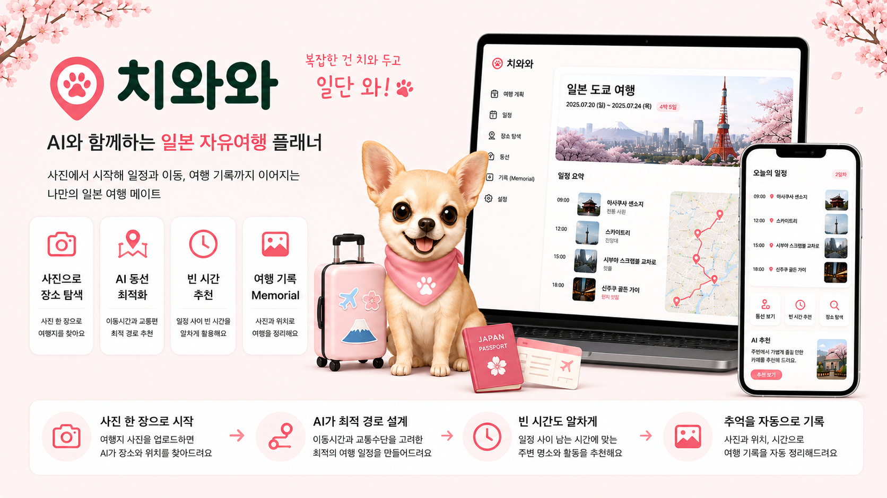
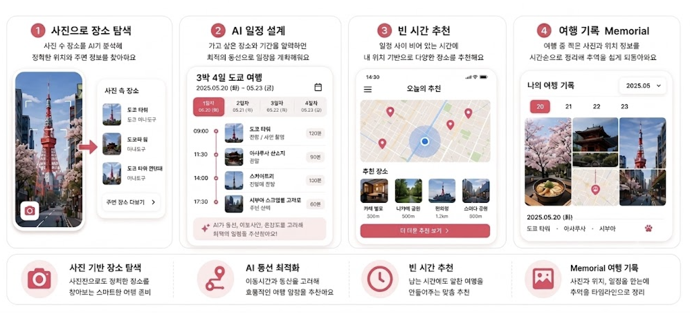
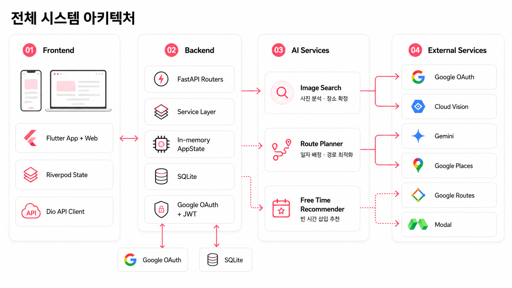
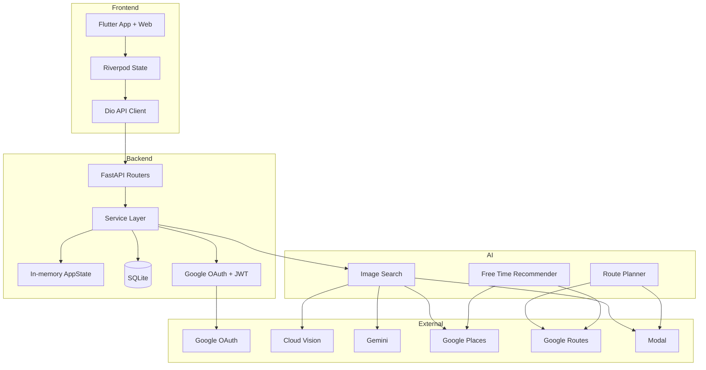

# 🐶 치와와 Chiwawa

<p align="center">
  
</p>

<h3 align="center">복잡한 건 치와 두고 일단 와</h3>

<p align="center">
  사진 속 여행지를 찾고, 가고 싶은 장소의 동선을 설계하고,<br>
  여행 중 남는 시간을 활용하며, 여행 후 기록까지 정리하는<br>
  <strong>일본 자유여행 통합 플래너</strong>
</p>

<p align="center">
  <strong>📸 사진 기반 장소 탐색 · 🗺️ 경로 최적화 · ⏰ 빈 시간 추천 · 🌁 Memorial</strong>
</p>

<br>

## 목차

1. [프로젝트 소개](#1-프로젝트-소개)
2. [문제 정의와 차별점](#2-문제-정의와-차별점)
3. [현재 구현 범위](#3-현재-구현-범위)
4. [핵심 기능](#4-핵심-기능)
5. [사용자 서비스 흐름](#5-사용자-서비스-흐름)
6. [전체 시스템 아키텍처](#6-전체-시스템-아키텍처)
7. [파트별 기술 스택](#7-파트별-기술-스택)
8. [프로젝트 구조](#8-프로젝트-구조)
9. [파트별 상세 문서](#9-파트별-상세-문서)
10. [기본 실행 방법](#10-기본-실행-방법)
11. [주요 API와 연동 흐름](#11-주요-api와-연동-흐름)
12. [테스트와 품질 관리](#12-테스트와-품질-관리)
13. [협업 방식](#13-협업-방식)
14. [현재 제약과 확장 방향](#14-현재-제약과-확장-방향)

<br>

## 1. 프로젝트 소개

**치와와**는 일본 자유여행을 준비하는 사용자가 여행지를 탐색하고, 방문 일정을 설계하고, 여행 중 일정을 확인하고, 여행 후 사진 기록까지 관리할 수 있도록 만든 App + Web 기반 여행 플래너입니다.

```text
사진 속 장소 탐색
→ 방문 희망 장소 저장
→ 날짜별 일정과 방문 순서 생성
→ 이동수단별 경로 확인
→ 여행 중 오늘 일정과 빈 시간 추천
→ 여행 후 사진 기반 Memorial 기록
```

치와와는 단순한 관광지 검색 서비스가 아닙니다.

사진에서 시작한 여행 관심사를 실제 장소 정보로 연결하고, 시간과 이동비용을 고려한 일정으로 구성하며, 여행이 끝난 뒤에도 사진과 방문 흐름을 다시 볼 수 있는 하나의 여행 경험을 지향합니다.

> 현재 저장소는 서비스 전체 흐름을 검증하기 위한 개발 프로토타입입니다. 기능별 실제 연동 수준은 [현재 구현 범위](#3-현재-구현-범위)에서 구분합니다.

<br>

## 2. 문제 정의와 차별점

### 해결하고자 한 문제

| 문제 상황 | 사용자 불편 |
|---|---|
| 📸 사진 속 장소 탐색 | SNS나 사진에서 본 장소의 정확한 이름과 위치를 찾기 어려움 |
| 🗺️ 여행 동선 설계 | 여러 장소의 이동시간과 방문 순서를 직접 비교해야 함 |
| 🚆 이동수단 비교 | 도보, 자동차, 대중교통에 따라 일정이 어떻게 달라지는지 판단하기 어려움 |
| ⏰ 빈 시간 활용 | 일정 사이에 시간이 남아도 이동과 체류가 가능한 장소를 다시 찾기 어려움 |
| 🌁 여행 기록 정리 | 여행 후 사진과 방문 장소를 날짜와 동선에 맞게 정리하는 데 시간이 오래 걸림 |
| 🔄 서비스 분산 | 장소 탐색, 일정 작성, 이동 경로와 기록 관리가 서로 다른 서비스에 나뉘어 있음 |

### 치와와의 접근

| 일반적인 여행 서비스 | 치와와 |
|---|---|
| 장소명 텍스트 검색 중심 | 사진을 분석해 장소 후보를 생성하고 Google Places로 실제 장소 확정 |
| 사용자가 방문 순서를 직접 조정 | 날짜 배정과 방문 순서를 정확 최적화 모듈로 계산 |
| 하나의 이동수단 또는 단순 거리 중심 | 도보·자동차·대중교통별 Route Option과 Timeline 생성 |
| 주변 인기 장소를 일괄 추천 | 이동 구간, 추가 이동시간, 거리와 체류시간을 함께 평가 |
| 사진을 개별 파일로만 관리 | 촬영시각과 위치 메타데이터를 기반으로 날짜별 Memorial 구성 |
| AI 결과를 그대로 사실로 사용 | 사진 이해 결과와 장소 사실 정보를 분리하고 Google Places로 재확정 |

### 핵심 차별점

#### 1. 사진 추정과 장소 사실의 분리

```text
Google Cloud Vision / Gemini
→ 사진 내용과 장소명 추정

Google Places
→ Place ID, 좌표, 도시, 국가와 평점 확정
```

AI가 추정한 좌표를 그대로 사용하지 않고 Google Places에서 실제 장소를 다시 확인합니다.

#### 2. 제한 범위 안에서의 정확 경로 계산

Route Planner는 다음 계산 방식을 사용합니다.

- Held-Karp 부분집합 동적 계획법 기반 방문 순서 계산
- 부분집합 기반 정확 일자 배정
- 필수 방문 여부와 우선순위 반영
- 미배정 장소 수와 이동시간을 고려한 사전식 목적함수
- 기본 POI 제한 초과 시 휴리스틱으로 자동 전환하지 않고 명시적 실패

#### 3. 빈 시간을 경로 삽입 문제로 평가

Free Time Recommender는 후보 장소 자체만 평가하지 않습니다.

```text
이전 장소
→ 추천 후보 이동
→ 후보 장소 체류
→ 다음 장소 이동
```

추가 이동시간, 거리, 체류시간과 일정 종료시각을 함께 계산해 실제 일정에 삽입할 수 있는 후보인지 판단합니다.

<br>

## 3. 현재 구현 범위

치와와는 파트별 구현 수준과 전체 서비스 연결 수준을 구분합니다.

| 영역 | 상태 | 현재 범위 |
|---|---|---|
| 📱 Flutter 화면 | 구현 | 홈, 일정, 여행 목록, 사진 탐색, Memorial, 마이페이지 |
| ⚙️ Backend API | 구현 | 여행, 희망 장소, 일정, 여행 중 보조 기능, Memorial, 인증 |
| 🔐 Google OAuth + JWT | 구현 | Google 로그인, JWT 발급과 인증 사용자 조회 |
| 📸 사진 기반 장소 검색 | 실제 연동 | Backend에서 `ai/image_search` 모듈 호출 |
| 🗺️ Route Planner | 구현·테스트 | 정확 일자 배정, 방문 순서, 이동수단별 Route Option과 Timeline |
| ⏰ Free Time Recommender | 구현·테스트 | Route Leg 주변 후보 검색과 일정 삽입 가능성 평가 |
| 🔌 Backend와 Route Planner 통합 | 부분 구현 | DTO와 AI 모듈은 존재하지만 기본 일정 API는 현재 모의 일정 생성 사용 |
| 🔌 Backend와 Free Time Recommender 통합 | 부분 구현 | Backend의 추천 Endpoint는 현재 시연용 규칙 기반 응답 |
| 🌁 Memorial | 구현 | 사진 메타데이터 저장, 날짜별 기록 생성과 지도·타임라인 UI |
| 💾 저장소 | 혼합 | 여행 프로토타입은 메모리, Google 사용자와 Memorial 메타데이터는 SQLite |
| 🚀 배포 | 부분 구현 | Dockerfile, GitHub Actions와 Modal AI 배포 Workflow |

### 실제 외부 서비스 연동

```text
Google OAuth
Google Cloud Vision
Gemini
Google Places
Google Routes
Modal
```

Google Routes 기반 Route Planner와 Free Time Recommender는 독립 AI 모듈로 구현되어 있습니다.

현재 Backend의 기본 일정 생성과 여행 중 추천 Endpoint 전체가 해당 모듈을 사용하는 상태는 아닙니다.

<br>

## 4. 핵심 기능

### 📸 사진 기반 여행지 탐색

사용자가 사진을 선택하면 Backend가 Image Search 모듈을 호출해 장소 후보를 생성합니다.

```text
사진 업로드
→ 이미지 형식 확인
→ Cloud Vision 랜드마크 감지
→ Gemini 장소 추정
→ 신뢰할 장소명 선택
→ Google Places로 실제 장소 확정
→ 주변 장소 검색
→ 일정 후보로 저장
```

주요 기능:

- 이미지 파일 또는 URL 입력
- 이미지 MIME 타입 감지
- Google Cloud Vision 랜드마크 분석
- Gemini 기반 장소명과 카테고리 추정
- Google Places 기반 Place ID와 실제 좌표 확정
- 식별된 장소 주변 후보 검색
- 장소 ID 기반 중복 제거
- 성공, 부분 성공과 실패 상태 구분
- 일부 Provider 실패 시 가능한 경로로 계속 처리
- Frontend 장소 결과 확인 및 보정 UI
- Modal 기반 Image Search 배포 구조

### 🗺️ 여행 일정과 경로 최적화

Route Planner는 여행 기간, 날짜별 시간창, 방문 희망 장소와 이동수단을 입력받아 Route Option을 생성합니다.

주요 기능:

- 전체 장소의 날짜별 배정
- 필수 방문 장소 우선 반영
- 장소 우선순위별 미배정 최소화
- 날짜별 방문 순서 계산
- 도보, 자동차, 대중교통 옵션 생성
- Route Leg별 이동시간 계산
- 방문과 이동이 이어지는 Timeline 생성
- 결과 평가와 E2E Benchmark 지원
- Modal 기반 Route Planner API 배포 구조

정확 계산의 기본 POI 제한은 12개이며, 제한을 초과하면 근사 경로로 자동 전환하지 않습니다.

### ⏰ 빈 시간대 장소 추천

Free Time Recommender는 이미 생성된 Route Option을 직접 변경하지 않고, 각 이동 구간에 추가할 수 있는 후보를 별도 결과로 제공합니다.

```text
Route Option
→ Route Leg별 polyline 생성
→ 경로 주변 장소 검색
→ 전체 Route에서 Place ID 중복 제거
→ 후보 경유 이동 지표 계산
→ 시간·거리·체류 정책 평가
→ 카테고리별 추천 결과 생성
```

검색 범위:

- 관광명소
- 카페
- 문화·전시 공간
- 공원·정원
- 음식점

후보는 자신이 발견된 Route Leg의 이전 장소와 다음 장소 사이에 삽입되는 조건으로 평가됩니다.

### 🌁 Memorial 여행 기록

여행 후 사진과 위치 메타데이터를 날짜별 기록으로 구성합니다.

Backend 기능:

- 인증 사용자별 Memorial 사진 메타데이터 저장
- EXIF 촬영시각과 위치 처리
- 사진 위치 수정
- 날짜별 여행 기록 생성
- 자신의 사진만 조회·수정·삭제하도록 JWT 보호
- 로그인 없는 시연을 위한 Memorial Demo 데이터 지원

Frontend 기능:

- 월별 여행 선택
- 날짜별 사진 그리드
- 사진 위치 수정
- 여행 요약 카드
- 시간순 Paw Map
- 사진과 경로 미리보기
- 공유와 내보내기 UI

현재 Backend는 사진 원본 파일이나 S3 경로를 저장하지 않고 사진 메타데이터를 중심으로 관리합니다.

### 🔐 인증과 사용자

- Google OAuth 로그인 URL 생성
- 일회성 OAuth `state` 검증
- HttpOnly 쿠키와 OAuth `state` 결합
- Google Callback 처리
- HS256 JWT 발급
- JWT 기반 현재 사용자 조회
- Flutter Web Redirect와 앱 Deep Link 구조
- 게스트 둘러보기 UI

현재 일부 여행 프로토타입 API는 공개 상태입니다.

인증이 필요한 주요 기능은 현재 사용자 조회, 사진 장소 검색과 회원 단위 Memorial API입니다.

<br>

## 5. 사용자 서비스 흐름

<p align="center">
  
</p>


### 1. 여행 생성

사용자가 여행 기본 정보를 입력합니다.

- 여행명
- 국가와 도시
- 시작일과 종료일
- 날짜별 시작·종료 시간
- 여행 시간대

### 2. 장소 탐색과 등록

- 장소명으로 방문 희망 장소 등록
- 사진을 업로드해 장소 후보 검색
- 검색된 장소를 일정 후보로 저장
- 필요하면 사용자가 장소 결과 수정

### 3. 일정 생성

현재 Backend API는 프로토타입용 모의 일정 초안을 생성합니다.

별도의 Route Planner 모듈에는 Google Routes 이동시간과 정확 Solver를 이용한 일정 계산이 구현되어 있습니다.

### 4. 일정 확인과 확정

- 날짜별 방문 순서
- 장소 체류시간
- 이동시간
- 이동수단
- 예상 종료시각
- 같은 계획을 다시 확정해도 중복 생성되지 않는 멱등 처리

### 5. 여행 중 보조 기능

- 오늘 일정 확인
- 빈 시간 활동 추천
- 현재 위치 주변 추천
- 지연 발생 시 재계획

현재 Backend의 해당 응답은 시연용 규칙 기반 구현입니다.

### 6. Memorial

- 여행 사진 메타데이터 등록
- 촬영시각과 장소 정리
- 날짜별 사진 묶음 생성
- 지도와 시간순 동선 표시
- 위치 보정과 기록 공유 UI

<br>

## 6. 전체 시스템 아키텍처

<p align="center">
  
</p>

<details>
<summary><strong>Mermaid 원본 다이어그램 보기</strong></summary>

<br>



</details>

### 파트별 역할

| 파트 | 주요 역할 |
|---|---|
| 📱 Frontend | 사용자 화면, 상태 관리, API Repository, 사진 탐색과 Memorial 시각화 |
| ⚙️ Backend | HTTP API, 인증, 여행 데이터 처리, 사진 검색 AI 호출과 프로토타입 상태 저장 |
| 📷 Image Search | 사진 분석, 실제 장소 확정과 주변 후보 검색 |
| 🗺️ Route Planner | 날짜 배정, 정확 방문 순서, 이동수단별 Route Option과 Timeline 생성 |
| ⏰ Free Time Recommender | Route Leg 주변 장소 검색과 일정 삽입 가능성 평가 |
| 🚀 Infrastructure | Docker 실행 환경, GitHub Actions CI와 Modal AI 배포 |

### 현재 통합 관계

현재 직접 연결된 주요 흐름:

```text
Frontend
↔ Backend
→ Image Search
```

다음 AI 모듈은 구현과 테스트가 완료되어 있지만 Backend의 기본 여행 API 전체가 직접 호출하는 상태는 아닙니다.

```text
Backend
⇢ Route Planner
⇢ Free Time Recommender
```

<br>

## 7. 파트별 기술 스택

### 📱 Frontend

| 기술 | 사용 목적 |
|---|---|
| Flutter / Dart | App + Web 사용자 인터페이스 |
| Riverpod | 인증, 여행, 일정, 사진 장소와 Memorial 상태 관리 |
| Dio | FastAPI 통신과 JWT Header 처리 |
| go_router | 화면 라우팅과 인증 Deep Link |
| shared_preferences | JWT와 사용자 세션 정보 저장 |
| CustomPainter | Memorial Paw Map과 여행 동선 시각화 |
| Pretendard | 한글 UI 폰트 |

### ⚙️ Backend

| 기술 | 사용 목적 |
|---|---|
| Python 3.13+ | Backend 실행 환경 |
| FastAPI | REST API와 OpenAPI 문서 |
| Pydantic v2 | 요청·응답 및 설정 검증 |
| pydantic-settings | 환경변수와 애플리케이션 설정 |
| SQLite | Google 사용자와 Memorial 사진 메타데이터 저장 |
| PyJWT | HS256 Access Token 발급과 검증 |
| HTTPX | Google OAuth와 외부 서비스 통신 |
| uv | 의존성, 실행과 빌드 |
| pytest | API와 서비스 테스트 |
| Ruff | 포맷과 Lint |
| basedpyright | 정적 타입 검사 |

### 📷 Image Search

| 기술 | 사용 목적 |
|---|---|
| Python | 사진 장소 검색 파이프라인 |
| Pydantic | 검색 요청과 결과 Schema |
| Google Cloud Vision | 랜드마크 감지 |
| Gemini | 장소명, 카테고리와 근거 추정 |
| Google Places | 실제 장소, 좌표, Place ID와 주변 후보 |
| HTTPX | 이미지와 외부 Provider 통신 |
| pytest | Provider, Service와 Backend 계약 테스트 |
| Modal | Image Search API 배포 |

### 🗺️ Route Planner

| 기술 | 사용 목적 |
|---|---|
| Python | 일정과 경로 Solver |
| Pydantic | 여행 요청과 Route Option Schema |
| Google Routes API | 이동수단별 Route Matrix |
| Held-Karp DP | 날짜 내부 방문 순서의 정확 계산 |
| Partition DP | 전체 POI의 정확 일자 배정 |
| pytest | Solver, Provider, Evaluation과 E2E 테스트 |
| Modal | Route Planner API 배포 |

### ⏰ Free Time Recommender

| 기술 | 사용 목적 |
|---|---|
| Python Dataclass | 추천 정책과 Domain Model |
| Google Routes API | Route Geometry와 후보 경유 이동 지표 |
| Google Places API | polyline 주변 카테고리 장소 검색 |
| HTTPX | 외부 API Provider |
| ZoneInfo | 여행 현지시간 변환 |
| pytest | Domain, Adapter, Provider와 Use Case 테스트 |

### 🚀 Infrastructure

| 기술 | 사용 목적 |
|---|---|
| Docker | Backend 실행 이미지 |
| GitHub Actions | AI CI, Main 병합 Guard와 Modal 배포 |
| Modal | Image Search와 Route Planner API 실행 환경 |
| Git / GitHub | 브랜치와 Pull Request 기반 협업 |

<br>

## 8. 프로젝트 구조

```text
chiwawa/
├── frontend/                       # Flutter App + Web
│   ├── lib/
│   │   ├── app/
│   │   ├── core/
│   │   ├── features/
│   │   └── shared/
│   ├── assets/
│   ├── test/
│   └── README.md
│
├── backend/                        # FastAPI Backend
│   ├── src/chiwawa_backend/
│   │   ├── routers/
│   │   ├── schemas/
│   │   ├── services/
│   │   └── sql/
│   ├── docs/
│   ├── tests/
│   ├── pyproject.toml
│   └── README.md
│
├── ai/
│   ├── image_search/               # 사진 기반 장소 탐색
│   │   ├── domain/
│   │   ├── providers/
│   │   ├── services/
│   │   ├── scripts/
│   │   ├── tests/
│   │   ├── modal_app.py
│   │   └── README.md
│   │
│   ├── route_planner/              # 일정 및 경로 최적화
│   │   ├── benchmark/
│   │   ├── domain/
│   │   ├── evaluation/
│   │   ├── providers/
│   │   ├── services/
│   │   ├── solvers/
│   │   ├── tests/
│   │   ├── modal_app.py
│   │   └── README.md
│   │
│   └── free_time_recommender/      # Route Leg 삽입 추천
│       ├── adapters/
│       ├── application/
│       ├── domain/
│       ├── providers/
│       ├── tests/
│       └── README.md
│
├── artifacts/                      # AI Evaluation과 Benchmark 결과
├── assets/images/                  # 통합 README 이미지
├── .github/workflows/              # CI, Merge Guard와 Modal 배포
├── Dockerfile
└── README.md
```

> `.dart_tool`, `__pycache__`, `.pytest_cache`, 로컬 데이터베이스와 환경변수 파일은 실행 과정에서 생성되는 개발 파일이므로 핵심 구조에서 제외합니다.

<br>

## 9. 파트별 상세 문서

통합 README에서는 각 파트의 대표 문서만 연결합니다.

| 파트 | 문서 | 주요 내용 |
|---|---|---|
| 📱 Frontend | [`frontend/README.md`](frontend/README.md) | Flutter 실행, 화면 구현 범위와 API Base URL |
| ⚙️ Backend | [`backend/README.md`](backend/README.md) | FastAPI 실행, 인증, 저장 범위, API 흐름과 품질 검사 |
| 📷 Image Search | [`ai/image_search/README.md`](ai/image_search/README.md) | 사진 기반 장소 탐색 파트 대표 문서 |
| 🗺️ Route Planner | [`ai/route_planner/README.md`](ai/route_planner/README.md) | 정확 일자 배정, 경로 최적화와 Timeline |
| ⏰ Free Time Recommender | [`ai/free_time_recommender/README.md`](ai/free_time_recommender/README.md) | Route Leg 주변 검색과 후보 삽입 가능성 평가 |

> 루트 README는 전체 서비스와 파트 간 연결 구조를 설명합니다. 각 파트의 내부 구현은 해당 대표 README에서 관리합니다.

<br>

## 10. 기본 실행 방법

### 10-1. 저장소 클론

```bash
git clone https://github.com/hekim-cse/chiwawa.git
cd chiwawa
```

### 10-2. Backend

```bash
cd backend

cp .env.example .env
uv sync --frozen

PYTHONPATH=..:src \
uv run uvicorn chiwawa_backend.main:app \
  --reload \
  --no-access-log \
  --host 127.0.0.1 \
  --port 8000
```

또는:

```bash
cd backend
make run
```

API 문서:

| 항목 | URL |
|---|---|
| Swagger 진입 | `http://127.0.0.1:8000/` |
| Swagger UI | `http://127.0.0.1:8000/docs` |
| ReDoc | `http://127.0.0.1:8000/redoc` |
| OpenAPI JSON | `http://127.0.0.1:8000/openapi.json` |
| Health Check | `http://127.0.0.1:8000/health` |

인증 설정이 없어도 상태 확인, API 문서와 인증이 필요하지 않은 프로토타입 API는 실행할 수 있습니다.

### 10-3. Frontend

```bash
cd frontend
flutter pub get
```

Backend와 연결한 Web 실행:

```bash
flutter run -d chrome \
  --dart-define=API_BASE_URL=http://127.0.0.1:8000
```

Web Server 모드:

```bash
flutter run -d web-server \
  --web-hostname 127.0.0.1 \
  --web-port 5190 \
  --dart-define=API_BASE_URL=http://127.0.0.1:8000
```

Android Emulator:

```bash
flutter run -d android \
  --dart-define=API_BASE_URL=http://10.0.2.2:8000
```

실제 기기:

```bash
flutter run -d <device-id> \
  --dart-define=API_BASE_URL=http://<개발-PC-LAN-IP>:8000
```

### 10-4. Image Search

```bash
python3 -m venv .venv
source .venv/bin/activate

python -m pip install --upgrade pip
python -m pip install -r ai/image_search/requirements.txt
```

환경변수 예시:

```text
ai/image_search/.env.example
```

테스트:

```bash
PYTHONPATH=. \
pytest ai/image_search/tests
```

### 10-5. Route Planner

```bash
python3 -m venv .venv
source .venv/bin/activate

python -m pip install --upgrade pip
python -m pip install -r ai/route_planner/requirements.txt
```

테스트:

```bash
PYTHONPATH=. \
pytest ai/route_planner/tests
```

세부 실행 스크립트와 환경변수는 [`ai/route_planner/README.md`](ai/route_planner/README.md)를 참고합니다.

### 10-6. Free Time Recommender

Route Planner와 같은 Python 환경에서 실행할 수 있습니다.

```bash
PYTHONPATH=. \
pytest ai/free_time_recommender/tests
```

Google Places와 Google Routes 실제 요청에는 Provider API Key 설정이 필요합니다.

<br>

## 11. 주요 API와 연동 흐름

Backend의 전체 HTTP 계약은 `backend/docs/api/reference.md`에서 관리합니다.

### 인증

| Method | Endpoint | 설명 |
|---|---|---|
| `GET` | `/api/v1/auth/google/login` | Google OAuth 로그인 시작 |
| `GET` | `/api/v1/auth/google/callback` | OAuth Callback 처리와 JWT 발급 |
| `GET` | `/api/v1/auth/me` | 현재 인증 사용자 조회 |

### 여행과 일정

| Method | Endpoint | 설명 |
|---|---|---|
| `POST` | `/api/v1/trips` | 여행 생성 |
| `GET` | `/api/v1/trips` | 여행 목록 조회 |
| `POST` | `/api/v1/trips/{trip_id}/wanted-places` | 방문 희망 장소 등록 |
| `POST` | `/api/v1/trips/{trip_id}/ai-plans` | 일정 초안 생성 |
| `GET` | `/api/v1/trips/{trip_id}/plans/{plan_id}` | 일정 초안 조회 |
| `POST` | `/api/v1/trips/{trip_id}/plans/{plan_id}/confirm` | 일정 확정 |

현재 `/ai-plans`의 Backend 기본 구현은 시연용 모의 일정입니다.

### 사진 장소 검색

```text
Flutter Explore
→ Backend Photo Places Router
→ Image Search
→ Cloud Vision + Gemini
→ Google Places
→ 후보 목록
→ Frontend 결과 카드
→ 방문 희망 장소로 저장
```

사진 장소 검색은 인증 사용자 API이며 실제 외부 Provider Key 설정이 필요합니다.

### 여행 중 보조 기능

- 오늘 일정 조회
- 빈 시간 추천
- 현재 위치 주변 추천
- 일정 지연 재계획

현재 Backend 응답은 시연용 규칙 기반 구현이며, 실제 Free Time Recommender 연결은 별도 통합 작업이 필요합니다.

### Memorial

```text
Flutter Memorial
→ JWT Bearer 인증
→ Memorial Photo Metadata API
→ SQLite
→ 날짜별 여행 기록 생성
→ Paw Map과 사진 타임라인
```

사진 원본 자체가 아니라 촬영시각, 위치와 사용자 수정 메타데이터를 저장합니다.

<br>

## 12. 테스트와 품질 관리

### Frontend

```bash
cd frontend

flutter analyze
flutter test
flutter build web
```

주요 테스트:

- Repository와 JSON Model
- Trip Scope 상태
- Plan Itinerary
- OAuth Deep Link
- Memorial 사진 편집
- Paw Map과 Timeline
- 공통 Widget 모듈

### Backend

```bash
cd backend

uv run ruff format --check .
uv run ruff check .
uv run basedpyright
uv run pytest
uv build --wheel
```

또는:

```bash
cd backend
make check
```

주요 테스트:

- API Pipeline
- Google OAuth와 JWT
- OAuth State
- CORS
- 명령 멱등성
- 일정 확정 원자성
- 날짜 및 시간 경계
- Trip 날짜 정합성
- Memorial과 Demo Mode
- 동시성 상태 관리

### AI

```bash
PYTHONPATH=. pytest ai/image_search/tests
PYTHONPATH=. pytest ai/route_planner/tests
PYTHONPATH=. pytest ai/free_time_recommender/tests
```

Route Planner의 평가와 Benchmark 결과는 `artifacts/`에 저장됩니다.

```text
artifacts/
├── clustering_evaluation_result.json
├── e2e_benchmark_result.json
└── route_evaluation_result.json
```

### GitHub Actions

| Workflow | 역할 |
|---|---|
| `ai-image-search-ci.yml` | Image Search 테스트와 검증 |
| `ai-route-planner-ci.yml` | Route Planner 테스트와 검증 |
| `main-merge-guard.yml` | Main 병합 보호 검사 |
| `modal-image-search-deploy.yml` | Modal Image Search 배포 |
| `modal-route-planner-deploy.yml` | Modal Route Planner 배포 |

<br>

## 13. 협업 방식

치와와는 Pull Request 기반으로 작업합니다.

```text
main
└── 최종 통합 및 릴리즈

develop
└── 기능 통합 브랜치

feat/*
fix/*
refactor/*
docs/*
└── 작업 단위 브랜치
```

### 기본 작업 흐름

```bash
git switch develop
git pull --ff-only origin develop
git switch -c feat/작업명
```

```text
작업 브랜치 생성
→ 구현
→ 로컬 테스트
→ Commit
→ Push
→ develop 대상 Pull Request
→ Review
→ develop 병합
→ develop에서 main 대상 통합 Pull Request
```

### Commit Convention

| 타입 | 의미 | 예시 |
|---|---|---|
| `feat` | 기능 추가 | `feat: 사진 장소 검색 API 추가` |
| `fix` | 오류 수정 | `fix: 일정 확정 중복 생성 방지` |
| `refactor` | 구조 개선 | `refactor: 추천 Provider 인터페이스 분리` |
| `docs` | 문서 변경 | `docs: 통합 README 작성` |
| `test` | 테스트 변경 | `test: Memorial 위치 수정 테스트 추가` |
| `chore` | 설정 및 기타 | `chore: CI 실행 환경 수정` |

<br>

## 14. 현재 제약과 확장 방향

### 현재 제약

- Frontend 일부 상태와 화면은 Mock 또는 Prototype 데이터를 지원합니다.
- Backend의 여행·일정·추천 데이터 대부분은 메모리에 저장되어 재시작 시 초기화됩니다.
- Google 사용자와 Memorial 사진 메타데이터만 SQLite에 영속 저장됩니다.
- 여행 관련 API 일부는 아직 인증과 사용자 소유권 검증이 없습니다.
- Backend의 일정 초안, 주변 추천과 빈 시간 추천은 현재 시연용 구현입니다.
- Route Planner와 Free Time Recommender가 Backend 기본 여행 흐름에 완전히 통합되지 않았습니다.
- Route Planner 정확 Solver는 기본 POI 12개 제한을 가집니다.
- 외부 Google API와 Gemini 사용에는 별도 Key와 비용이 필요합니다.
- AI Provider에 장기 Cache, 자동 Retry와 Circuit Breaker가 없습니다.
- Memorial은 사진 원본 저장 서비스가 아니라 메타데이터와 표시 흐름 중심입니다.
- 실제 운영 배포를 위한 사용자 권한, Secret 관리와 영속 데이터베이스 확장이 필요합니다.

### 우선 확장 방향

```text
1. Backend 모의 일정 생성
   → Route Planner 실제 호출로 교체

2. Backend 빈 시간·주변 추천
   → Free Time Recommender 실제 호출로 교체

3. 여행 API
   → JWT 사용자 소유권 검증 추가

4. In-memory AppState
   → 영속 데이터베이스로 이전

5. Frontend Mock State
   → Backend API Repository 연결 확대

6. Memorial
   → 사진 원본 저장소와 공유 결과 생성 연동

7. AI Provider
   → Retry, Rate Limit, Cache와 운영 모니터링 추가
```

<br>

---

<p align="center">
  <strong>🐶 복잡한 건 치와 두고 일단 와</strong><br>
  사진에서 시작해 일정과 이동, 여행 기록까지 이어지는 일본 자유여행 플래너
</p>
