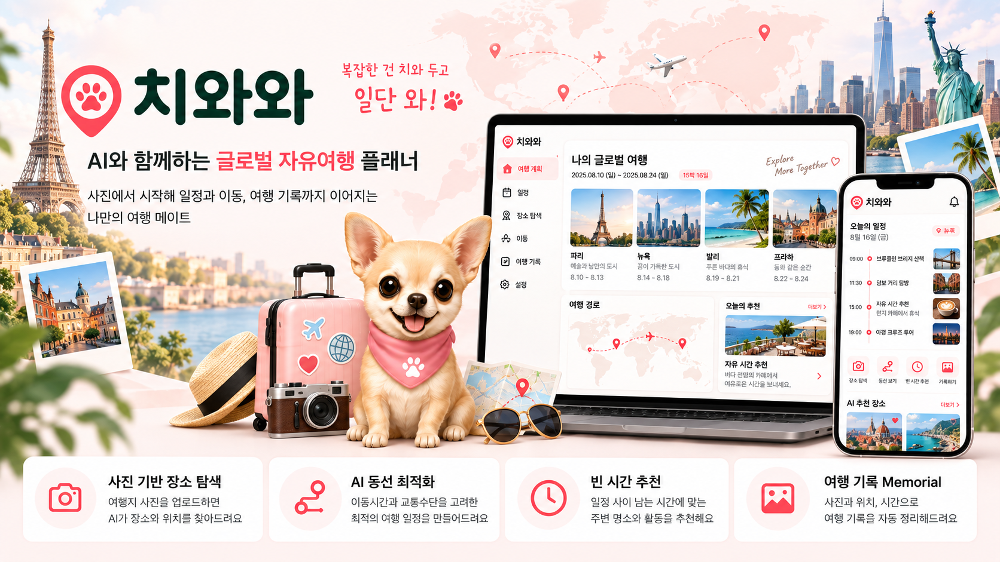
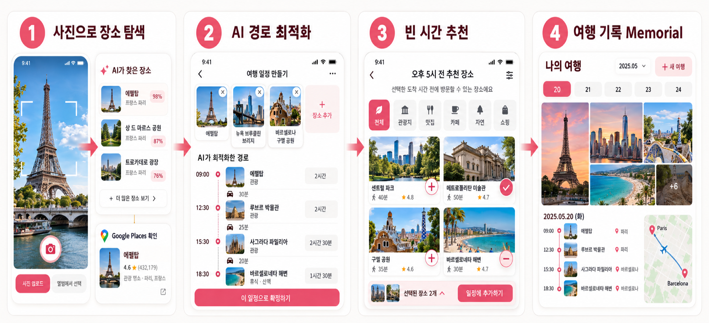
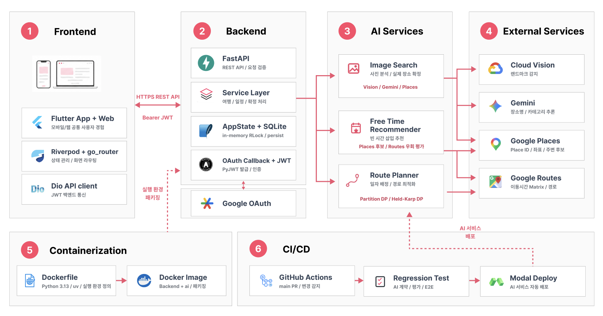

# 🐶 치와와 Chiwawa

<p align="center">
  
</p>

<h3 align="center">복잡한 건 치와 두고 일단 와</h3>

<p align="center">
  사진 속 여행지를 실제 장소로 확정하고, 이동 동선을 최적화하며,<br>
  남는 시간의 일정과 여행 후 기록까지 연결하는<br>
  <strong>AI 기반 글로벌 자유여행 플래너</strong>
</p>

<p align="center">
  <a href="https://github.com/hekim-cse/chiwawa/actions/workflows/ai-image-search-ci.yml"></a>
  <a href="https://github.com/hekim-cse/chiwawa/actions/workflows/ai-route-planner-ci.yml"></a>
  <a href="https://github.com/hekim-cse/chiwawa/actions/workflows/modal-image-search-deploy.yml"></a>
  <a href="https://github.com/hekim-cse/chiwawa/actions/workflows/modal-route-planner-deploy.yml"></a>
</p>

<p align="center">
  <strong>Flutter · FastAPI · Modal · Google Cloud Vision · Gemini · Google Places · Google Routes</strong>
</p>

---

## ✨ 사용자 경험

<p align="center">
  
</p>

### 1. 사진으로 장소 탐색

- 이미지 형식과 MIME 타입 검증
- Cloud Vision 랜드마크 감지
- Gemini 기반 장소명·카테고리 추론
- Google Places 기반 Place ID·주소·좌표·평점 확정
- 동일 Place ID 중복 제거와 주변 장소 후보 제공
- 분석된 장소를 기존 일정 후보와 같은 계약으로 저장

### 2. AI 경로 최적화

- 출발지와 도착지의 장소·시각 고정
- 사진·검색·추천으로 추가한 장소 자동 병합
- 날짜별 장소 배정과 방문 순서 계산
- 도보·자동차·대중교통별 이동시간 비교
- Route Option과 도착·출발·체류 Timeline 생성
- 확정 결과를 SQLite에 저장하고 홈 일정과 동기화

### 3. 빈 시간 추천

- 최적화 결과의 마지막 방문지부터 고정 도착지까지 남은 시간 계산
- Route Geometry 주변의 카테고리별 장소 검색
- 후보 방문에 필요한 이동·체류·우회시간 평가
- 사용자가 정한 도착시각을 넘지 않는 후보만 반환
- 관광지·맛집·카페·자연·쇼핑 등 카테고리별 다중 결과 제공
- 추천 장소의 일정 후보 추가·삭제 상태 즉시 반영

### 4. 여행 기록 Memorial

- 회원별 사진 원본 파일과 촬영시각·위치 메타데이터 저장
- 날짜별 사진 그리드와 Timeline 구성
- 위치 보정과 Paw Map 동선 시각화
- 여행 요약과 공유 UI 제공

## 🧩 핵심 기술 문제와 해결

### AI 추론과 장소 사실을 분리했습니다

사진 모델이 생성한 장소명과 좌표를 그대로 일정에 사용하면 환각이 실제 동선에
전파될 수 있습니다. 치와와는 AI가 장소 후보를 추론하게 하되, 일정에 사용하는
Place ID·좌표·주소·평점은 Google Places 응답으로 다시 확정합니다.

```text
Cloud Vision + Gemini
→ 장소 후보와 근거 추론

Google Places
→ 존재하는 장소인지 검증
→ Place ID·좌표·주소 확정
```

### 제한 범위에서는 정확해를 계산합니다

Route Planner는 임의 휴리스틱으로 결과를 바꾸지 않고, 기본 POI 12개 범위에서
부분집합 동적 계획법을 사용합니다.

- Held-Karp DP로 날짜 내부 방문 순서 계산
- Partition DP로 전체 장소의 날짜별 배정
- 필수 방문 여부와 장소 우선순위 반영
- 미배정 장소 수와 이동시간을 함께 고려한 사전식 목적함수
- 지원 범위를 넘으면 조용히 근사값을 반환하지 않고 명시적으로 실패

### 빈 시간을 경로 삽입 문제로 정의했습니다

후보 장소가 단순히 가깝다는 이유만으로 추천하지 않습니다.

```text
현재 장소
→ 추천 후보까지 이동
→ 후보 체류
→ 고정 도착지까지 이동
→ 사용자 도착시각 안에 들어오는지 검증
```

이 방식으로 경로 최적화 결과는 그대로 유지하면서, 남은 시간 안에 추가 가능한
장소를 카테고리별로 제안합니다.

### 확정 상태를 서버의 단일 기준으로 유지했습니다

사진이나 빈 시간 추천에서 추가한 장소가 화면에만 존재하면 재최적화·일정 확정·홈
조회 과정에서 사라질 수 있습니다. 치와와는 모든 장소를 `wanted place` 계약으로
정규화하고, 확정 경로와 생성된 일정 항목을 SQLite에 함께 저장합니다.

- 여행과 등록 장소 영속화
- 확정 Route Option과 Timeline 영속화
- 같은 결과를 다시 확정해도 중복 생성되지 않는 멱등 처리
- 확정 후 Riverpod Provider 무효화로 홈·일정 화면 동기화

## 🏗️ 시스템 아키텍처

<p align="center">
  
</p>

### 실제 연동 경계

```text
Flutter App / Web
↔ FastAPI Backend
↔ SQLite

FastAPI
→ Modal Image Search
   → Cloud Vision
   → Gemini
   → Google Places

FastAPI
→ Modal Route Planner
   → Places에서 확정된 좌표 입력
   → Google Routes 이동시간 행렬

Route Planner
→ Free Time Recommender
   → Google Places 후보 검색
   → Google Routes 우회 이동 계산

FastAPI Google OAuth + JWT
↔ Google OAuth
```

Route Planner 저장소에는 장소명으로 좌표를 만드는 개발 스크립트용 Places Provider도
있지만, 현재 Modal 운영 경로는 앞단에서 확정된 좌표를 입력받아 Google Routes를
직접 호출합니다.

## 🚀 구현 및 배포 범위

| 영역 | 구현 내용 |
|---|---|
| Frontend | Flutter App·Web, Riverpod 상태 관리, Dio API Repository |
| Backend | FastAPI, Pydantic 계약, Google OAuth·JWT, SQLite 상태 저장 |
| Image Search | Cloud Vision·Gemini 분석, Places 사실 확정, Modal 배포 |
| Route Planner | 정확 일자 배정, 방문 순서, 이동수단별 Route Option·Timeline |
| Free Time Recommender | 경로 주변 검색, 후보 우회 지표, 도착시간 기반 삽입 검증 |
| Memorial | 사진 파일·메타데이터 저장, 날짜별 기록, Paw Map·Timeline UI |
| CI/CD | GitHub Actions 회귀 테스트, 평가 Artifact, Modal 자동 배포 |

### 배포 자동화

```text
main 반영
→ GitHub Actions 변경 경로 감지
→ AI 단위·계약·E2E 회귀 테스트
→ Modal Image Search 배포
→ Modal Route Planner·Free Time Recommender 배포
```

현재 저장소에서 자동 배포가 확인되는 범위는 Modal AI 서비스입니다. FastAPI와
Flutter는 Docker·로컬 실행 구성을 제공하며, 운영 호스팅 주소는 저장소에 포함하지
않습니다.

## ✅ 검증 결과

Route Planner는 정답을 알고 있는 Fixture와 반복 Benchmark로 정확성·완전성·결정성을
검증합니다.

| 검증 항목 | 저장된 결과 |
|---|---:|
| 기준 순서 이동시간 | 140분 |
| 정확 DP 최적화 이동시간 | 40분 |
| 이동시간 감소 | 100분 |
| Fixture 개선율 | 71.43% |
| E2E 반복 실행 | 3회 |
| Route Matrix 예상·반환 구간 | 80 / 80 |
| 누락 Matrix 구간 | 0 |
| POI 완전 배정 | 3회 모두 성공 |
| 결과 Fingerprint | 3회 동일 |

> 위 수치는 [`artifacts/route_evaluation_result.json`](artifacts/route_evaluation_result.json)과
> [`artifacts/e2e_benchmark_result.json`](artifacts/e2e_benchmark_result.json)에 저장된
> 평가 시나리오 결과이며, 모든 실제 여행에 대한 일반화 성능을 의미하지 않습니다.

### 품질 검사

```bash
# Frontend
cd frontend
flutter analyze
flutter test
flutter build web

# Backend
cd backend
uv run ruff format --check .
uv run ruff check .
uv run basedpyright
uv run pytest
uv build --wheel

# AI
cd ..
PYTHONPATH=. pytest ai/image_search/tests
PYTHONPATH=. pytest ai/route_planner/tests
PYTHONPATH=. pytest ai/free_time_recommender/tests
```

## 🛠️ 기술 스택

| 구분 | 기술 | 사용 목적 |
|---|---|---|
| Frontend | Flutter, Dart | App·Web 공통 사용자 인터페이스 |
| State | Riverpod | 인증·여행·일정·사진·Memorial 상태 동기화 |
| API Client | Dio | FastAPI 통신, JWT Header, 장기 AI 요청 처리 |
| Backend | FastAPI, Pydantic v2 | REST API와 요청·응답 계약 검증 |
| Persistence | SQLite | 여행·등록 장소·확정 일정·경로와 사용자 메타데이터 저장 |
| Authentication | Google OAuth, JWT | Google 로그인과 사용자 세션 |
| Image AI | Cloud Vision, Gemini | 랜드마크 감지와 장소 후보 추론 |
| Place Data | Google Places | Place ID·좌표·주소 확정과 주변 후보 검색 |
| Route Data | Google Routes | 이동수단별 이동시간·경로 Geometry 계산 |
| Optimization | Held-Karp DP, Partition DP | 방문 순서와 날짜 배정의 정확 계산 |
| Serverless | Modal | Image Search·Route Planner 실행 환경 |
| CI/CD | GitHub Actions | 회귀 테스트, 평가 결과와 Modal 자동 배포 |

## 🗂️ 프로젝트 구조

```text
chiwawa/
├── frontend/                       # Flutter App + Web
│   ├── lib/
│   │   ├── app/
│   │   ├── core/                   # API, Repository, Model, 인증
│   │   └── features/               # 홈, 일정, 탐색, Memorial
│   └── test/
├── backend/                        # FastAPI Backend
│   ├── src/chiwawa_backend/
│   │   ├── routers/
│   │   ├── schemas/
│   │   └── services/
│   └── tests/
├── ai/
│   ├── image_search/               # 사진 기반 장소 확정
│   ├── route_planner/              # 정확 일정·경로 최적화
│   └── free_time_recommender/      # 경로 삽입 후보 추천
├── artifacts/                      # 평가·Benchmark 결과
├── assets/images/                  # 통합 README 이미지
├── .github/workflows/              # CI와 Modal 배포
├── Dockerfile
└── README.md
```

### 상세 문서

| 파트 | 문서 |
|---|---|
| Frontend | [`frontend/README.md`](frontend/README.md) |
| Backend | [`backend/README.md`](backend/README.md) |
| Backend API | [`backend/docs/api/reference.md`](backend/docs/api/reference.md) |
| Image Search | [`ai/image_search/README.md`](ai/image_search/README.md) |
| Route Planner | [`ai/route_planner/README.md`](ai/route_planner/README.md) |
| Free Time Recommender | [`ai/free_time_recommender/README.md`](ai/free_time_recommender/README.md) |

## ▶️ 실행 방법

### Backend

```bash
git clone https://github.com/hekim-cse/chiwawa.git
cd chiwawa/backend

cp .env.example .env
uv sync --frozen

PYTHONPATH=..:src \
uv run uvicorn chiwawa_backend.main:app \
  --reload \
  --host 127.0.0.1 \
  --port 8000
```

| 항목 | URL |
|---|---|
| Swagger UI | `http://127.0.0.1:8000/docs` |
| ReDoc | `http://127.0.0.1:8000/redoc` |
| OpenAPI JSON | `http://127.0.0.1:8000/openapi.json` |
| Health Check | `http://127.0.0.1:8000/health` |

### Frontend API 연동 모드

```bash
cd frontend
flutter pub get

flutter run -d chrome \
  --dart-define=USE_API=true \
  --dart-define=API_BASE_URL=http://127.0.0.1:8000
```

`USE_API`를 지정하지 않으면 화면 검증용 Mock Repository를 사용할 수 있습니다.

### 주요 환경변수

```text
GOOGLE_MAPS_API_KEY=
GOOGLE_CLOUD_VISION_API_KEY=
GEMINI_API_KEY=
GOOGLE_CLIENT_ID=
GOOGLE_CLIENT_SECRET=
GOOGLE_REDIRECT_URI=
JWT_SECRET=
IMAGE_SEARCH_URL=
ROUTE_PLANNER_URL=
FREE_TIME_RECOMMENDER_URL=
APP_DB_PATH=data/chiwawa.db
```

실제 Secret은 Git에 포함하지 않으며, Modal 배포에서는 GitHub Actions Secret과
Modal Secret을 통해 주입합니다.

## 🔌 주요 API

| Method | Endpoint | 역할 |
|---|---|---|
| `GET` | `/api/v1/auth/google/login` | Google OAuth 시작 |
| `GET` | `/api/v1/auth/google/callback` | Callback 검증과 JWT 발급 |
| `POST` | `/api/v1/trips` | 여행 생성 |
| `POST` | `/api/v1/trips/{trip_id}/wanted-places` | 일정 후보 장소 저장 |
| `POST` | `/api/v1/trips/{trip_id}/photo-places/search` | 사진 장소 분석 |
| `POST` | `/api/v1/trips/{trip_id}/photo-places/{search_id}/confirm` | 사진 장소 일정 후보 확정 |
| `POST` | `/api/v1/trips/{trip_id}/route-optimizations` | 실제 경로 최적화 |
| `POST` | `/api/v1/trips/{trip_id}/route-optimizations/confirm` | 최적화 일정 확정·영속화 |
| `GET` | `/api/v1/trips/{trip_id}/route-optimizations/confirmed` | 확정 경로 조회 |
| `GET` | `/api/v1/trips/{trip_id}/travel/free-time-recommendations` | 빈 시간 추천 조회 |
| `POST` | `/api/v1/memorial/photos` | Memorial 사진 메타데이터 등록 |
| `POST` | `/api/v1/trips/{trip_id}/memorial/generate` | 날짜별 Memorial 생성 |

전체 HTTP 계약은 [`backend/docs/api/reference.md`](backend/docs/api/reference.md)에서
관리합니다.

## 🤝 협업 방식

치와와는 기능별 작업 브랜치와 Pull Request 리뷰를 통해 개발했습니다. 개발 완료 후
운영 브랜치는 `main`으로 단일화했습니다.

```text
feat/* · fix/* · refactor/* · docs/*
→ 로컬 테스트
→ Commit
→ main 대상 Pull Request
→ Review
→ main 병합
→ GitHub Actions 검증·Modal 배포
```

| 타입 | 의미 | 예시 |
|---|---|---|
| `feat` | 기능 추가 | `feat: 사진 장소 검색 API 추가` |
| `fix` | 오류 수정 | `fix: 일정 확정 중복 생성 방지` |
| `refactor` | 구조 개선 | `refactor: 추천 Provider 인터페이스 분리` |
| `docs` | 문서 변경 | `docs: 글로벌 서비스 README 개편` |
| `test` | 테스트 변경 | `test: 확정 경로 영속화 회귀 테스트 추가` |
| `chore` | 설정 및 기타 | `chore: CI 실행 환경 수정` |

<details>
<summary><strong>운영 환경 확장 시 고려사항</strong></summary>

<br>

- 정확 경로 Solver는 기본 POI 12개 범위에서 동작합니다.
- Google API와 Gemini 사용에는 인증 정보·호출량·비용 관리가 필요합니다.
- Memorial 원본 파일은 현재 로컬 파일시스템에 저장하므로 다중 인스턴스 운영 시 Object Storage 연동이 필요합니다.
- 여행 관련 일부 프로토타입 API는 운영 공개 전에 사용자 소유권 검증을 확대해야 합니다.
- 대규모 운영에서는 SQLite 확장, Rate Limit, Cache와 모니터링 정책을 추가로 검토할 수 있습니다.

</details>

---

<p align="center">
  <strong>🐶 복잡한 건 치와 두고 일단 와</strong><br>
  사진에서 시작해 일정과 이동, 여행 기록까지 이어지는 글로벌 여행 플래너
</p>
