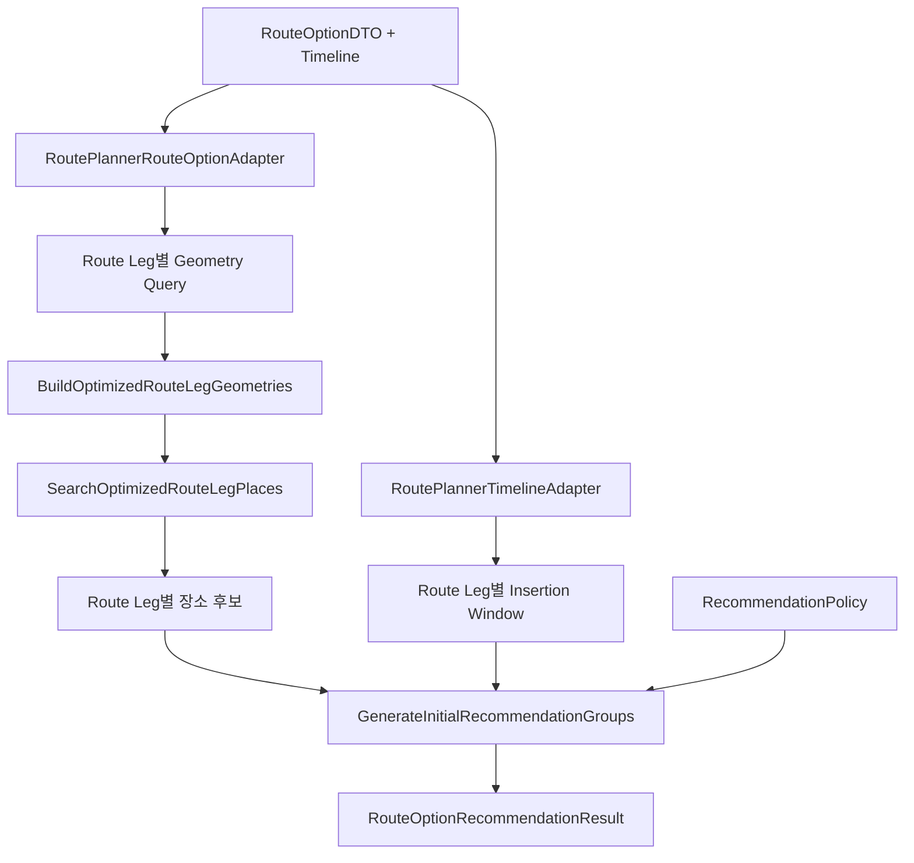

# ⏳ Free Time Recommender

Route Planner가 생성한 최적화 경로와 Timeline을 바탕으로, 이동 구간 주변의 장소를 검색하고 **기존 일정에 삽입 가능한 후보를 평가**하는 추천 모듈입니다.

이 모듈은 새로운 일정을 처음부터 만들거나 추천 장소를 자동 확정하지 않습니다.
원본 Route Option을 유지한 채 각 이동 구간에서 추가할 수 있는 장소 후보와 삽입 영향을 계산합니다.

> 기본 일정과 Route Option은 [Route Planner](../route_planner/README.md)에서 생성합니다.

<br>

## 📚 목차

1. [🎯 모듈 역할](#-모듈-역할)
2. [🔄 전체 처리 흐름](#-전체-처리-흐름)
3. [🔗 Route Planner와의 관계](#-route-planner와의-관계)
4. [🧱 추천 처리 단위](#-추천-처리-단위)
5. [🧠 핵심 Use Case](#-핵심-use-case)
6. [✅ Route Option 정합성 검증](#-route-option-정합성-검증)
7. [🗺️ Route Leg Geometry 생성](#-route-leg-geometry-생성)
8. [📍 경로 주변 장소 검색](#-경로-주변-장소-검색)
9. [⏱️ Insertion Window 생성](#-insertion-window-생성)
10. [🚶 후보 삽입 영향 계산](#-후보-삽입-영향-계산)
11. [⚙️ 추천 정책](#-추천-정책)
12. [📦 추천 결과 모델](#-추천-결과-모델)
13. [🌐 통합 실행과 독립 실행](#-통합-실행과-독립-실행)
14. [🚨 오류 처리](#-오류-처리)
15. [🧪 테스트 관점](#-테스트-관점)
16. [📁 디렉터리 구조](#-디렉터리-구조)
17. [⚠️ 현재 한계](#-현재-한계)
18. [🔗 세부 문서](#-세부-문서)

<br>

---

## 🎯 모듈 역할

`ai/free_time_recommender`는 다음 문제를 처리합니다.

- Route Option과 Timeline 정합성 검증
- Route Leg별 Geometry Query 생성
- 이동 구간별 encoded polyline 생성
- 최적화 경로 주변의 장소 검색
- 후보 장소와 원래 Route Leg 연결
- Timeline 기반 Insertion Window 생성
- 후보 경유 이동시간과 거리 계산
- 추천 정책 기반 삽입 가능성 평가
- 이동수단별 추천 결과와 사용 불가 상태 보존

이 모듈은 LLM이나 학습형 추천 모델이 아닙니다.
경로 Geometry, 이동시간, 거리, 체류시간과 명시적인 정책을 사용하는 결정론적 추천 시스템입니다.

> **관련 문서**
>
> - [추천 Application 흐름](./application/README.md)
> - [추천 도메인과 정책](./domain/README.md)

<br>

## 🔄 전체 처리 흐름



```text
Route Option과 Timeline 검증
→ Route Leg별 Geometry Query 생성
→ 구간별 실제 경로 Geometry 생성
→ 경로 주변 장소 검색
→ Timeline 기반 Insertion Window 생성
→ 후보 경유 이동시간과 거리 계산
→ 추천 정책 검증
→ 추천 그룹 생성
```

추천 파이프라인은 `GenerateRouteOptionRecommendations`가 조정합니다.

1. Route Option을 Geometry Query로 변환합니다.
2. 각 Route Leg의 Geometry를 생성합니다.
3. Geometry 주변의 장소 후보를 검색합니다.
4. Timeline을 구간별 Insertion Window로 변환합니다.
5. 후보가 일정에 들어갈 수 있는지 평가합니다.
6. 카테고리별 추천 그룹을 생성합니다.

> **관련 문서**
>
> - [추천 Use Case와 전체 처리 순서](./application/README.md)
> - [추천 도메인 모델](./domain/README.md)

<br>

---

## 🔗 Route Planner와의 관계

Free Time Recommender는 Route Planner 결과를 입력으로 사용합니다.

필요한 주요 정보는 다음과 같습니다.

- 날짜
- 이동수단
- 정렬된 장소 목록
- Route Leg 목록
- 각 Route Leg의 이동시간
- Timeline
- 여행 timezone

```text
Route Planner
→ DayPlanDTO
→ RouteOptionDTO
→ Free Time Recommender
→ Route Option별 추천 결과
```

Free Time Recommender는 Route Planner가 계산한 방문 순서나 Timeline을 임의로 수정하지 않습니다.

원본 Route Option은 추천 결과 안에 그대로 포함되며, 추천 결과는 별도의 부가 정보로 반환됩니다.

### Timeline이 없는 옵션

Route Planner가 Provider 누락 등으로 Timeline을 생성하지 못한 경우 해당 Route Option은 추천 대상에서 제외됩니다.

```text
timeline 존재
→ 추천 실행 가능

timeline 없음
→ 추천 실행하지 않음
→ UNAVAILABLE 상태 유지
```

> **관련 문서**
>
> - [Route Planner DTO Adapter](./adapters/README.md)
> - [Route Planner 연동 Application](./application/README.md)
> - [Route Planner 대표 문서](../route_planner/README.md)

<br>

## 🧱 추천 처리 단위

추천은 다음 계층으로 처리됩니다.

```text
Trip
└── Day
    └── Route Option
        └── Route Leg
            └── Place Candidate
```

### Trip

전체 여행 일정 최적화 결과와 날짜별 추천 결과를 결합합니다.

### Day

각 여행 날짜의 Route Option 목록을 유지합니다.

### Route Option

다음 이동수단을 각각 독립적으로 처리합니다.

- `DRIVE`
- `WALK`
- `TRANSIT`

서버는 특정 이동수단 하나를 자동으로 선택하지 않습니다.

### Route Leg

후보 장소 검색과 삽입 가능성 평가는 Route Leg 단위로 수행합니다.

### Place Candidate

검색된 장소는 원래 발견된 Route Leg에 연결됩니다.

```text
Candidate
→ source_route_leg_index
→ 해당 Route Leg에서만 평가
```

> **관련 문서**
>
> - [추천 도메인 모델](./domain/README.md)
> - [Route Planner Adapter](./adapters/README.md)

<br>

## 🧠 핵심 Use Case

### PlanTripWithRecommendations

경로 최적화와 추천 생성을 하나의 요청으로 조합합니다.

```text
TripPlanningRequestDTO
→ TripPlanner.plan_trip()
→ 날짜별 Route Option 수집
→ 추천 가능한 옵션 분리
→ Route Option별 추천 생성
→ planning + day_recommendations 반환
```

원본 Planning 결과와 추천 결과를 함께 보존합니다.

### GenerateRouteOptionRecommendationOutcomes

Timeline이 있는 Route Option만 실제 추천 Use Case로 전달합니다.

```text
timeline 있음
→ 추천 실행
→ SUCCESS

timeline 없음
→ 추천 실행하지 않음
→ UNAVAILABLE
```

사용할 수 없는 이동수단 옵션도 결과에서 삭제하지 않고 원래 순서를 유지합니다.

### GenerateRouteOptionRecommendations

추천 가능한 Route Option 목록을 입력 순서대로 처리합니다.

각 Route Option에 대해 다음 작업을 수행합니다.

1. Geometry Query 생성
2. Route Leg Geometry 생성
3. 경로 주변 장소 후보 검색
4. Insertion Window 생성
5. 후보 경유 이동 영향 계산
6. 추천 정책 적용
7. 추천 그룹 생성

> **관련 문서**
>
> - [추천 Application과 Use Case](./application/README.md)

<br>

## ✅ Route Option 정합성 검증

외부 Provider를 호출하기 전에 Route Planner 결과의 정합성을 검증합니다.

주요 검증 대상은 다음과 같습니다.

- `ordered_stops`와 `route_legs`의 개수 관계
- 각 Route Leg의 출발 `place_id`
- 각 Route Leg의 도착 `place_id`
- Route Leg 순서와 ordered stops 순서
- Route Option과 Timeline의 장소 순서
- Route Option과 Timeline의 `day_index`
- 이동수단 일치 여부
- 추천 대상 Route Option의 Timeline 존재 여부
- timezone 유효성

다음과 같은 구조는 오류로 처리됩니다.

```text
ordered_stops
START → POI-A → END

route_legs
START → POI-B
POI-B → END
```

정합성이 깨진 입력은 Google Provider에 전달하지 않습니다.

> **관련 문서**
>
> - [Route Option 및 Timeline Adapter](./adapters/README.md)
> - [추천 도메인 불변조건](./domain/README.md)

<br>

## 🗺️ Route Leg Geometry 생성

Route Option의 전체 경로를 Route Leg 단위의 Geometry 요청으로 변환합니다.

예를 들어 다음 경로가 있다면:

```text
START → POI-A → POI-B → END
```

Geometry Query는 다음처럼 분리됩니다.

```text
START → POI-A
POI-A → POI-B
POI-B → END
```

각 Geometry Query에는 다음 정보가 포함됩니다.

- 원본 Route Leg 인덱스
- 출발지 좌표
- 도착지 좌표
- 이동수단
- 출발 시각
- Provider 요청 정보

`BuildOptimizedRouteLegGeometries`는 Query를 Geometry Provider에 전달해 각 구간의 실제 경로를 생성합니다.

### 생성 결과

각 Route Leg Geometry에는 다음 성격의 정보가 포함됩니다.

- Route Leg 식별 정보
- 출발·도착 위치
- 이동수단
- encoded polyline
- Provider가 반환한 경로 정보

이 Geometry는 Search Along Route의 입력으로 사용됩니다.

> **관련 문서**
>
> - [Geometry 생성 Use Case](./application/README.md)
> - [Route Geometry 도메인](./domain/README.md)
> - [Google Routes Geometry Provider](./providers/README.md)

<br>

## 📍 경로 주변 장소 검색

`SearchOptimizedRouteLegPlaces`는 각 Route Leg Geometry를 기준으로 장소 후보를 검색합니다.

```text
Route Leg Geometry
→ 카테고리별 Search Along Route
→ Route Leg별 후보 그룹
```

### 서버 관리 카테고리

검색 카테고리는 클라이언트가 임의로 전달하지 않고 서버 설정에서 관리합니다.

이를 통해 다음을 일관되게 제어할 수 있습니다.

- 서비스에서 제공할 추천 장소 유형
- 카테고리별 검색 후보 수
- 카테고리별 실제 평가 후보 수
- 운영 정책 변경

### Route Leg 연결

검색된 후보는 발견된 원래 Route Leg와 연결됩니다.

```text
Route Leg 0에서 발견된 Candidate
→ Route Leg 0의 Insertion Window에서만 평가
```

후보를 모든 Route Leg에 반복 대입하지 않습니다.

### Place ID 중복 제거

동일 장소가 여러 Route Leg 또는 여러 검색 결과에 포함될 수 있습니다.

```text
동일 Google Place ID
→ 최초 유효 후보 유지
→ 후속 중복 후보 제거
```

Place ID 기반 전역 중복 제거로 같은 장소가 여러 추천 그룹에 반복 노출되는 것을 방지합니다.

> **관련 문서**
>
> - [경로 주변 장소 검색 Use Case](./application/README.md)
> - [Place Candidate 도메인](./domain/README.md)
> - [Google Places Provider](./providers/README.md)

<br>

## ⏱️ Insertion Window 생성

`RoutePlannerTimelineAdapter`는 Route Option Timeline을 Route Leg별 Insertion Window로 변환합니다.

```text
현재 장소 출발 시각
→ 다음 장소 도착 예정 시각
→ 해당 Route Leg의 삽입 가능 시간 범위
```

예시:

```text
POI-A 출발: 13:00
POI-B 도착: 13:30

Insertion Window
→ 13:00 ~ 13:30
```

후보 장소는 자신이 발견된 Route Leg의 Insertion Window를 기준으로 평가됩니다.

### Timezone 처리

여행 요청의 IANA timezone을 기준으로 시각을 해석합니다.

- timezone 정보가 없는 datetime에는 여행 timezone을 적용합니다.
- 이미 timezone-aware인 datetime은 여행 timezone으로 변환합니다.
- 지원하지 않는 timezone은 오류로 처리합니다.

이 처리는 날짜 경계와 현지 시각 해석 오류를 방지하기 위한 필수 단계입니다.

> **관련 문서**
>
> - [Timeline Adapter](./adapters/README.md)
> - [Insertion Window 도메인](./domain/README.md)

<br>

## 🚶 후보 삽입 영향 계산

원래 Route Leg가 다음과 같다고 가정합니다.

```text
Origin → Destination
```

후보를 삽입하면 다음 두 구간이 필요합니다.

```text
Origin → Candidate
Candidate → Destination
```

후보 평가에서는 원래 Route Leg와 후보 경유 경로를 비교합니다.

### 평가 정보

- Origin에서 Candidate까지 이동시간
- Candidate에서 Destination까지 이동시간
- Candidate까지 편도 거리
- Candidate 경유 총 이동시간
- 원래 Route Leg 이동시간
- 후보 삽입으로 증가하는 이동시간
- 후보 장소 최소 체류시간
- Insertion Window의 가용시간
- 일정 안에 후보를 수용할 수 있는지 여부

### Provider 호출 범위

각 후보에 대해 원래 Route Leg를 기준으로 두 개의 경로를 조회합니다.

```text
Origin → Candidate
Candidate → Destination
```

후보를 다른 Route Leg에 반복 평가하지 않습니다.

> **관련 문서**
>
> - [추천 그룹 생성 Use Case](./application/README.md)
> - [추천 Budget과 Policy](./domain/README.md)
> - [후보 경유 경로 Provider](./providers/README.md)

<br>

## ⚙️ 추천 정책

`RecommendationPolicy`는 후보를 추천 결과에 포함할 기준을 정의합니다.

주요 정책 값은 환경변수로 주입됩니다.

```text
FREE_TIME_MINIMUM_STAY_MINUTES
FREE_TIME_MAXIMUM_ONE_WAY_TRAVEL_MINUTES
FREE_TIME_MAXIMUM_ONE_WAY_DISTANCE_METERS
FREE_TIME_CANDIDATES_PER_CATEGORY
FREE_TIME_CANDIDATES_TO_EVALUATE_PER_CATEGORY
FREE_TIME_PROVIDER_TIMEOUT_SECONDS
```

| 설정 | 의미 |
|---|---|
| 최소 체류시간 | 후보 장소에서 확보해야 하는 최소 머무름 시간 |
| 최대 편도 이동시간 | 후보까지 허용할 최대 편도 이동시간 |
| 최대 편도 거리 | 후보까지 허용할 최대 편도 거리 |
| 검색 후보 수 | 카테고리별 Place 검색 결과 수 |
| 평가 후보 수 | 실제 경로 영향 계산 대상 수 |
| Provider Timeout | 외부 Provider 요청 제한시간 |

정책 값이 누락되거나 유효하지 않으면 임의의 값으로 대체하지 않고 설정 오류로 처리합니다.

### 추천 가능성 판단

개념적으로 다음 조건을 확인합니다.

```text
편도 이동시간 ≤ 정책 제한
AND
편도 거리 ≤ 정책 제한
AND
후보 체류시간 확보 가능
AND
Insertion Window 안에 이동과 체류 수용 가능
```

추천 정책은 학습 결과가 아니라 서버가 명시적으로 관리하는 결정 규칙입니다.

> **관련 문서**
>
> - [추천 정책과 시간 예산](./domain/README.md)
> - [환경 설정과 Provider 구성](./providers/README.md)

<br>

## 📦 추천 결과 모델

### RouteOptionRecommendationResult

한 Route Option의 추천 결과입니다.

```text
RouteOptionRecommendationResult
├── route_option
├── route_leg_geometries
└── recommendation_groups
```

- `route_option`: 원본 Route Planner 결과
- `route_leg_geometries`: Route Leg별 실제 경로 Geometry
- `recommendation_groups`: 구간과 카테고리별 추천 후보

### RouteOptionRecommendationOutcome

Route Option의 추천 가능 상태를 함께 표현합니다.

```text
RouteOptionRecommendationOutcome
├── route_option
├── status
└── recommendation
```

상태는 다음 두 가지입니다.

- `SUCCESS`
- `UNAVAILABLE`

`SUCCESS`에는 추천 결과가 반드시 존재해야 합니다.

`UNAVAILABLE`에는 추천 결과가 존재하지 않아야 합니다.

### DayRouteOptionRecommendations

한 날짜의 모든 Route Option 추천 결과를 입력 순서대로 보존합니다.

```text
DayRouteOptionRecommendations
├── day_index
└── route_options
```

### TripPlanWithRecommendations

일정 최적화 원본 응답과 추천 결과를 결합합니다.

```text
TripPlanWithRecommendations
├── planning
└── day_recommendations
```

추천 결과는 사용자 선택을 위한 후보이며 기존 일정을 자동으로 변경하지 않습니다.

> **관련 문서**
>
> - [추천 결과 조립과 Application 모델](./application/README.md)
> - [추천 그룹과 도메인 모델](./domain/README.md)

<br>

## 🌐 통합 실행과 독립 실행

추천 기능은 두 가지 방식으로 실행할 수 있습니다.

### 통합 실행

일정 최적화 요청과 추천 생성을 함께 실행합니다.

```text
TripPlanningRequestDTO
→ Route Planner
→ TripPlanningResponseDTO
→ Free Time Recommender
→ planning + day_recommendations
```

추천을 요청하지 않으면 기존 Route Planner 응답 계약을 유지합니다.

### 독립 실행

이미 생성된 Route Option을 입력으로 추천만 수행할 수 있습니다.

```text
Route Option 목록
+ timezone
+ Recommendation Policy
→ Route Option별 추천 결과
```

두 실행 방식 모두 동일한 Adapter 검증과 추천 정책을 사용합니다.

> **관련 문서**
>
> - [통합 실행과 독립 추천 Use Case](./application/README.md)
> - [Route Planner 연동 Adapter](./adapters/README.md)

<br>

## 🚨 오류 처리

### 입력 검증 오류

다음 사례는 요청 또는 도메인 검증 오류로 처리합니다.

- 빈 Route Option 목록
- Route Option 타입 불일치
- 추천 대상 Route Option에 Timeline 없음
- 지원하지 않는 IANA timezone
- Route Option과 Timeline 장소 순서 불일치
- Route Leg 개수 불일치
- Route Leg 식별자 불일치
- `day_index` 불일치
- 이동수단 불일치
- Recommendation Policy 타입 불일치

### Provider 오류

외부 Provider 오류를 빈 추천 목록으로 조용히 변환하지 않습니다.

```text
Google Places 오류
Google Routes 오류
Provider timeout
응답 형식 오류
→ 명시적인 Provider 또는 실행 오류
```

### Timeline 없는 Route Option

Timeline이 없는 옵션은 전체 결과에서 제거하지 않습니다.

```text
원본 Route Option 유지
→ status = UNAVAILABLE
→ recommendation = None
```

이를 통해 호출 측은 DRIVE, WALK, TRANSIT 전체 옵션의 상태를 동일한 순서로 확인할 수 있습니다.

> **관련 문서**
>
> - [Adapter 검증과 오류](./adapters/README.md)
> - [외부 Provider 오류 정책](./providers/README.md)
> - [추천 결과 상태 처리](./application/README.md)

<br>

## 🧪 테스트 관점

주요 테스트 대상은 다음과 같습니다.

- Route Option과 Route Leg 정합성
- Timeline 장소 순서 검증
- naive datetime의 여행 timezone 적용
- aware datetime의 여행 timezone 변환
- Route Leg별 Geometry Query 생성
- Geometry Provider 오류 전파
- Route Leg별 장소 검색
- Place ID 기반 전역 중복 제거
- 후보와 원래 Route Leg 연결
- 후보를 원래 Route Leg에서만 평가하는지 검증
- 카테고리별 검색 후보 수 제한
- 카테고리별 평가 후보 수 제한
- 추천 정책 경계값
- Timeline 없는 옵션의 `UNAVAILABLE`
- DRIVE, WALK, TRANSIT 입력 순서 보존
- 통합 Planning 응답 계약 유지
- 독립 추천 요청 검증
- Provider 오류를 빈 결과로 숨기지 않는지 검증

> **관련 문서**
>
> - [추천 Application 테스트 관점](./application/README.md)
> - [Adapter 정합성 검증](./adapters/README.md)
> - [추천 도메인 불변조건](./domain/README.md)
> - [Provider 계약과 테스트 대역](./providers/README.md)

<br>

## 📁 디렉터리 구조

```text
ai/free_time_recommender/
├── README.md
├── adapters/
│   ├── README.md
│   ├── route_planner_route_option_adapter.py
│   ├── route_planner_timeline_adapter.py
│   └── errors.py
├── application/
│   ├── README.md
│   ├── factory.py
│   ├── plan_trip_with_recommendations.py
│   ├── generate_route_option_recommendations.py
│   ├── build_optimized_route_leg_geometries.py
│   ├── search_along_route_places.py
│   ├── search_optimized_route_leg_places.py
│   ├── generate_initial_recommendation_groups.py
│   └── ports.py
├── domain/
│   ├── README.md
│   ├── recommendation_policy.py
│   ├── recommendation_budget.py
│   ├── place_candidate.py
│   └── route_geometry.py
├── providers/
│   ├── README.md
│   ├── google_along_route_place_provider.py
│   ├── google_candidate_route_metrics_provider.py
│   └── google_routes_geometry_provider.py
├── config.py
└── tests/
```

> **세부 문서**
>
> - [Application](./application/README.md)
> - [Adapters](./adapters/README.md)
> - [Domain](./domain/README.md)
> - [Providers](./providers/README.md)

<br>

## ⚠️ 현재 한계

- 추천 장소를 기존 일정에 자동 삽입하거나 저장하지 않습니다.
- 최종 장소 선택은 사용자 또는 호출 측의 책임입니다.
- 사용자의 추천 선택 이력을 학습하지 않습니다.
- 개인 선호를 모델이 자동 추론하지 않습니다.
- 영업시간, 휴무일과 예약 가능 여부를 완전한 강제 제약으로 검증하지 않습니다.
- 실시간 위치와 교통 변화에 따른 자동 재추천을 수행하지 않습니다.
- 서버가 DRIVE, WALK, TRANSIT 중 하나를 최종 선택하지 않습니다.
- 후보 품질은 Google Places와 Routes 응답 품질의 영향을 받습니다.
- Provider retry, cache, rate-limit과 failover는 별도 운영 설계가 필요합니다.

<br>

## 🔗 세부 문서

| 문서 | 설명 |
|---|---|
| [Application](./application/README.md) | 추천 Use Case, 전체 처리 흐름과 통합 실행 |
| [Adapters](./adapters/README.md) | Route Planner DTO 변환과 정합성 검증 |
| [Domain](./domain/README.md) | 장소 후보, Geometry, Insertion Window와 추천 정책 |
| [Providers](./providers/README.md) | Google Places, Routes와 후보 경유 경로 조회 |
| [Route Planner](../route_planner/README.md) | 정확 일자 배정과 이동수단별 경로 및 Timeline 생성 |
