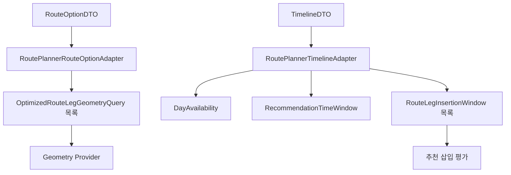

# 🔄 Free Time Recommender Adapters

Route Planner의 `RouteOptionDTO`와 `TimelineDTO`를 Free Time Recommender의 내부 도메인 모델로 변환합니다.

Adapter는 단순 필드 복사만 수행하지 않습니다.
외부 DTO의 장소 순서, Route Leg, Timeline, 이동수단과 시각 정합성을 검증하고, 안전하게 변환할 수 없는 입력은 명시적인 Adapter 오류로 거부합니다.

> 상위 문서: [Free Time Recommender](../README.md)

<br>

## 📚 목차

1. [🎯 디렉터리 역할](#-디렉터리-역할)
2. [📁 파일 구성](#-파일-구성)
3. [🔄 전체 변환 흐름](#-전체-변환-흐름)
4. [🗺️ RoutePlannerRouteOptionAdapter](#-routeplannerrouteoptionadapter)
5. [⏱️ RoutePlannerTimelineAdapter](#-routeplannertimelineadapter)
6. [📆 DayAvailability 변환](#-dayavailability-변환)
7. [🕰️ 마지막 구간 RecommendationTimeWindow](#-마지막-구간-recommendationtimewindow)
8. [🛣️ 전체 Route Leg 삽입 구간](#-전체-route-leg-삽입-구간)
9. [🌏 timezone 변환](#-timezone-변환)
10. [✅ 정합성 검증](#-정합성-검증)
11. [🚨 Adapter 오류](#-adapter-오류)
12. [🧪 테스트 관점](#-테스트-관점)
13. [⚠️ 현재 구조의 주의사항](#-현재-구조의-주의사항)
14. [🔗 관련 문서](#-관련-문서)

<br>


## 🎯 디렉터리 역할

`ai/free_time_recommender/adapters`는 다음 책임을 가집니다.

- Route Planner 이동수단을 추천 도메인 이동수단으로 변환
- Route Option을 Route Leg별 Geometry Query로 변환
- Route Stop, Route Leg와 Timeline 순서 검증
- Timeline 문자열 시각을 `datetime`으로 변환
- timezone-naive 시각에 여행 timezone 적용
- timezone-aware 시각을 여행 timezone으로 변환
- Timeline을 날짜 가용시간 모델로 변환
- Timeline 전체를 하나의 점유 구간으로 표현
- 마지막 방문지와 최종 도착지 사이의 추천 시간 범위 생성
- 모든 Route Leg의 삽입 가능 구간 생성
- 외부 DTO 계약 위반을 Adapter 전용 오류로 변환

Adapter의 위치는 다음과 같습니다.

```text
Route Planner DTO
→ Adapter 검증 및 변환
→ Free Time Recommender Domain
→ Application Use Case
```

<br>

## 📁 파일 구성

```text
ai/free_time_recommender/adapters/
├── README.md
├── errors.py
├── route_planner_route_option_adapter.py
└── route_planner_timeline_adapter.py
```

| 파일 | 책임 |
|---|---|
| `route_planner_route_option_adapter.py` | Route Option을 Route Leg별 Geometry Query로 변환 |
| `route_planner_timeline_adapter.py` | Timeline을 가용시간 및 삽입 구간 모델로 변환 |
| `errors.py` | Adapter 계약 오류 정의 |

<br>

---

## 🔄 전체 변환 흐름



Route Option과 Timeline은 서로 독립적인 입력처럼 보이지만 실제로는 다음 정합성을 공유합니다.

```text
day_index
travel_mode
ordered_stops
route_legs
timeline_stops
```

Adapter는 이 정보들이 서로 일치하는지 외부 Provider 호출 전에 검증합니다.

<br>

## 🗺️ RoutePlannerRouteOptionAdapter

`RoutePlannerRouteOptionAdapter`는 Route Planner의 최적화 방문 순서를 각 이동 구간의 Geometry Query로 변환합니다.

### 입력

```text
RouteOptionDTO
ZoneInfo
```

### 출력

```text
tuple[OptimizedRouteLegGeometryQuery, ...]
```

### 이동수단 변환

Route Planner와 Free Time Recommender는 서로 다른 Enum을 사용합니다.

```text
Route Planner TravelMode
→ Free Time Recommender RouteTravelMode
```

매핑:

```text
WALK    → WALK
DRIVE   → DRIVE
TRANSIT → TRANSIT
```

값은 같지만 타입은 다르므로 명시적인 Mapping을 사용합니다.

### 변환 전 필수 조건

다음 조건이 필요합니다.

```text
route_option은 RouteOptionDTO
timezone은 ZoneInfo
timeline 존재
missing_segments 없음
```

Timeline이 없으면 Geometry 요청을 만들 수 없습니다.

```text
timeline = None
→ RoutePlannerRouteOptionAdapterError
```

누락 구간이 있는 경로도 Geometry 생성 대상이 아닙니다.

```text
missing_segments 존재
→ RoutePlannerRouteOptionAdapterError
```

### Route Leg별 Query 생성

예:

```text
START → POI-A → POI-B → END
```

변환 결과:

```text
Leg 0: START → POI-A
Leg 1: POI-A → POI-B
Leg 2: POI-B → END
```

각 Query에는 다음 정보가 포함됩니다.

```text
OptimizedRouteLegGeometryQuery
├── day_index
├── leg_index
├── origin_place_id
├── destination_place_id
└── geometry_query
    ├── origin coordinate
    ├── destination coordinate
    ├── travel_mode
    └── departure_at
```

### departure_at

각 Route Leg의 출발시각은 해당 구간 출발 Stop의 Timeline 값을 사용합니다.

```text
timeline_stops[leg_index].departure_at
```

즉, 모든 구간이 동일한 여행 시작시각을 사용하는 것이 아닙니다.

```text
Leg 0
→ START 출발시각

Leg 1
→ POI-A 출발시각

Leg 2
→ POI-B 출발시각
```

이 방식은 특히 시간에 따라 경로 결과가 달라질 수 있는 TRANSIT Geometry 요청에 중요합니다.

<br>

## ✅ Route Option 검증

Geometry Query를 만들기 전에 다음 계약을 검증합니다.

### 정류장 수

```text
ordered_stops 수 ≥ 2
```

최소 START와 END가 필요합니다.

### Route Leg 수

```text
len(route_legs)
= len(ordered_stops) - 1
```

### Timeline Stop 수

```text
len(timeline_stops)
= len(ordered_stops)
```

### day_index

```text
timeline.day_index
= route_option.day_index
```

### 이동수단

```text
timeline.travel_mode
= route_option.travel_mode
```

### 전체 장소 순서

```text
timeline_stops의 place_id 순서
= ordered_stops의 place_id 순서
```

### 구간별 장소 연결

각 Route Leg는 같은 위치의 정류장 쌍과 일치해야 합니다.

```text
route_leg.origin_place_id
= ordered_stops[index].place_id
```

```text
route_leg.destination_place_id
= ordered_stops[index + 1].place_id
```

불일치하면 Geometry Provider를 호출하지 않습니다.

<br>

## ⏱️ RoutePlannerTimelineAdapter

`RoutePlannerTimelineAdapter`는 Route Planner의 Timeline을 추천 도메인에서 사용할 수 있는 시간 모델로 변환합니다.

주요 변환 메서드는 다음과 같습니다.

| 메서드 | 출력 |
|---|---|
| `to_day_availability()` | `DayAvailability` |
| `to_recommendation_time_window()` | 마지막 구간 전용 `RecommendationTimeWindow` |
| `to_route_leg_insertion_windows()` | 모든 Route Leg의 삽입 구간 |
| `to_timezone_aware_route_leg_insertion_windows()` | 여행 timezone이 적용된 모든 삽입 구간 |

### Timeline 해석

현재 Route Planner Timeline은 연속된 일정입니다.

```text
계획 시작
→ START
→ 이동
→ POI 체류
→ 이동
→ 다음 POI 체류
→ ...
→ END
→ 실제 종료
```

Stop 사이의 시간은 빈 시간이 아니라 이동시간입니다.

따라서 `to_day_availability()`에서는 각 Stop을 별도의 점유 구간으로 나누지 않고 전체 Timeline을 하나의 연속 점유 구간으로 처리합니다.

<br>

## 📆 DayAvailability 변환

`to_day_availability()`는 Timeline을 하루의 가용시간 모델로 변환합니다.

### 처리 순서

```text
1. Timeline 상위 시각 파싱
2. 계획 시작·종료·실제 종료 검증
3. Timeline Stop 파싱 및 구조 검증
4. 총 체류시간과 총 이동시간 검증
5. BusyTimeInterval 생성
6. DayAvailability 반환
```

### 상위 시각

파싱 대상:

```text
planned_start_at
planned_end_at
actual_end_at
```

모두 ISO 형식 문자열에서 `datetime`으로 변환됩니다.

### 점유 범위

점유 종료시각은 다음과 같습니다.

```text
busy_end_at
= min(actual_end_at, planned_end_at)
```

#### 실제 종료가 계획 종료보다 빠름

```text
계획 시작
→ 실제 종료
```

까지만 점유합니다.

#### 실제 종료가 계획 종료를 초과함

```text
계획 시작
→ 계획 종료
```

까지 점유합니다.

`DayAvailability` 범위 밖으로 Busy Interval이 나가지 않도록 계획 종료시각에서 자릅니다.

### 점유시간이 0분인 경우

```text
busy_end_at == planned_start_at
```

이면 `BusyTimeInterval`을 생성하지 않습니다.

### BusyTimeInterval 경계

시작 경계:

```text
첫 Timeline Stop의 place_id
```

종료 경계:

```text
마지막 Timeline Stop의 place_id
```

### 결과

```text
DayAvailability
├── day_index
├── start_at
├── end_at
└── busy_intervals
```

현재 Route Planner Timeline이 정상적인 연속 일정이라면 일반적으로 `busy_intervals`에는 하나의 구간이 들어갑니다.

<br>

## 🕰️ 마지막 구간 RecommendationTimeWindow

`to_recommendation_time_window()`는 마지막 방문지와 최종 도착지 사이의 추천 범위를 만듭니다.

### 대상 Stop

```text
previous_stop
= timeline_stops[-2]

next_stop
= timeline_stops[-1]
```

### 시작시각

```text
previous_stop.departure_at
```

### 종료시각

```text
timeline.planned_end_at
```

주의할 점은 최종 END의 실제 도착시각이 아니라 **계획 종료시각**을 Window의 끝으로 사용한다는 것입니다.

### 사용 가능 시간

```text
available_minutes
=
planned_end_at
- previous_stop.departure_at
```

### 검증

마지막 방문지 출발시각은 계획 종료시각보다 빨라야 합니다.

```text
window_start_at >= planned_end_at
→ RoutePlannerTimelineAdapterError
```

### 결과

```text
RecommendationTimeWindow
├── day_index
├── start_at
├── end_at
├── available_minutes
├── previous_place_id
└── next_place_id
```

이 메서드는 마지막 구간 하나만 대상으로 합니다.

현재 일반적인 Route Leg별 추천 파이프라인에서는 다음의 전체 구간 변환 메서드를 별도로 사용합니다.

<br>

## 🛣️ 전체 Route Leg 삽입 구간

`to_route_leg_insertion_windows()`는 Timeline의 모든 인접 Stop 쌍을 삽입 가능 구간으로 변환합니다.

예:

```text
START → POI-A → POI-B → END
```

결과:

```text
Window 0: START → POI-A
Window 1: POI-A → POI-B
Window 2: POI-B → END
```

### 공통 Timeline 검증

변환 전 `to_day_availability()`를 호출합니다.

따라서 다음 검증을 재사용합니다.

- 상위 시각
- Stop 순서
- 체류시간 합계
- 이동시간 합계
- Timeline 구조

### 원래 이동시간

각 Route Leg의 원래 이동시간은 Timeline 시각 차이로 계산합니다.

```text
original_travel_minutes
=
next_stop.arrival_at
- previous_stop.departure_at
```

### RouteLegInsertionWindow

각 구간에는 다음 정보가 포함됩니다.

```text
RouteLegInsertionWindow
├── day_index
├── leg_index
├── previous_place_id
├── next_place_id
├── previous_departure_at
├── next_arrival_at
├── original_travel_minutes
├── original_timeline_end_at
└── planned_end_at
```

이 구조를 통해 후보를 삽입했을 때 다음을 평가할 수 있습니다.

```text
원래 구간 이동시간
후보 경유 이동시간
일정 전체 종료 변화
계획 종료 초과 여부
```

### Route Leg 연결

`leg_index`는 Timeline Stop 인접 쌍의 순서를 그대로 사용합니다.

```text
zip(parsed_stops, parsed_stops[1:])
```

따라서 Route Option Adapter의 Geometry Query `leg_index`와 동일한 위치 체계를 공유해야 합니다.

<br>

## 🌏 timezone 변환

Route Planner Timeline은 현재 timezone offset이 없는 문자열을 생성할 수 있습니다.

Adapter는 두 방식으로 timezone을 처리합니다.

### Route Option Geometry 시각

`RoutePlannerRouteOptionAdapter._parse_datetime()`은 다음 규칙을 사용합니다.

```text
naive datetime
→ 전달받은 ZoneInfo를 직접 적용

aware datetime
→ 전달받은 ZoneInfo로 변환
```

또한 `Z` suffix를 `+00:00`으로 치환한 뒤 ISO 형식으로 파싱합니다.

```text
2026-07-23T00:30:00Z
→ UTC aware datetime
→ 여행 timezone 변환
```

### Route Leg 삽입 구간

`to_timezone_aware_route_leg_insertion_windows()`는 먼저 일반 삽입 Window를 만든 뒤 모든 시각에 여행 timezone을 적용합니다.

변환 대상:

```text
previous_departure_at
next_arrival_at
original_timeline_end_at
planned_end_at
```

처리 규칙:

```text
naive
→ timezone 적용

aware
→ timezone 변환
```

### ZoneInfo 타입

timezone은 문자열이 아니라 이미 생성된 `ZoneInfo` 객체여야 합니다.

```text
ZoneInfo("Asia/Seoul")
```

문자열을 직접 전달하면 TypeError가 발생합니다.

<br>

## ✅ 정합성 검증

Adapter 계층은 Route Planner DTO를 내부 도메인으로 변환하기 전에 강한 검증을 수행합니다.

### Route Option과 Timeline

```text
day_index 일치
travel_mode 일치
Stop 수 일치
place_id 순서 일치
```

### Route Stop과 Route Leg

```text
Route Leg 수
= Stop 수 - 1
```

```text
Route Leg origin/destination
= 인접 Stop place_id
```

### Timeline 상위 시각

검증 대상:

- 계획 종료가 계획 시작보다 늦은지
- 실제 종료가 계획 시작보다 빠르지 않은지
- timezone-aware와 naive 시각이 섞이지 않았는지
- `exceeds_planned_end`가 실제 시각 관계와 일치하는지

### Timeline Stop

검증 대상:

- Stop별 도착·출발 시각
- Stop 순서
- START와 END 구조
- Stop 사이 이동시간
- 체류시간과 도착·출발 차이
- Timeline 상위 시각과 첫·마지막 Stop 관계

### 총 체류시간

```text
TimelineDTO.total_stay_minutes
=
모든 Timeline Stop stay_minutes 합계
```

### 총 이동시간

```text
TimelineDTO.total_travel_minutes
=
각 이전 Stop 출발
→ 다음 Stop 도착
시간 차이 합계
```

이 검증을 통해 DTO 필드의 합계값과 실제 Timeline 시각이 서로 다른 입력을 거부합니다.

<br>

## 🚨 Adapter 오류

### RoutePlannerTimelineAdapterError

다음 상황에 사용됩니다.

```text
Route Planner Timeline 값이 올바르지 않음
또는
추천 도메인으로 안전하게 변환할 수 없음
```

상속:

```text
ValueError
```

### RoutePlannerRouteOptionAdapterError

Route Option 변환 계약 위반에 사용됩니다.

상속:

```text
ValueError
```

### 대표 오류 사례

#### Route Option Adapter

- Timeline 없음
- `missing_segments` 존재
- Stop 수 부족
- Route Leg 수 불일치
- Timeline Stop 수 불일치
- day_index 불일치
- 이동수단 불일치
- 장소 순서 불일치
- 잘못된 Timeline ISO 시각

#### Timeline Adapter

- 잘못된 계획 시작·종료 관계
- naive와 aware 시각 혼합
- Stop 구조 불일치
- 체류시간 합계 불일치
- 이동시간 합계 불일치
- 마지막 추천 Window 시작시각이 계획 종료 이후
- 잘못된 ISO 시각

Adapter는 이 오류들을 빈 Geometry Query나 빈 Window 목록으로 조용히 바꾸지 않습니다.

<br>

## 🧪 테스트 관점

### RoutePlannerRouteOptionAdapter

- 정상 START→END 경로
- 복수 POI Route Option
- WALK, DRIVE, TRANSIT 이동수단 변환
- Timeline 없는 Route Option
- `missing_segments` 존재
- Stop 1개 이하
- Route Leg 개수 불일치
- Timeline Stop 개수 불일치
- day_index 불일치
- travel_mode 불일치
- 전체 place_id 순서 불일치
- 개별 Route Leg 연결 불일치
- Geometry Query leg_index
- 각 Leg별 다른 departure_at

### 시각 파싱

- timezone-naive ISO 문자열
- timezone-aware ISO 문자열
- UTC `Z` 문자열
- 여행 timezone 변환
- 잘못된 ISO 문자열
- 문자열이 아닌 값

### DayAvailability

- 정상 연속 Timeline
- 실제 종료가 계획 종료보다 빠름
- 실제 종료가 계획 종료 초과
- 점유시간 0분
- 첫 START 경계
- 마지막 END 경계
- 하나의 Busy Interval 생성

### RecommendationTimeWindow

- 마지막 POI→END 구간
- START→END만 있는 경로
- available_minutes 계산
- 마지막 출발시각과 계획 종료시각 동일
- 마지막 출발시각이 계획 종료 이후

### RouteLegInsertionWindow

- 모든 Route Leg Window 생성
- leg_index 순서
- 원래 이동시간 계산
- 전체 Timeline 종료시각 보존
- 계획 종료시각 보존
- 복수 POI 경로의 Window 수

```text
Window 수
= Timeline Stop 수 - 1
```

### timezone-aware Window

- naive Timeline에 ZoneInfo 적용
- aware Timeline을 여행 timezone으로 변환
- 잘못된 timezone 타입
- 모든 datetime 필드에 timezone 적용

### 합계 검증

- total_stay_minutes 불일치
- total_travel_minutes 불일치
- Stop별 stay_minutes 불일치
- Stop 사이 음수 이동시간
- `exceeds_planned_end` 불일치

<br>

## ⚠️ 현재 구조의 주의사항

### 두 종류의 추천 시간 모델이 존재함

현재 Adapter는 다음 두 모델을 모두 제공합니다.

```text
RecommendationTimeWindow
→ 마지막 방문지와 END 사이 한 구간

RouteLegInsertionWindow
→ Timeline의 모든 Route Leg
```

두 모델의 목적이 다르므로 같은 개념으로 문서화하면 안 됩니다.

### to_day_availability는 빈 구간을 만들지 않음

현재 Route Planner Timeline 전체는 연속 일정으로 해석됩니다.

따라서 Stop 사이의 이동시간을 빈 시간으로 보지 않고 계획 시작부터 실제 종료까지 하나의 Busy Interval로 만듭니다.

### timezone 적용 방식

naive datetime에는 `replace(tzinfo=timezone)`을 사용합니다.

이 방식은 문자열을 해당 지역의 현지시각으로 해석하는 정책입니다.

이미 다른 timezone이 포함된 datetime은 `astimezone()`으로 변환합니다.

### ZoneInfo 생성은 호출 측 책임

Adapter는 timezone 문자열을 받아 검증하지 않습니다.

```text
"Asia/Seoul"
```

대신 이미 생성된 다음 객체를 요구합니다.

```python
ZoneInfo("Asia/Seoul")
```

### Timeline 검증이 반복될 수 있음

다음 메서드는 내부적으로 `to_day_availability()`를 호출해 Timeline 전체를 다시 검증합니다.

```text
to_recommendation_time_window()
to_route_leg_insertion_windows()
```

같은 Timeline에서 여러 변환을 수행하면 파싱과 검증이 반복될 수 있습니다.

### Route Planner Timeline 계약에 강하게 결합됨

Adapter는 다음 구조를 전제로 합니다.

```text
ordered_stops
route_legs
timeline_stops
```

Route Planner DTO 필드나 Timeline 생성 정책이 바뀌면 Adapter 검증과 변환도 함께 수정해야 합니다.

<br>

## 🔗 관련 문서

| 문서 | 설명 |
|---|---|
| [Free Time Recommender](../README.md) | 추천 모듈 전체 구조 |
| [Domain](../domain/README.md) | Geometry, 시간 예산과 장소 후보 모델 |
| [Application](../application/README.md) | Adapter 결과를 사용하는 추천 Use Case |
| [Providers](../providers/README.md) | Geometry와 후보 경로 Provider |
| [Route Planner Domain](../../route_planner/domain/README.md) | `RouteOptionDTO`와 `TimelineDTO` |
| [Route Planner Solvers](../../route_planner/solvers/README.md) | Route Option과 Timeline 생성 규칙 |
| [`RoutePlannerRouteOptionAdapter`](./route_planner_route_option_adapter.py) | Route Leg별 Geometry Query 변환 |
| [`RoutePlannerTimelineAdapter`](./route_planner_timeline_adapter.py) | Timeline 가용시간과 삽입 구간 변환 |
