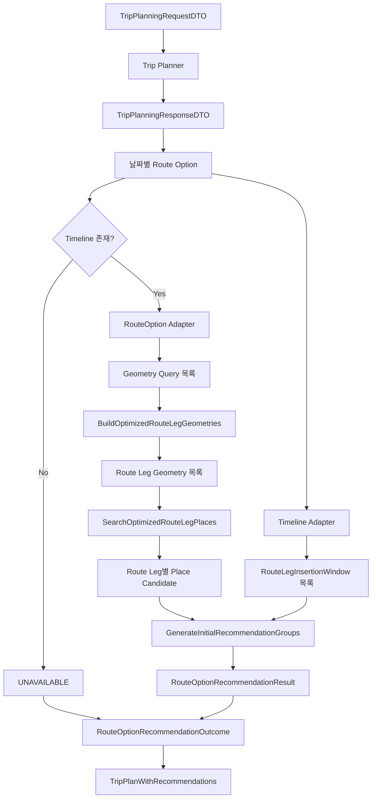

# 🧭 Free Time Recommender Application

Route Planner의 경로 옵션을 입력받아 Route Leg Geometry, 경로 주변 장소 후보, 삽입 가능 시간과 후보 경유 이동 지표를 결합하는 Application 계층입니다.

Application 계층은 추천 알고리즘의 실행 순서를 조정하지만 Google API를 직접 호출하지 않습니다.
외부 연동은 Port 인터페이스 뒤의 Provider에 위임하고, 추천 가능성은 Domain 정책과 모델을 사용해 평가합니다.

> 상위 문서: [Free Time Recommender](../README.md)

<br>

## 📚 목차

1. [🎯 디렉터리 역할](#-디렉터리-역할)
2. [📁 파일 구성](#-파일-구성)
3. [🔄 전체 실행 흐름](#-전체-실행-흐름)
4. [🔌 Application Ports](#-application-ports)
5. [🗺️ BuildOptimizedRouteLegGeometries](#-buildoptimizedrouteleggeometries)
6. [📍 SearchAlongRoutePlaces](#-searchalongrouteplaces)
7. [🧩 SearchOptimizedRouteLegPlaces](#-searchoptimizedroutelegplaces)
8. [✅ GenerateInitialRecommendationGroups](#-generateinitialrecommendationgroups)
9. [🚘 GenerateRouteOptionRecommendations](#-generaterouteoptionrecommendations)
10. [📦 Route Option 추천 결과](#-route-option-추천-결과)
11. [🚦 추천 가능·불가 옵션 보존](#-추천-가능불가-옵션-보존)
12. [🧳 PlanTripWithRecommendations](#-plantripwithrecommendations)
13. [🌏 timezone 처리](#-timezone-처리)
14. [🔁 순서와 중복 제거 정책](#-순서와-중복-제거-정책)
15. [🚨 오류 처리](#-오류-처리)
16. [🧪 테스트 관점](#-테스트-관점)
17. [⚠️ 현재 한계](#-현재-한계)
18. [🔗 관련 문서](#-관련-문서)

<br>


## 🎯 디렉터리 역할

`ai/free_time_recommender/application`은 다음 책임을 가집니다.

- 외부 Provider의 Port 계약 정의
- Route Leg별 Geometry 조회 순서 조정
- Geometry별 카테고리 장소 검색
- 여러 Route Leg의 검색 결과 병합
- Google Place ID 기반 전역 중복 제거
- 후보와 원래 Route Leg 식별 정보 결합
- Timeline을 Route Leg별 삽입 Window로 변환
- 후보 경유 이동시간과 거리 조회
- 추천 정책 적용
- 카테고리별 초기 추천 그룹 생성
- Route Option별 추천 결과 조립
- Timeline 없는 Route Option의 `UNAVAILABLE` 상태 보존
- Route Planner 실행과 추천 실행을 하나의 Facade로 결합
- 입력 순서와 날짜 순서 보존

Application 계층의 위치는 다음과 같습니다.

```text
Route Planner DTO
→ Adapter
→ Application Use Case
→ Provider Port
→ Domain Result
→ 추천 결과
```

<br>

## 📁 파일 구성

현재 주요 Application 파일은 다음과 같습니다.

```text
ai/free_time_recommender/application/
├── README.md
├── ports.py
├── factory.py
├── build_optimized_route_leg_geometries.py
├── search_along_route_places.py
├── search_optimized_route_leg_places.py
├── generate_initial_recommendation_groups.py
├── generate_route_option_recommendations.py
└── plan_trip_with_recommendations.py
```

| 파일 | 책임 |
|---|---|
| `ports.py` | Geometry, Places와 후보 이동 지표 Provider 계약 |
| `factory.py` | Provider와 Use Case 의존성 조립 |
| `build_optimized_route_leg_geometries.py` | Route Leg별 Geometry 생성 |
| `search_along_route_places.py` | 하나의 polyline에서 카테고리별 장소 검색 |
| `search_optimized_route_leg_places.py` | 모든 Route Leg 검색 결과 병합 및 중복 제거 |
| `generate_initial_recommendation_groups.py` | 삽입 Window와 후보 이동 지표 기반 추천 그룹 생성 |
| `generate_route_option_recommendations.py` | Route Option별 전체 추천 파이프라인 |
| `plan_trip_with_recommendations.py` | Route Planner와 추천 기능 통합 Facade |

<br>

---

## 🔄 전체 실행 흐름



Route Option 하나의 처리 순서:

```text
Route Option 검증
→ Route Leg별 Geometry Query 생성
→ Route Leg별 Geometry 조회
→ 각 Geometry 주변 장소 검색
→ 카테고리 우선순위 기준 병합
→ Place ID 중복 제거
→ Timeline의 모든 Route Leg를 삽입 Window로 변환
→ 후보별 경유 이동 지표 조회
→ 추천 정책 평가
→ 카테고리별 추천 그룹 생성
→ 원본 Route Option과 함께 반환
```

<br>

## 🔌 Application Ports

Application은 구체적인 Google Provider 클래스에 직접 의존하지 않고 `ports.py`에 정의된 계약을 사용합니다.

대표적인 Port 책임:

```text
RouteGeometryProvider
→ RouteGeometryQuery를 RouteLegGeometry로 변환

AlongRoutePlaceProvider
→ AlongRoutePlaceSearchQuery로 장소 후보 검색

CandidateRouteMetricsProvider
→ 후보 경유 이동시간과 거리 조회
```

의존 방향:

```text
Application Use Case
→ Port Protocol
← Google Provider 구현
```

이를 통해 테스트에서는 실제 네트워크 호출 없이 Fake 또는 Stub Provider를 주입할 수 있습니다.

### Port 설계 원칙

Provider에는 Route Planner의 외부 DTO를 직접 전달하지 않습니다.

예:

```text
잘못된 방향:
RouteOptionDTO
→ GoogleRoutesGeometryProvider

현재 방향:
RouteOptionDTO
→ Adapter
→ RouteGeometryQuery
→ RouteGeometryProvider
```

Application과 Provider 사이에는 Free Time Recommender의 순수 Domain 모델만 전달됩니다.

<br>

## 🗺️ BuildOptimizedRouteLegGeometries

`BuildOptimizedRouteLegGeometries`는 Route Leg별 Geometry Query를 Provider에 순서대로 전달합니다.

### 입력

```text
tuple[OptimizedRouteLegGeometryQuery, ...]
```

### 출력

```text
tuple[OptimizedRouteLegGeometry, ...]
```

### 처리 흐름

```text
OptimizedRouteLegGeometryQuery
→ query.geometry_query
→ RouteGeometryProvider.get_route_geometry()
→ RouteLegGeometry
→ 원래 Route Leg 식별 정보와 결합
```

결합되는 정보:

```text
day_index
leg_index
origin_place_id
destination_place_id
geometry
```

### 입력 검증

- `queries`는 tuple
- 각 원소는 `OptimizedRouteLegGeometryQuery`

빈 tuple은 허용되며 빈 결과를 반환합니다.

### 순서 보존

입력 Query를 앞에서부터 순차 처리합니다.

```text
입력 Leg 0, 1, 2
→ 결과 Leg 0, 1, 2
```

`leg_index`가 결과에 함께 저장되므로 향후 비동기 또는 병렬 조회로 변경하더라도 원래 구간과 다시 결합할 기준이 존재합니다.

### Provider 오류

Provider 오류를 빈 Geometry로 바꾸지 않습니다.

```text
Geometry Provider 오류
→ 그대로 호출자에게 전파
```

일부 구간만 성공한 불완전 결과도 반환하지 않습니다.

<br>

## 📍 SearchAlongRoutePlaces

`SearchAlongRoutePlaces`는 하나의 encoded polyline에서 서버 관리 카테고리를 순서대로 검색합니다.

개념적 입력:

```text
SearchAlongRoutePlacesRequest
└── encoded_polyline
```

출력:

```text
tuple[CategoryPlaceCandidates, ...]
```

### 카테고리 카탈로그

검색 카테고리와 순서는 `RecommendationCategoryCatalog`에서 가져옵니다.

기본 순서:

```text
LANDMARK
CAFE
CULTURE
PARK
RESTAURANT
```

### 카테고리별 Query

각 카테고리에 대해 다음 Query를 생성합니다.

```text
AlongRoutePlaceSearchQuery
├── encoded_polyline
├── category
├── page_size
├── language_code
└── region_code
```

검색 결과는 카테고리 표시명과 함께 묶습니다.

```text
CategoryPlaceCandidates
├── category
├── display_name
└── candidates
```

### 검색 순서

카테고리 카탈로그 순서대로 Provider를 호출하고 결과 순서도 유지합니다.

이 순서는 이후 여러 Route Leg 결과를 병합할 때 중복 후보의 대표 카테고리를 결정하는 기준이 됩니다.

<br>

## 🧩 SearchOptimizedRouteLegPlaces

`SearchOptimizedRouteLegPlaces`는 최적화 경로의 모든 Route Leg Geometry에서 장소 후보를 검색합니다.

### 입력

```text
tuple[OptimizedRouteLegGeometry, ...]
```

### 출력

```text
tuple[CategoryRouteLegPlaceCandidates, ...]
```

### 빈 Geometry

```text
geometries = ()
→ ()
```

빈 경로를 오류로 처리하지 않고 빈 결과를 반환합니다.

### 구간별 검색

각 Geometry의 encoded polyline을 `SearchAlongRoutePlaces`에 전달합니다.

```text
Leg 0 Geometry
→ 카테고리별 후보

Leg 1 Geometry
→ 카테고리별 후보

Leg 2 Geometry
→ 카테고리별 후보
```

먼저 모든 구간의 검색을 완료한 뒤 카테고리 단위로 결과를 합칩니다.

### 카테고리 구성 검증

모든 Route Leg 검색 결과는 동일한 카테고리 수와 순서를 가져야 합니다.

검증:

```text
구간별 그룹 수 동일
카테고리별 위치 동일
```

불일치하면 ValueError가 발생합니다.

### Place ID 전역 중복 제거

중복 제거 Set:

```text
seen_place_ids
```

이 Set은 카테고리마다 초기화되지 않고 전체 병합 과정에서 하나만 사용됩니다.

따라서 동일한 `place_id`는 다음 경우에도 한 번만 유지됩니다.

```text
여러 Route Leg에서 발견
여러 카테고리에서 발견
동일 구간의 중복 응답
```

### 대표 후보 선택

카테고리 카탈로그 순서와 Route Leg 처리 순서에서 처음 발견된 후보를 유지합니다.

```text
먼저 처리된 카테고리
→ 대표 카테고리

같은 카테고리라면 먼저 처리된 Route Leg
→ 대표 Route Leg
```

### 원래 Route Leg 연결

유지된 후보는 다음 정보와 결합됩니다.

```text
RouteLegPlaceCandidate
├── candidate
├── day_index
├── leg_index
├── origin_place_id
└── destination_place_id
```

후보는 자신이 처음 유지된 Route Leg에서만 후속 삽입 평가를 받습니다.

<br>

## ✅ GenerateInitialRecommendationGroups

`GenerateInitialRecommendationGroups`는 검색된 후보와 Route Leg별 삽입 Window를 결합해 초기 추천 그룹을 생성합니다.

개념적 요청:

```text
GenerateInitialRecommendationGroupsRequest
├── candidate_groups
├── insertion_windows
├── travel_mode
└── policy
```

### 입력 관계

```text
RouteLegPlaceCandidate.leg_index
↔
RouteLegInsertionWindow.leg_index
```

후보는 자신이 발견된 Route Leg와 같은 `leg_index`의 Window에서 평가됩니다.

다른 Route Leg Window에 반복 대입하지 않습니다.

### 후보 경유 지표

후보마다 Candidate Route Metrics Provider를 사용해 다음 두 구간을 조회합니다.

```text
이전 장소 → 후보
후보 → 다음 장소
```

Provider는 첫 번째 이동시간과 체류시간을 반영해 두 번째 요청 출발시각을 계산합니다.

### 정책 평가

추천 판단에는 다음 성격의 조건이 사용됩니다.

```text
양쪽 편도 이동시간
양쪽 편도 거리
후보 최소 체류시간
원래 Route Leg 이동시간
후보 경유 후 전체 Timeline 종료
계획 종료 초과 여부
후보 제한 수
```

도메인의 `EvaluateRecommendationFeasibility`는 시간 예산을 계산하며, 거리와 Route Leg 삽입 영향은 Application에서 조회한 이동 지표와 함께 판단됩니다.

### 후보 제한

검색 결과 전체를 무제한으로 이동 지표 조회하지 않습니다.

정책과 Application 설정에 따라 실제 평가 및 결과 후보 수를 제한합니다.

검색 요청의 `page_size`와 최종 추천의 `candidate_limit`은 서로 다른 개념입니다.

### 결과

카테고리별 초기 추천 그룹은 원본 후보와 계산된 삽입 영향 정보를 보존합니다.

추천은 기존 Route Option을 직접 변경하지 않습니다.

```text
원본 경로
→ 그대로 유지

추천 후보
→ 별도 결과로 결합
```

<br>

## 🚘 GenerateRouteOptionRecommendations

`GenerateRouteOptionRecommendations`는 Route Option 단위 추천 파이프라인의 중심 Use Case입니다.

### 의존성

```text
GenerateRouteOptionRecommendations
├── RoutePlannerRouteOptionAdapter
├── RoutePlannerTimelineAdapter
├── BuildOptimizedRouteLegGeometries
├── SearchOptimizedRouteLegPlaces
└── GenerateInitialRecommendationGroups
```

### 입력

```text
route_options: tuple[RouteOptionDTO, ...]
timezone: ZoneInfo
policy: RecommendationPolicy
```

### 출력

```text
tuple[RouteOptionRecommendationResult, ...]
```

### 입력 검증

- `route_options`는 tuple
- `route_options`는 비어 있지 않음
- 모든 원소는 `RouteOptionDTO`
- `timezone`은 `ZoneInfo`
- `policy`는 `RecommendationPolicy`
- 모든 Route Option에 Timeline 존재

Timeline이 없는 옵션은 이 Use Case에 직접 전달하면 ValueError가 발생합니다.

```text
timeline = None
→ 추천 실행 불가
```

Timeline 없는 옵션의 상태 보존은 상위 Outcome Generator가 담당합니다.

### 옵션별 실행 순서

각 Route Option에 대해 다음 순서로 처리합니다.

```text
1. Route Option → Geometry Query
2. Geometry Query → Route Leg Geometry
3. Route Leg Geometry → 장소 후보 그룹
4. Timeline → timezone-aware Route Leg Window
5. 후보 + Window + 정책 → 추천 그룹
6. 원본 Route Option과 결과 결합
```

### 이동수단

추천 그룹 생성에 사용할 이동수단은 첫 Geometry Query에서 가져옵니다.

```text
queries[0].geometry_query.travel_mode
```

따라서 정상 Route Option은 최소 하나 이상의 Route Leg와 Geometry Query를 가져야 합니다.

START와 END만 있는 경로도 Route Leg 하나가 존재하므로 정상 처리할 수 있습니다.

### 입력 순서 보존

Route Option을 입력 순서대로 처리하고 결과도 같은 순서로 반환합니다.

```text
DRIVE
WALK
TRANSIT

→ DRIVE 추천
→ WALK 추천
→ TRANSIT 추천
```

단, 이 Use Case 자체에는 Timeline 없는 옵션을 건너뛰는 로직이 없습니다.

<br>

## 📦 Route Option 추천 결과

### RouteOptionRecommendationResult

한 Route Option의 정상 추천 결과입니다.

```text
RouteOptionRecommendationResult
├── route_option
├── route_leg_geometries
└── recommendation_groups
```

검증 규칙:

- `route_option`은 `RouteOptionDTO`
- `route_leg_geometries`는 tuple
- `recommendation_groups`는 tuple

### 원본 Route Option

결과는 원본 Route Option을 그대로 포함합니다.

```text
추천 전 Route Option
= 추천 결과 내부 Route Option
```

Application은 방문 순서, Route Leg 또는 Timeline을 수정하지 않습니다.

### Route Leg Geometry

각 Geometry에는 원래 구간 식별자가 함께 보존됩니다.

```text
day_index
leg_index
origin_place_id
destination_place_id
encoded polyline
```

### Recommendation Groups

장소 후보, 원래 발견 구간, 후보 경유 이동 지표와 추천 가능성 결과를 카테고리별로 포함합니다.

빈 추천 그룹 또는 후보가 없는 카테고리도 도메인 계약에 따라 유지될 수 있습니다.

<br>

## 🚦 추천 가능·불가 옵션 보존

`GenerateRouteOptionRecommendationOutcomes`는 Timeline 없는 Route Option을 결과에서 삭제하지 않습니다.

### 추천 가능한 옵션

```text
timeline 존재
→ available 목록에 포함
→ 실제 추천 Generator 실행
→ SUCCESS
```

### 추천 불가능한 옵션

```text
timeline 없음
→ Generator에 전달하지 않음
→ UNAVAILABLE
→ recommendation = None
```

### 결과 모델

```text
RouteOptionRecommendationOutcome
├── route_option
├── status
└── recommendation
```

상태:

```text
SUCCESS
UNAVAILABLE
```

### 상태 불변조건

#### SUCCESS

```text
recommendation 존재
recommendation.route_option = route_option
```

#### UNAVAILABLE

```text
recommendation = None
```

### 순서 복원

먼저 Timeline 있는 옵션만 모아 한 번에 추천을 생성합니다.

이후 원본 Route Option 목록을 다시 순회하면서 결과를 배치합니다.

예:

```text
원본:
DRIVE   timeline 있음
WALK    timeline 없음
TRANSIT timeline 있음
```

추천 실행 대상:

```text
DRIVE
TRANSIT
```

최종 Outcome:

```text
DRIVE   SUCCESS
WALK    UNAVAILABLE
TRANSIT SUCCESS
```

원본 이동수단 순서가 유지됩니다.

### 결과 수 검증

추천 Generator가 반환한 결과 수는 사용 가능한 Route Option 수와 같아야 합니다.

```text
추천 결과 수
≠
Timeline 있는 옵션 수
→ ValueError
```

<br>

## 🧳 PlanTripWithRecommendations

`PlanTripWithRecommendations`는 경로 최적화와 추천을 요청 한 번으로 실행하는 Application Facade입니다.

### 의존성

```text
PlanTripWithRecommendations
├── TripPlanner
└── RouteOptionRecommendationGenerator
```

두 의존성 모두 Protocol 계약으로 주입됩니다.

### 입력

```text
TripPlanningRequestDTO
RecommendationPolicy
```

### 출력

```text
TripPlanWithRecommendations
├── planning
└── day_recommendations
```

### 실행 순서

```text
1. 요청 타입 검증
2. 추천 정책 타입 검증
3. 요청 timezone을 ZoneInfo로 변환
4. Trip Planner 실행
5. Planning 결과 검증
6. 날짜별 Route Option 수집
7. 추천 Outcome 생성
8. 원본 Planning과 날짜별 추천 결합
```

### timezone 검증

```text
ZoneInfo(request.timezone)
```

지원하지 않는 IANA timezone이면 ValueError가 발생합니다.

### Trip Planner 결과 타입

Trip Planner는 반드시 다음 타입을 반환해야 합니다.

```text
TripPlanningResponseDTO
```

다른 타입이면 TypeError가 발생합니다.

### trip_id 검증

```text
planning.trip_id
=
request.trip_id
```

불일치하면 다른 여행 결과가 잘못 결합되는 것을 막기 위해 실패합니다.

### 날짜 존재

```text
planning.day_plans가 비어 있음
→ ValueError
```

### day_index 중복

Planning 결과의 날짜 `day_index`는 고유해야 합니다.

```text
중복 day_index
→ ValueError
```

### 날짜별 Route Option

각 날짜에는 최소 하나의 Route Option이 필요합니다.

```text
route_options가 비어 있음
→ ValueError
```

또한 모든 Route Option의 `day_index`가 상위 DayPlan과 같아야 합니다.

### 결과 조립

날짜별 결과:

```text
DayRouteOptionRecommendations
├── day_index
└── route_options
```

최종 결과:

```text
TripPlanWithRecommendations
├── planning
└── day_recommendations
```

원본 `TripPlanningResponseDTO`를 수정하지 않고 그대로 `planning` 필드에 보존합니다.

<br>

## 🌏 timezone 처리

Application은 요청의 timezone 문자열을 `ZoneInfo`로 변환합니다.

```text
request.timezone
→ ZoneInfo
```

생성된 `ZoneInfo`는 다음 단계에 전달됩니다.

```text
RoutePlannerRouteOptionAdapter
RoutePlannerTimelineAdapter
GenerateRouteOptionRecommendations
```

### Geometry Query

Timeline의 각 Route Leg 출발시각에 여행 timezone을 적용합니다.

```text
naive Timeline 시각
→ 여행 timezone 적용

aware Timeline 시각
→ 여행 timezone으로 변환
```

### Insertion Window

모든 Route Leg Window의 다음 시각을 timezone-aware datetime으로 변환합니다.

```text
previous_departure_at
next_arrival_at
original_timeline_end_at
planned_end_at
```

### Provider 전달

Geometry Provider와 Candidate Metrics Provider에는 timezone-aware datetime이 전달됩니다.

Provider는 이를 UTC 문자열로 변환해 Google API에 전송합니다.

<br>

## 🔁 순서와 중복 제거 정책

Application의 결과는 여러 단계에서 입력 순서를 보존합니다.

### Route Option 순서

```text
입력 Route Option 순서
=
추천 결과 순서
=
Outcome 순서
```

### Route Leg 순서

```text
Geometry Query 순서
=
Geometry 결과 순서
=
Timeline Window leg_index
```

### 카테고리 순서

```text
RecommendationCategoryCatalog 순서
=
검색 결과 그룹 순서
=
병합 결과 그룹 순서
```

### Place Candidate 중복 제거

중복 기준:

```text
PlaceCandidate.place_id
```

적용 범위:

```text
모든 Route Leg
+
모든 카테고리
```

대표 후보는 처리 순서상 최초로 발견된 항목입니다.

이 정책은 평점이나 거리로 가장 좋은 중복 후보를 선택하는 것이 아닙니다.

<br>

## 🚨 오류 처리

Application은 외부 오류나 계약 오류를 빈 추천으로 바꾸지 않습니다.

### 입력 타입 오류

대표 사례:

- tuple이 아닌 Route Option 목록
- 잘못된 Route Option 원소
- 잘못된 `ZoneInfo`
- 잘못된 `RecommendationPolicy`
- 잘못된 Geometry Query
- 잘못된 Geometry 결과

### Route Planner 계약 오류

대표 사례:

- Timeline 없는 옵션을 직접 추천 Generator에 전달
- `trip_id` 불일치
- 날짜 결과 없음
- 중복 `day_index`
- 날짜별 Route Option 없음
- DayPlan과 Route Option의 `day_index` 불일치

### Adapter 오류

Route Option, Route Leg와 Timeline 정합성 오류는 Adapter에서 발생하고 Application으로 전파됩니다.

### Provider 오류

다음 오류를 빈 결과로 바꾸지 않습니다.

- Geometry timeout
- Places timeout
- Candidate Metrics timeout
- Transport 오류
- HTTP 오류
- 잘못된 JSON
- 잘못된 외부 응답 구조

### 검색 결과 없음

정상적인 빈 Places 결과는 오류가 아닙니다.

```text
후보 없음
→ 빈 후보 그룹
```

### Timeline 없음

Timeline 없는 Route Option은 통합 흐름에서 오류가 아니라 다음 상태로 보존됩니다.

```text
UNAVAILABLE
```

단, `GenerateRouteOptionRecommendations`에 직접 전달하면 ValueError입니다.

<br>

## 🧪 테스트 관점

### BuildOptimizedRouteLegGeometries

- 빈 Query tuple
- 단일 Route Leg
- 복수 Route Leg
- 입력 순서 보존
- `day_index`와 `leg_index` 보존
- 출발·도착 Place ID 보존
- 잘못된 Query 타입
- Provider 오류 전파
- 일부 처리 후 Provider 오류

### SearchAlongRoutePlaces

- 기본 카테고리 순서
- 카테고리별 Query 생성
- encoded polyline 전달
- page size
- language code
- region code
- 빈 후보
- Provider 오류 전파

### SearchOptimizedRouteLegPlaces

- 빈 Geometry
- 단일 Leg 검색
- 복수 Leg 검색
- 카테고리 수 불일치
- 카테고리 순서 불일치
- 같은 Place ID의 구간 간 중복
- 같은 Place ID의 카테고리 간 중복
- 최초 카테고리 유지
- 최초 Route Leg 유지
- 후보의 `day_index`
- 후보의 `leg_index`
- 출발·도착 Place ID

### GenerateInitialRecommendationGroups

- 후보와 Window `leg_index` 연결
- 후보를 다른 Window에서 평가하지 않는지
- 후보 전후 이동 지표 조회
- 체류시간 반영
- 편도 이동시간 경계값
- 편도 거리 경계값
- 계획 종료 경계값
- 추천 불가 사유
- 카테고리별 후보 제한
- 후보가 없는 그룹
- Provider 오류 전파

### GenerateRouteOptionRecommendations

- 빈 Route Option tuple
- list 입력
- 잘못된 Route Option 원소
- Timeline 없는 Route Option
- 잘못된 timezone 타입
- 잘못된 Policy
- Adapter 호출 순서
- Geometry Builder 호출 순서
- Places 검색 호출 순서
- Timeline Window 변환
- 추천 그룹 생성
- Route Option 결과 순서
- 원본 Route Option 보존

### Recommendation Outcomes

- 모든 옵션 Timeline 있음
- 일부 옵션 Timeline 없음
- 모든 옵션 Timeline 없음
- DRIVE, WALK, TRANSIT 순서 보존
- 결과 수 불일치
- SUCCESS의 추천 누락
- SUCCESS의 Route Option 불일치
- UNAVAILABLE의 추천 존재

### PlanTripWithRecommendations

- 정상 통합 실행
- 잘못된 요청 타입
- 잘못된 Policy 타입
- 유효하지 않은 IANA timezone
- Trip Planner 결과 타입 오류
- `trip_id` 불일치
- 빈 날짜 결과
- 중복 `day_index`
- 빈 Route Option
- DayPlan과 Route Option의 날짜 불일치
- 날짜 순서 보존
- Planning 원본 보존

<br>

## ⚠️ 현재 한계

- Geometry와 Places 검색은 Route Leg별로 순차 실행됩니다.
- Candidate Metrics는 후보마다 두 번의 Google Routes 요청이 필요합니다.
- 후보 수 증가에 따라 외부 API 호출 수가 빠르게 증가합니다.
- Application 수준의 병렬 처리, 배치 처리와 요청 cache가 없습니다.
- 일부 Provider 요청 성공 후 후속 요청이 실패하면 부분 결과를 반환하지 않습니다.
- Timeline 없는 옵션은 추천할 수 없으며 `UNAVAILABLE`로만 보존됩니다.
- 검색 후보 중복은 Place ID 최초 발견 기준으로 제거합니다.
- 중복 후보의 평점, 거리 또는 삽입 영향 비교는 수행하지 않습니다.
- 검색 카테고리 순서가 대표 카테고리 결정에도 영향을 줍니다.
- Route Option Generator는 빈 Route Option 목록을 허용하지 않습니다.
- Geometry Query의 첫 번째 이동수단을 전체 추천 그룹의 이동수단으로 사용합니다.
- Route Option 내부에서 이동수단이 구간별로 달라지는 구조는 지원하지 않습니다.
- 추천 결과는 원본 일정을 자동 수정하거나 저장하지 않습니다.
- 사용자 선택 결과를 학습하거나 다음 추천에 반영하지 않습니다.
- 영업시간, 휴무일과 예약 가능 여부는 완전한 강제 제약으로 처리되지 않습니다.
- 통합 Facade는 Route Planner 전체 실행이 성공한 뒤에만 추천을 시작합니다.
- Provider 오류에 대한 retry와 fallback이 없습니다.

<br>

## 🔗 관련 문서

| 문서 | 설명 |
|---|---|
| [Free Time Recommender](../README.md) | 추천 모듈 전체 구조 |
| [Domain](../domain/README.md) | 장소 후보, Geometry, 시간 예산과 추천 정책 |
| [Adapters](../adapters/README.md) | Route Option과 Timeline 변환 |
| [Providers](../providers/README.md) | Google Places와 Routes 구현 |
| [Route Planner](../../route_planner/README.md) | 일정 최적화와 Route Option 생성 |
| [Route Planner Application](../../route_planner/application/README.md) | Trip Planner 전체 실행 흐름 |
| [`GenerateRouteOptionRecommendations`](./generate_route_option_recommendations.py) | Route Option 단위 추천 파이프라인 |
| [`PlanTripWithRecommendations`](./plan_trip_with_recommendations.py) | 경로 최적화와 추천 통합 Facade |
