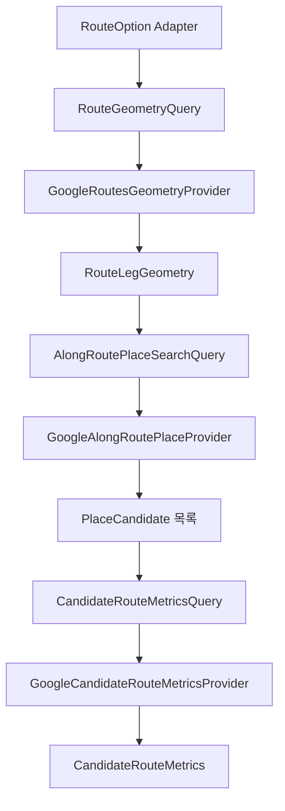

# 🌐 Free Time Recommender Providers

Free Time Recommender가 사용하는 Google Places 및 Google Routes 외부 연동 구현을 설명합니다.

Provider 계층은 다음 세 가지 정보를 제공합니다.

```text
Route Leg Geometry
경로 주변 장소 후보
후보 경유 이동시간과 거리
```

각 Provider는 외부 응답을 내부 도메인 모델로 변환하며, timeout, 네트워크 오류, HTTP 오류와 잘못된 응답을 명시적인 Provider 오류로 전달합니다.

> 상위 문서: [Free Time Recommender](../README.md)

<br>

## 📚 목차

1. [🎯 디렉터리 역할](#-디렉터리-역할)
2. [📁 파일 구성](#-파일-구성)
3. [🔄 전체 Provider 흐름](#-전체-provider-흐름)
4. [🗺️ GoogleRoutesGeometryProvider](#-googleroutesgeometryprovider)
5. [📍 GoogleAlongRoutePlaceProvider](#-googlealongrouteplaceprovider)
6. [🚶 GoogleCandidateRouteMetricsProvider](#-googlecandidateroutemetricsprovider)
7. [🕒 출발시각 처리](#-출발시각-처리)
8. [⏱️ 이동시간 반올림 정책](#-이동시간-반올림-정책)
9. [📨 요청 Header와 Field Mask](#-요청-header와-field-mask)
10. [✅ 응답 검증](#-응답-검증)
11. [🚨 오류 처리](#-오류-처리)
12. [🔐 API Key와 민감정보](#-api-key와-민감정보)
13. [🧪 테스트 관점](#-테스트-관점)
14. [⚠️ 현재 한계](#-현재-한계)
15. [🔗 관련 문서](#-관련-문서)

<br>


## 🎯 디렉터리 역할

`ai/free_time_recommender/providers`는 다음 책임을 가집니다.

- Google Routes Compute Routes를 이용한 Route Leg polyline 생성
- Google Places Text Search를 이용한 경로 주변 장소 검색
- Google Routes Compute Routes를 이용한 후보 경유 이동시간과 거리 조회
- 내부 Domain Query를 Google API Payload로 변환
- 외부 응답을 내부 Domain Model로 변환
- 출발시각을 UTC 문자열로 변환
- DRIVE 요청에 교통량 반영 설정 적용
- duration을 분 단위 이동시간으로 변환
- timeout, 네트워크, HTTP와 응답 형식 오류 구분
- 테스트용 `httpx.BaseTransport` 주입 지원

Provider는 추천 정책을 결정하지 않습니다.

```text
Application
→ Provider Query
→ Google API
→ Domain Result
→ Application
→ 추천 정책 평가
```

<br>

## 📁 파일 구성

```text
ai/free_time_recommender/providers/
├── README.md
├── errors.py
├── google_along_route_place_provider.py
├── google_candidate_route_metrics_provider.py
└── google_routes_geometry_provider.py
```

| 파일 | 책임 |
|---|---|
| `google_routes_geometry_provider.py` | Route Leg의 encoded polyline 조회 |
| `google_along_route_place_provider.py` | polyline 주변 장소 후보 검색 |
| `google_candidate_route_metrics_provider.py` | 후보 전후 이동시간과 거리 조회 |
| `errors.py` | Provider별 timeout, transport, HTTP와 응답 오류 |

<br>

---

## 🔄 전체 Provider 흐름



전체 추천 흐름에서 Provider 호출 순서는 다음과 같습니다.

```text
1. Route Leg별 Geometry 조회
2. Geometry polyline 주변 장소 검색
3. 후보별 이전 장소→후보 이동 지표 조회
4. 후보 체류시간 반영
5. 후보→다음 장소 이동 지표 조회
```

<br>

## 🗺️ GoogleRoutesGeometryProvider

`GoogleRoutesGeometryProvider`는 Route Leg의 실제 도로 또는 대중교통 경로를 encoded polyline으로 조회합니다.

### Endpoint

```text
https://routes.googleapis.com/directions/v2:computeRoutes
```

### 입력

```text
RouteGeometryQuery
├── origin
├── destination
├── travel_mode
└── departure_at
```

### 출력

```text
RouteLegGeometry
└── encoded_polyline
```

### 생성자

```python
GoogleRoutesGeometryProvider(
    api_key: str,
    timeout_seconds: float = 20.0,
    transport: httpx.BaseTransport | None = None,
)
```

검증 규칙:

- `api_key`는 비어 있지 않은 문자열
- `timeout_seconds`는 0보다 큰 유한한 숫자
- bool은 timeout 숫자로 허용하지 않음

### 요청 Payload

```text
origin
destination
travelMode
computeAlternativeRoutes = false
polylineQuality = OVERVIEW
polylineEncoding = ENCODED_POLYLINE
```

좌표는 다음 Google Waypoint 형식으로 변환됩니다.

```json
{
  "location": {
    "latLng": {
      "latitude": 35.0,
      "longitude": 139.0
    }
  }
}
```

### 출발시각

`query.departure_at`이 존재하면 UTC로 변환해 요청에 포함합니다.

```text
timezone-aware datetime
→ UTC
→ RFC 3339 Z 문자열
```

예:

```text
2026-07-23T09:30:00+09:00
→ 2026-07-23T00:30:00Z
```

### DRIVE 교통 설정

DRIVE 요청에 출발시각이 포함되면 다음 설정을 추가합니다.

```text
routingPreference = TRAFFIC_AWARE
```

Google Routes의 기본 `TRAFFIC_UNAWARE` 상태에서 출발시각을 보내지 않도록 명시적으로 교통량 반영 모드를 사용합니다.

### Field Mask

```text
routes.polyline.encodedPolyline
```

Geometry 생성에 필요한 polyline만 요청합니다.

### 응답 조건

정상 응답에는 정확히 하나의 Route가 필요합니다.

```text
routes 수 = 1
```

그리고 다음 값이 존재해야 합니다.

```text
routes[0].polyline.encodedPolyline
```

빈 문자열이나 공백 문자열은 허용하지 않습니다.

<br>

## 📍 GoogleAlongRoutePlaceProvider

`GoogleAlongRoutePlaceProvider`는 Google Places Text Search의 경로 편향 검색을 사용합니다.

### Endpoint

```text
https://places.googleapis.com/v1/places:searchText
```

### 입력

```text
AlongRoutePlaceSearchQuery
├── encoded_polyline
├── category
├── page_size
├── language_code
└── region_code
```

### 출력

```text
tuple[PlaceCandidate, ...]
```

### 생성자

```python
GoogleAlongRoutePlaceProvider(
    api_key: str,
    timeout_seconds: float = 20.0,
    transport: httpx.BaseTransport | None = None,
)
```

검증 규칙은 Geometry Provider와 같습니다.

- 비어 있지 않은 API Key
- 0보다 큰 유한한 timeout
- bool timeout 거부

### 카테고리 검색어

각 서버 관리 카테고리를 Google Text Search 문자열로 변환합니다.

```text
LANDMARK   → 랜드마크 관광명소
CAFE       → 카페
CULTURE    → 박물관 미술관 전시관
PARK       → 공원 정원
RESTAURANT → 음식점
```

### 요청 Payload

```json
{
  "textQuery": "카페",
  "pageSize": 10,
  "languageCode": "ko",
  "regionCode": "JP",
  "searchAlongRouteParameters": {
    "polyline": {
      "encodedPolyline": "..."
    }
  }
}
```

실제 `languageCode`와 `regionCode`는 Query에서 전달받습니다.

### Field Mask

```text
places.id
places.displayName
places.formattedAddress
places.location
places.rating
places.userRatingCount
```

### 응답 변환

각 장소 응답을 다음 모델로 변환합니다.

```text
PlaceCandidate
├── place_id
├── name
├── coordinate
├── category
├── formatted_address
├── rating
└── user_rating_count
```

카테고리는 Google 응답에서 읽는 것이 아니라 요청에 사용한 서버 카테고리를 그대로 부여합니다.

```text
Search Query category
→ PlaceCandidate.category
```

### 빈 검색 결과

응답에 `places`가 없으면 기본 빈 배열로 처리합니다.

```text
places 없음
→ ()
```

이는 정상적인 검색 결과 없음으로 취급됩니다.

### 잘못된 Place

장소 하나라도 필수 필드나 타입이 잘못되면 전체 응답을 실패로 처리합니다.

```text
일부 Place 파싱 실패
→ 해당 후보만 제외하지 않음
→ InvalidAlongRoutePlaceResponseError
```

<br>

## 🚶 GoogleCandidateRouteMetricsProvider

`GoogleCandidateRouteMetricsProvider`는 후보 삽입 전후의 두 이동 구간을 순차적으로 조회합니다.

### Endpoint

```text
https://routes.googleapis.com/directions/v2:computeRoutes
```

### 입력

```text
CandidateRouteMetricsQuery
```

주요 정보:

```text
previous_place_id
candidate_place_id
next_place_id
previous_departure_at
stay_minutes
travel_mode
```

### 출력

```text
CandidateRouteMetrics
├── previous_to_candidate
├── candidate_to_next
├── candidate_arrival_at
├── candidate_departure_at
└── next_arrival_at
```

### 순차 조회

첫 번째 요청:

```text
previous_place_id
→ candidate_place_id
```

출발시각:

```text
previous_departure_at
```

후보 도착시각:

```text
candidate_arrival_at
=
previous_departure_at
+ previous_to_candidate.travel_minutes
```

후보 출발시각:

```text
candidate_departure_at
=
candidate_arrival_at
+ stay_minutes
```

두 번째 요청:

```text
candidate_place_id
→ next_place_id
```

출발시각:

```text
candidate_departure_at
```

최종 다음 장소 도착시각:

```text
next_arrival_at
=
candidate_departure_at
+ candidate_to_next.travel_minutes
```

즉, 두 Route 요청을 같은 출발시각으로 병렬 호출하지 않습니다.

후보까지의 이동시간과 체류시간을 반영한 뒤 두 번째 구간을 조회합니다.

### Place ID 기반 요청

Geometry Provider가 좌표를 사용하는 것과 달리 Candidate Metrics Provider는 Google Place ID를 사용합니다.

```json
{
  "origin": {
    "placeId": "previous-place-id"
  },
  "destination": {
    "placeId": "candidate-place-id"
  }
}
```

### 요청 기본값

```text
computeAlternativeRoutes = false
languageCode = ko
regionCode = JP
```

현재 언어와 지역 코드는 Query나 설정이 아니라 Provider 코드에 고정되어 있습니다.

### DRIVE 교통 설정

DRIVE에서는 항상 출발시각을 전송하므로 다음 설정을 사용합니다.

```text
routingPreference = TRAFFIC_AWARE
```

### Field Mask

```text
routes.legs.duration
routes.legs.distanceMeters
```

### 응답 조건

각 요청은 정확히 다음 구조를 가져야 합니다.

```text
Route 1개
└── Leg 1개
```

여러 Route 또는 여러 Leg가 반환되면 잘못된 응답으로 처리합니다.

<br>

## 🕒 출발시각 처리

### Geometry Provider

```text
departure_at이 있을 때만 전송
```

TRANSIT은 Domain Model에서 출발시각이 필수입니다.

WALK와 DRIVE는 출발시각이 없을 수 있습니다.

### Candidate Metrics Provider

두 요청 모두 출발시각을 필수로 전송합니다.

```text
이전 장소 → 후보
→ previous_departure_at

후보 → 다음 장소
→ candidate_departure_at
```

### UTC 변환

공통 변환:

```text
datetime.astimezone(UTC)
→ isoformat()
→ +00:00을 Z로 치환
```

Provider는 timezone-naive datetime을 직접 검증하지 않습니다.

정상 Query Domain Model이 timezone-aware datetime을 보장한다는 계약에 의존합니다.

<br>

## ⏱️ 이동시간 반올림 정책

Candidate Metrics Provider는 Google duration 초 값을 **분 단위 올림**으로 변환합니다.

예:

```text
1초   → 1분
60초  → 1분
61초  → 2분
90초  → 2분
120초 → 2분
```

처리 방식:

```text
Decimal seconds
÷ 60
→ ROUND_CEILING
```

Google duration은 다음 형식을 허용합니다.

```text
"90s"
"90.5s"
```

조건:

- 문자열이어야 함
- `s`로 끝나야 함
- 초 값은 유한해야 함
- 초 값은 0 이상이어야 함

### Route Planner와의 차이

Route Planner Matrix Provider는 다음 방식을 사용합니다.

```text
round(duration_seconds / 60)
```

Free Time Recommender Candidate Metrics Provider는 다음 방식을 사용합니다.

```text
ceil(duration_seconds / 60)
```

따라서 같은 초 단위 이동시간도 두 모듈에서 분 값이 다를 수 있습니다.

```text
90초

Route Planner
→ round(1.5)

Free Time Recommender
→ ceil(1.5) = 2
```

추천 가능성에서는 시간을 과소평가하지 않기 위해 올림한 값을 사용합니다.

<br>

## 📨 요청 Header와 Field Mask

세 Provider는 공통적으로 다음 Header를 사용합니다.

```text
Content-Type: application/json
X-Goog-Api-Key: API Key
X-Goog-FieldMask: Provider별 요청 필드
```

Provider별 Field Mask:

| Provider | Field Mask |
|---|---|
| Geometry | `routes.polyline.encodedPolyline` |
| Along Route Place | 장소 ID, 이름, 주소, 좌표, 평점, 평가 수 |
| Candidate Metrics | Route Leg duration과 distanceMeters |

API Key는 Payload에 넣지 않고 Header로 전송합니다.

<br>

## ✅ 응답 검증

### Geometry 응답

검증 항목:

- JSON 객체
- `routes`는 배열
- Route 정확히 1개
- Route는 객체
- `polyline`은 객체
- `encodedPolyline`은 비어 있지 않은 문자열

### Places 응답

검증 항목:

- JSON 객체
- `places`는 배열
- 각 장소는 객체
- `displayName`은 객체
- `location`은 객체
- 장소 ID 존재
- 표시명 text 존재
- 위도와 경도 존재
- Domain `PlaceCandidate` 검증 통과

### Candidate Metrics 응답

검증 항목:

- JSON 객체
- `routes`는 배열
- Route 정확히 1개
- Route는 객체
- `legs`는 배열
- Leg 정확히 1개
- Leg는 객체
- duration 존재
- distanceMeters 존재
- Domain `RouteLegMetrics` 검증 통과

잘못된 응답은 일부 값을 기본값으로 대체하지 않습니다.

<br>

## 🚨 오류 처리

Provider 오류는 외부 실패 유형별로 분리됩니다.

### Timeout Error

`httpx.TimeoutException`을 Provider 전용 timeout 오류로 변환합니다.

예:

```text
RouteGeometryTimeoutError
AlongRoutePlaceTimeoutError
CandidateRouteMetricsTimeoutError
```

### Transport Error

`httpx.TransportError`를 Provider 전용 네트워크 오류로 변환합니다.

예:

```text
RouteGeometryTransportError
AlongRoutePlaceTransportError
CandidateRouteMetricsTransportError
```

### HTTP Error

응답 상태가 400 이상이면 Provider 전용 HTTP 오류가 발생합니다.

예:

```text
RouteGeometryHttpError
AlongRoutePlaceHttpError
CandidateRouteMetricsHttpError
```

HTTP 오류 객체에는 상태 코드가 전달됩니다.

현재 Provider는 응답 본문 전체를 예외 생성자에 전달하지 않습니다.

### Invalid Response Error

응답 JSON 또는 구조가 올바르지 않으면 Provider별 응답 오류로 변환합니다.

예:

```text
InvalidRouteGeometryResponseError
InvalidAlongRoutePlaceResponseError
InvalidCandidateRouteMetricsResponseError
```

### 빈 추천 결과와 오류 구분

Places 응답의 `places`가 없거나 빈 배열인 것은 정상 결과입니다.

```text
검색 후보 없음
→ ()
```

반면 다음은 오류입니다.

```text
places가 배열이 아님
장소 구조가 잘못됨
응답이 JSON이 아님
```

### 오류 은폐 금지

Provider 오류는 빈 Geometry, 빈 Metrics 또는 기본 이동시간으로 변환하지 않습니다.

```text
외부 Provider 실패
→ 명시적 예외
→ Application으로 전파
```

<br>

## 🔐 API Key와 민감정보

세 Provider는 모두 생성자에서 API Key를 필수로 받습니다.

```python
api_key="..."
```

Route Planner Provider와 달리 이 Provider 파일들은 자체적으로 `.env`를 읽지 않습니다.

환경변수 로딩과 Provider 생성은 Factory 또는 설정 계층 책임입니다.

### 검증

```text
문자열 아님
→ TypeError

빈 문자열 또는 공백
→ ValueError
```

### 로그 정책

다음 값을 로그 또는 문서에 포함하면 안 됩니다.

- 실제 API Key
- `X-Goog-Api-Key` Header
- 사용자 경로와 결합된 전체 요청 Payload
- 개인정보가 포함될 수 있는 외부 응답

테스트에서는 Fake API Key와 `httpx.MockTransport`를 사용합니다.

<br>

## 🧪 테스트 관점

### 공통 생성자

- 정상 API Key
- 빈 API Key
- 문자열 아닌 API Key
- timeout 기본값
- timeout 0
- timeout 음수
- timeout NaN
- timeout Infinity
- bool timeout
- 사용자 지정 Transport

### Geometry Provider

- 좌표 Waypoint 변환
- WALK Payload
- DRIVE Payload
- TRANSIT Payload
- departureTime UTC 변환
- DRIVE `TRAFFIC_AWARE`
- 출발시각 없는 DRIVE
- Field Mask
- 정상 encoded polyline
- Route 0개
- Route 2개
- polyline 누락
- 빈 encoded polyline
- JSON 아닌 응답

### Along Route Place Provider

- 카테고리별 검색어
- encoded polyline Payload
- page_size
- languageCode
- regionCode
- Field Mask
- 정상 복수 후보
- 빈 `places`
- `places` 누락
- `places` 타입 오류
- 장소 객체 타입 오류
- displayName 누락
- location 누락
- 잘못된 좌표
- 잘못된 rating
- 후보 카테고리 유지

### Candidate Metrics Provider

- 이전 장소→후보 첫 요청
- 후보 도착시각
- 체류시간 반영
- 후보→다음 장소 두 번째 요청
- 두 번째 출발시각
- next_arrival_at
- DRIVE `TRAFFIC_AWARE`
- WALK와 TRANSIT 요청
- Place ID Payload
- languageCode와 regionCode
- 정확히 Route 1개
- 정확히 Leg 1개
- duration 누락
- distanceMeters 누락
- 소수 duration
- 분 단위 올림 경계값

### 오류 변환

각 Provider에서 다음을 검증합니다.

- `httpx.TimeoutException`
- `httpx.TransportError`
- HTTP 400
- HTTP 401 또는 403
- HTTP 429
- HTTP 500
- JSON 파싱 실패
- 응답 구조 오류

<br>

## ⚠️ 현재 한계

- Google Places와 Google Routes 구현에 직접 의존합니다.
- 자동 retry, backoff와 circuit breaker가 없습니다.
- 요청 cache가 없습니다.
- Rate Limit 처리 정책이 없습니다.
- Candidate마다 Routes API를 두 번 호출합니다.
- 후보 수가 증가하면 API 호출 수가 선형으로 증가합니다.
- 후보 Metrics 요청을 병렬 처리하지 않습니다.
- 두 번째 경로는 첫 번째 이동시간과 체류시간 계산 이후에만 요청할 수 있습니다.
- Candidate Metrics의 `languageCode="ko"`와 `regionCode="JP"`가 코드에 고정되어 있습니다.
- Places 검색 품질은 카테고리별 한국어 검색어에 의존합니다.
- Places 응답 중 하나의 후보만 잘못되어도 전체 응답을 실패 처리합니다.
- Geometry는 `OVERVIEW` 품질 polyline만 요청합니다.
- 대체 경로를 조회하지 않습니다.
- Provider 자체에는 API Key 환경변수 로딩 기능이 없습니다.
- Provider 자체에는 추천 거리 및 시간 정책이 없습니다.
- Route Planner와 추천 Provider의 분 단위 변환 정책이 서로 다릅니다.
- 실제 Google API 통합 테스트는 비용, 인증과 네트워크 상태의 영향을 받습니다.

<br>

## 🔗 관련 문서

| 문서 | 설명 |
|---|---|
| [Free Time Recommender](../README.md) | 추천 모듈 전체 구조 |
| [Domain](../domain/README.md) | Provider Query와 Result 도메인 모델 |
| [Adapters](../adapters/README.md) | Route Option과 Timeline 변환 |
| [Application](../application/README.md) | Provider 호출 순서와 추천 조립 |
| [Route Planner Providers](../../route_planner/providers/README.md) | 일정 최적화용 이동시간 Matrix Provider |
| [`GoogleRoutesGeometryProvider`](./google_routes_geometry_provider.py) | Route Leg polyline 생성 |
| [`GoogleAlongRoutePlaceProvider`](./google_along_route_place_provider.py) | 경로 주변 장소 검색 |
| [`GoogleCandidateRouteMetricsProvider`](./google_candidate_route_metrics_provider.py) | 후보 전후 이동 지표 조회 |
