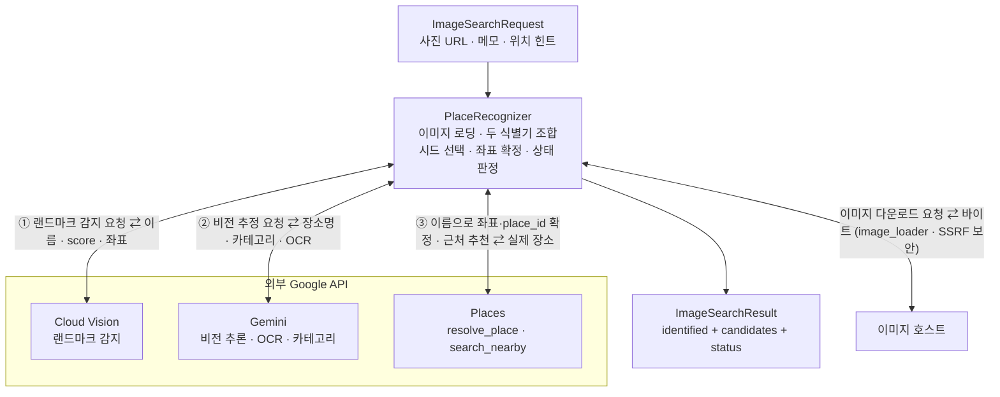

# 📸 Image Search

사진 한 장을 여행 장소 후보로 바꾸는 **사진 기반 장소 검색** 모듈입니다.

이 모듈은 사진을 이해하는 일은 AI(Gemini)에 맡기되, **좌표와 사실은 항상 Google Places의 실제 값으로 확정**합니다. 랜드마크 감지가 준 좌표조차 신뢰하지 않고 Places로 재확정해, 환각(hallucination)으로 인한 잘못된 위치를 차단합니다.

> 형제 모듈: [Route Planner](../route_planner/README.md) · [Free Time Recommender](../free_time_recommender/README.md)

<br>

## 📚 목차

1. [🎯 모듈 역할](#-모듈-역할)
2. [🔄 전체 처리 흐름](#-전체-처리-흐름)
3. [🧠 캐스케이드 식별](#-캐스케이드-식별)
4. [📍 좌표는 항상 Places](#-좌표는-항상-places)
5. [🗂️ 카테고리와 근처 추천](#-카테고리와-근처-추천)
6. [🌐 Modal HTTP 엔트리포인트](#-modal-http-엔트리포인트)
7. [🔒 이미지 로딩 보안](#-이미지-로딩-보안)
8. [📥 입력과 출력](#-입력과-출력)
9. [🧪 테스트 관점](#-테스트-관점)
10. [📁 디렉터리 구조](#-디렉터리-구조)
11. [⚠️ 현재 한계](#-현재-한계)
12. [🔗 세부 문서](#-세부-문서)

<br>


## 🎯 모듈 역할

`ai/image_search`는 다음 문제를 처리합니다.

- 사진(URL 또는 로컬 경로)을 받아 촬영된 장소를 추정합니다.
- 랜드마크 감지와 비전 LLM 두 식별기를 함께 돌려 서로를 보완합니다.
- 추정한 장소명을 Google Places로 검색해 실제 좌표·place_id·주소를 확정합니다.
- 식별한 장소 주변의 관련 장소를 추천 후보로 덧붙입니다.
- 사용자 메모와 위치 힌트를 인식 맥락으로 반영합니다.
- 결과를 백엔드 계약 DTO(`ImageSearchResult`)로 돌려주고, 인식 성공·부분·실패 상태를 함께 전달합니다.

이 모듈은 사진을 이해하는 데 AI를 사용합니다. 다만 **좌표·place_id·주소 같은 사실 정보는 AI 출력에 의존하지 않고 항상 Google Places의 실제 응답으로 확정**합니다.

```text
AI가 판단하는 것    "무엇을 찍었는가" (장소명 추정 · 카테고리 · 분위기)
Places가 확정하는 것 "그곳이 어디인가" (좌표 · place_id · 주소 · 평점)
```

> **관련 문서**
>
> - [Services](./services/README.md) — 두 식별기를 캐스케이드로 조합하는 실행 계층
> - [Providers](./providers/README.md) — Cloud Vision · Gemini · Places 외부 연동
> - [Domain](./domain/README.md) — 요청·응답 계약과 provider 원신호 모델

<br>

## 🔄 전체 처리 흐름



외부 소스로 향하는 화살표는 모두 **양방향(요청 ⇄ 응답)** 입니다. `PlaceRecognizer`는 이미지를 내려받고(또는 로컬 경로를 읽고), 랜드마크 감지(Cloud Vision)와 비전 추론(Gemini)을 **매 요청마다 모두** 호출하며, Places로 좌표·place_id를 확정하고 근처를 추천합니다. 요청(`ImageSearchRequest`)이 들어오고 결과(`ImageSearchResult`)가 나가는 두 화살표만 단방향입니다. **좌표·place_id 같은 사실은 오직 Places 응답으로만 확정됩니다.**

```text
요청 검증
→ 이미지 로딩 및 보안 검증(image_loader)
→ 두 식별기 병행 실행(랜드마크 감지 + 비전 LLM)
→ 시드 선택(자신 있는 랜드마크 우선, 아니면 LLM 추정)
→ Places로 좌표·place_id 확정(실패 시 LLM 이름으로 재시도)
→ 주변 장소 추천(confidence 순차 감소 · place_id 중복 제거)
→ 인식 상태 판정
→ 최종 응답 반환
```

`PlaceRecognizer`가 전체 처리 순서를 조정합니다.

1. 이미지 소스를 한 곳에서 로딩해 두 식별기에 같은 바이트를 넘깁니다.
2. 이미지 바이트로 MIME 타입을 감지해 Gemini에 올바른 타입을 전달합니다.
3. 랜드마크 감지와 비전 LLM을 매 요청마다 모두 실행합니다.
4. 두 결과 중 시드로 삼을 장소명을 선택합니다.
5. 시드 이름을 Places로 검색해 좌표·place_id를 확정합니다.
6. 확정된 좌표를 중심으로 근처 추천 후보를 채웁니다.
7. 인식 상태를 판정해 `ImageSearchResult`를 반환합니다.

> **관련 문서**
>
> - [Services](./services/README.md) — `PlaceRecognizer.search`의 단계별 구현

<br>


## 🧠 캐스케이드 식별

두 식별기를 병행한 뒤, 어느 결과를 "시드(seed)"로 삼을지 고르는 것이 캐스케이드의 핵심입니다. "폴백"이라는 이름과 달리 **두 식별기는 매 요청마다 모두 호출**되며, 캐스케이드는 그 결과 중 무엇을 채택할지 결정하는 내부 로직입니다.

### 두 식별기

- **LandmarkProvider (Cloud Vision)** — 에펠탑·센소지처럼 이름이 붙은 유명 랜드마크에 강합니다. 이름과 좌표, `score`(0~1)를 반환합니다.
- **VisionLlmProvider (Gemini)** — 카페·골목·음식·간판처럼 이름이 겉으로 드러나지 않는 일반 장소와 분위기에 강합니다. 장소명 추정·카테고리·분위기 키워드·OCR 텍스트를 반환합니다.

### 시드 선택 규칙

```text
랜드마크 score ≥ 0.6       → 랜드마크 이름을 시드로 채택
그 외 · LLM 추정이 있으면   → LLM 장소명 추정을 시드로 채택
둘 다 없으면               → FAILED
```

임계값(0.6)은 랜드마크 감지를 신뢰할 최소 기준입니다. 이보다 낮은 랜드마크 점수는 오탐 가능성이 높다고 보고 LLM 추정으로 넘깁니다.

### LLM 폴백

랜드마크를 시드로 골랐지만 그 이름이 Places에서 검색되지 않으면, LLM 추정 이름으로 한 번 더 Places를 시도합니다.

```text
랜드마크 이름으로 Places 검색 실패
→ LLM 추정 이름이 있고, 방금 실패한 이름과 다르면
→ LLM 이름으로 Places 재시도
```

랜드마크 감지의 오탐을 LLM이 보정하는 안전장치입니다.

### 우아한 저하

한 식별기나 외부 호출이 실패해도 전체 요청을 중단하지 않습니다.

```text
랜드마크 감지 실패   → 랜드마크 없이 LLM으로 진행
비전 LLM 실패        → LLM 없이 랜드마크로 진행
근처 추천 실패        → 식별 결과만 반환(PARTIAL)
시드 확정 자체 실패   → FAILED로 명시
```

> **관련 문서**
>
> - [Services](./services/README.md) — `_pick_seed` · `_llm_fallback_seed`
> - [Providers](./providers/README.md) — 각 식별기의 입력·출력

<br>

## 📍 좌표는 항상 Places

이 모듈의 1급 불변조건입니다. **어떤 식별기가 준 좌표도 그대로 쓰지 않습니다.**

```text
식별기 출력(장소 "이름")  → Places 검색 → Places가 준 좌표·place_id·주소 확정
                                          └ 식별기가 준 좌표는 폐기
```

### 식별기 좌표를 폐기하는 이유

- 랜드마크 감지는 좌표를 함께 주지만, 그 좌표조차 신뢰하지 않습니다.
- 비전 LLM에는 애초에 좌표를 맞히라고 요구하지 않습니다("위치는 다음 단계가 확정한다"고 프롬프트에 명시).
- LLM은 그럴듯한 좌표를 지어낼 수 있고, 랜드마크 감지에도 오탐이 있습니다.

이름은 검색어로만 쓰고 사실 확정은 Places에 맡기면, 잘못된 이름은 "검색 실패"로 걸러지고 실제 존재하는 장소만 좌표를 얻습니다.

### Places가 확정하는 값

```text
place_id
좌표(latitude · longitude)
formatted_address
city · country
rating · review_count
primary_type
```

> **관련 문서**
>
> - [Services](./services/README.md) — 좌표 확정과 LLM 폴백 순서
> - [Providers](./providers/README.md) — `PlacesProvider.resolve_place`

<br>

## 🗂️ 카테고리와 근처 추천

### 카테고리

비전 LLM이 사진의 주 피사체를 폐집합 `PlaceCategory` 중 하나로 분류합니다. 이 카테고리는 근처 추천의 검색 필터로 쓰입니다.

```text
명소·자연   LANDMARK · TEMPLE_SHRINE · HISTORIC · NATURE · PARK · GARDEN
전망        VIEWPOINT · NIGHTVIEW
먹거리      CAFE · DESSERT · RESTAURANT · BAR · MARKET
거리·쇼핑   STREET · SHOPPING
```

애매한 경계(CAFE와 DESSERT, RESTAURANT와 BAR 등)는 주 피사체 기준으로 하나만 고르고, 불확실함은 카테고리 변경이 아니라 `confidence`로 낮춰 표현합니다.

### 근처 추천

식별한 장소의 좌표를 중심으로 같은 성격의 장소를 추천 후보로 덧붙입니다.

```text
요청 후보 수 max_candidates 중 1개는 식별 장소
남은 (max_candidates − 1)개를 근처에서 채운다
```

검색 중심이 식별 장소의 좌표라 자기 자신이 결과에 섞일 수 있습니다.

```text
필요 개수보다 1개 더 요청
→ place_id가 식별 장소와 같은 후보 제외
→ 요청한 개수만큼 잘라 반환
```

### confidence 순차 감소

근처 후보는 식별 장소만큼 확실하지 않으므로, 식별 장소의 confidence를 기준으로 순차 감소(decay)시켜 순위를 매깁니다.

```text
식별 장소       base_conf
근처 후보 1     base_conf − decay
근처 후보 2     base_conf − decay × 2
...
```

### 인식 상태

```text
SUCCESS  근처 추천을 얻음, 또는 애초에 근처를 요청하지 않음(max_candidates = 1)
PARTIAL  식별은 됐으나 요청한 근처 추천을 하나도 얻지 못함
FAILED   식별 자체 실패(시드 없음 또는 Places 확정 실패)
```

> **관련 문서**
>
> - [Domain](./domain/README.md) — `PlaceCategory` · `RecognitionStatus`
> - [Services](./services/README.md) — `_build_nearby` · confidence decay

<br>

## 🌐 Modal HTTP 엔트리포인트

`modal_app.py`는 이 모듈을 **Modal 서버리스 HTTP 서비스**로 배포하기 위한 엔트리포인트입니다. 백엔드가 in-process import 대신 HTTP로 호출할 수 있게 합니다(route_planner의 `modal_app.py` 패턴과 동일).

### 구성

```text
App      chiwawa-image-search
엔드포인트  POST search_photo  (@modal.fastapi_endpoint)
Secret   chiwawa-image-search → 환경변수로 API 키 3종 주입
설정      timeout = 120 · max_containers = 10 · docs = False
```

### 하나의 코어, 두 진입점

로직은 `PlaceRecognizer` 하나이며, 진입점만 둘입니다.

```text
백엔드 in-process import ─┐
                          ├→ PlaceRecognizer(코어)
Modal HTTP search_photo ─┘
```

`modal_app.py`는 로직을 다시 짜지 않고 `PlaceRecognizer`를 그대로 감쌉니다. 런타임에는 둘 중 하나만 사용합니다.

### 에러 매핑

```text
ImageLoadError   → 422  (이미지 로딩 · SSRF 차단 실패)
ValidationError  → 422  (payload 스키마 검증 실패)
ValueError       → 400  (그 외 값 오류)
RuntimeError     → 502  (AI · 외부 API 장애)
```

`ImageLoadError`는 `ValueError`의 하위 클래스라 반드시 400 분기보다 먼저 잡습니다. provider 실패는 typed `ProviderError`(RuntimeError 하위: Timeout · Transport · Http · InvalidResponse)로 올라와 502로 매핑됩니다.

### 인증

현재 엔드포인트는 **공개(무인증)** 입니다. 호출마다 유료 API 3종을 소비하므로 `max_containers`로 비용 상한만 걸어 두었고, 백엔드 HTTP 전환 시점에 proxy-auth를 함께 얹을 예정입니다.

> **관련 문서**
>
> - [Providers](./providers/README.md) — Secret이 주입하는 API 키 이름

<br>

## 🔒 이미지 로딩 보안

`services/image_loader.py`는 신뢰할 수 없는 이미지 소스를 안전하게 바이트로 로딩합니다. 검증 로직은 순수 함수로 분리해 네트워크·파일 없이 테스트합니다.

### URL (SSRF 방지)

```text
스킴          http · https 만 허용
호스트 해석    DNS로 모든 주소를 해석
주소 차단      공인(global) IP가 아니면 차단
              (루프백 · 사설 · 링크로컬 · 메타데이터 · unspecified)
```

검사와 접속 사이에 DNS를 다시 해석해 우회하는 리바인딩을 막습니다.

```text
검증한 IP로만 TCP 접속을 고정(pinned IP)
→ TLS SNI · 인증서 검증은 원 호스트명으로 유지
→ 접속 시 재해석 없음
```

### 크기와 시간 제한

```text
follow_redirects = False    리다이렉트 우회 차단
Content-Length 사전 거부      선언된 크기가 상한 초과면 본문 받기 전 거부
스트리밍 상한 20MB            청크 누적이 상한 초과면 중단
데드라인 30s                 전체 다운로드 wall-clock 제한
```

### 로컬 경로 (경로 탈출 방지)

```text
image_path 로딩은 allowed_base_dir 지정 필수(임의 파일 읽기 방지)
정규화 후 base 디렉터리 하위인지 확인 → 밖이면 차단(../ · 절대경로)
```

### MIME 타입 감지

이미지 바이트의 매직 넘버로 타입을 추정해 Gemini에 올바른 타입을 넘깁니다.

```text
JPEG · PNG · GIF · WEBP · HEIC(아이폰) 인식
알 수 없으면 image/jpeg 로 둔다
```

> **관련 문서**
>
> - [Services](./services/README.md) — `image_loader`의 검증 함수 상세

<br>

## 📥 입력과 출력

### 입력

주요 입력 모델은 `ImageSearchRequest`입니다.

```text
ImageSearchRequest
├── image_url            URL 또는
├── image_path           로컬 경로 (둘 중 최소 하나 필수)
├── note                 사용자 메모 (예: "야경")
├── latitude / longitude 촬영·현재 위치 힌트
├── city / country       여행 맥락 힌트
└── max_candidates       반환 후보 최대 개수 (기본 5)
```

### 출력

```text
ImageSearchResult
├── identified           식별된 1순위 장소 (실패 시 null)
├── candidates           식별 + 근처 추천 목록
├── status               SUCCESS · PARTIAL · FAILED
└── signals              원신호 (landmark · llm)
```

각 후보는 `PlaceCandidate`입니다.

```text
PlaceCandidate
├── name · city · country
├── latitude · longitude
├── confidence           0~1
├── reason               판단 근거
├── category             PlaceCategory
├── source               LANDMARK · LLM · NEARBY
├── place_id             선택
└── rating               선택
```

> **관련 문서**
>
> - [Domain](./domain/README.md) — 요청·응답 DTO와 계약 필드

<br>

## 🧪 테스트 관점

주요 테스트 대상은 다음과 같습니다.

- 캐스케이드 시드 선택(랜드마크 우선 · LLM 폴백 · 둘 다 실패)
- 좌표가 항상 Places에서 오는지(식별기 좌표 미사용)
- 근처 추천의 자기 자신 제외(place_id 중복 제거)와 개수 절단
- confidence 순차 감소 순서
- 인식 상태 판정(SUCCESS · PARTIAL · FAILED) 경계
- 우아한 저하(한 식별기 실패 시 다른 하나로 진행)
- image_loader SSRF 차단(사설 · 루프백 · 메타데이터 IP · 스킴 · 리다이렉트)
- image_loader 크기 상한 · 데드라인 · 경로 탈출 차단
- MIME 타입 감지(JPEG · PNG · WEBP · HEIC)
- 백엔드 계약(`ImageSearchResult` ↔ `PhotoPlaceCandidateRead`) 매핑
- 응답 JSON Schema 계약(`contracts/ai_image_search/`) 드리프트 검증
- Modal 엔트리포인트의 payload 검증 · 에러 매핑

이 모듈은 결정론적 단위 테스트로 로직 · 경계 · 보안을 검증합니다. 실제 Google · Gemini 응답을 쓰는 end-to-end 확인은 `scripts/run_image_search.py`로 별도 수행합니다(실 API 키 필요).

> **관련 문서**
>
> - [Services](./services/README.md) · [Providers](./providers/README.md) — 계층별 테스트 관점

<br>

## 📁 디렉터리 구조

```text
image_search/
├── README.md                  이 문서
├── modal_app.py               Modal HTTP 엔트리포인트(search_photo)
├── requirements.txt           독립 실행 · CI · 배포 의존성
├── .env.example               필요한 API 키 3종 예시
├── domain/
│   ├── README.md
│   ├── schemas.py             provider 원신호 모델 + PlaceCategory 어휘
│   └── search_schemas.py      백엔드 계약 DTO(요청 · 후보 · 결과)
├── providers/
│   ├── README.md
│   ├── env.py                 API 키 로딩(fail-fast)
│   ├── errors.py              provider 오류 타입(ProviderError 계열)
│   ├── landmark_provider.py   Cloud Vision 랜드마크 감지
│   ├── vision_llm_provider.py Gemini 비전 추론
│   └── places_provider.py     Google Places(resolve · nearby)
├── services/
│   ├── README.md
│   ├── place_recognizer.py    캐스케이드 조합(Application 계층)
│   └── image_loader.py        이미지 로딩 + SSRF · 경로 보안
├── scripts/
│   ├── run_image_search.py               실사진 end-to-end 검증 CLI
│   └── export_modal_response_schema.py   응답 계약 JSON Schema 생성
└── tests/                                결정론적 단위 테스트
```

> **세부 문서**
>
> - [Domain](./domain/README.md)
> - [Providers](./providers/README.md)
> - [Services](./services/README.md)

<br>

## ⚠️ 현재 한계

- 위치 힌트(촬영 좌표 · 도시 · 국가)를 받지만, 아직 Places 검색의 locationBias로는 활용하지 않습니다.
- 랜드마크 · LLM 두 식별기를 순차로 호출합니다(병렬 앙상블은 미적용).
- 카테고리는 폐집합 `PlaceCategory`로 고정되어 있어, 목록에 없는 성격의 장소는 근사치로 분류됩니다.
- 근처 추천은 단일 카테고리 필터 기준이며, 다중 카테고리 혼합은 하지 않습니다.
- Modal 엔드포인트는 현재 무인증 공개 상태입니다(비용 상한만 적용).
- 실 API 검증으로 모델·캐스케이드 동작은 확인했고(예: 기요미즈데라 식별 SUCCESS), 정확도·confidence 캘리브레이션 세부 튜닝은 계속 진행합니다.

<br>

## 🔗 세부 문서

| 문서 | 설명 |
|---|---|
| [Domain](./domain/README.md) | 요청 · 응답 계약 DTO와 provider 원신호 모델, 카테고리 어휘 |
| [Providers](./providers/README.md) | Cloud Vision · Gemini · Places 외부 연동과 API 키 정책 |
| [Services](./services/README.md) | 캐스케이드 실행 계층(`PlaceRecognizer`)과 이미지 로딩 보안 |
| [Route Planner](../route_planner/README.md) | 형제 모듈 · 정확 경로 최적화 |
| [Free Time Recommender](../free_time_recommender/README.md) | 형제 모듈 · 빈 시간대 장소 추천 |
