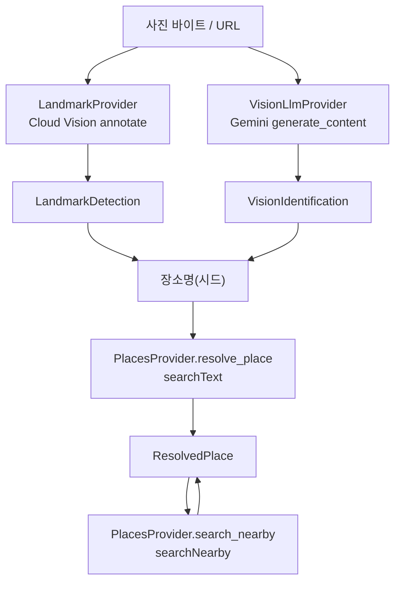

# 🌐 Image Search Providers

이미지 검색이 의존하는 세 외부 서비스를 감싸, 사진과 장소명을 **provider 원신호 모델**로 변환하는 외부 연동 계층입니다.

Provider는 어떤 장소를 채택할지 스스로 결정하지 않습니다. Cloud Vision · Gemini · Places 각 API를 호출해 응답을 도메인 모델(`LandmarkDetection` · `VisionIdentification` · `ResolvedPlace`)로 바꿀 뿐이며, 시드 선택·좌표 확정·근처 추천 조립 같은 캐스케이드 판단은 상위 `PlaceRecognizer`가 맡습니다.

> 상위 문서: [Image Search](../README.md)

<br>

## 📚 목차

1. [🎯 디렉터리 역할](#-디렉터리-역할)
2. [📁 파일 구성](#-파일-구성)
3. [🔄 전체 Provider 흐름](#-전체-provider-흐름)
4. [🗺️ LandmarkProvider](#-landmarkprovider)
5. [🤖 VisionLlmProvider](#-visionllmprovider)
6. [📍 PlacesProvider](#-placesprovider)
7. [✅ 응답 검증](#-응답-검증)
8. [🚨 오류 처리](#-오류-처리)
9. [🔐 API Key와 민감정보](#-api-key와-민감정보)
10. [🧪 테스트 관점](#-테스트-관점)
11. [⚠️ 현재 한계](#-현재-한계)
12. [🔗 관련 문서](#-관련-문서)

<br>


## 🎯 디렉터리 역할

`ai/image_search/providers`는 다음 책임을 가집니다.

- Cloud Vision 랜드마크 감지 REST 호출과 `LandmarkDetection` 변환
- Gemini 멀티모달 추론과 `VisionIdentification` 구조화 출력
- Google Places Text Search · Nearby Search 호출과 `ResolvedPlace` 변환
- `PlaceCategory` → Places `includedTypes` 매핑
- Places `addressComponents` → city · country 구조화 파싱
- API 키 3종의 fail-fast 로딩
- HTTP 상태 오류와 빈·불량 응답의 명시적 전파

세 provider는 역할이 뚜렷하게 나뉩니다. 앞의 둘은 사진에서 "무엇을 찍었는가"를 추정하는 식별기이고, 마지막 하나는 "그곳이 어디인가"라는 사실을 확정합니다.

```text
LandmarkProvider  사진 → 랜드마크 이름 · score · 좌표   (원신호)
VisionLlmProvider 사진 → 장소명 추정 · 카테고리 · OCR   (원신호)
PlacesProvider    이름 → place_id · 좌표 · 주소 · 평점  (사실 확정)
```

이 디렉터리는 **이종(heterogeneous) provider의 모음**입니다. 전송 계층이 서로 다르며, 그래서 각 ### 하위 절의 서술 축(요청 형식·검증·오류)도 provider마다 다릅니다.

```text
LandmarkProvider  httpx REST        (Cloud Vision images:annotate)
VisionLlmProvider google-genai SDK  (Gemini generate_content)
PlacesProvider    httpx REST        (Places searchText · searchNearby)
```

Provider 계층은 캐스케이드 정책을 판단하지 않습니다.

```text
PlaceRecognizer(상위)
→ Provider 호출(식별 · 확정 · 근처)
→ 원신호 모델 반환
→ PlaceRecognizer 가 시드 선택 · 좌표 확정 · 상태 판정
```

> **관련 문서**
>
> - [Image Search](../README.md) — 모듈 전체 구조와 캐스케이드 불변조건
> - [Services](../services/README.md) — `PlaceRecognizer`가 provider를 조합하는 실행 계층
> - [Domain](../domain/README.md) — provider 원신호 모델과 `PlaceCategory` 어휘

<br>

## 📁 파일 구성

```text
ai/image_search/providers/
├── README.md               이 문서
├── env.py                  API 키 3종 로딩(fail-fast)
├── landmark_provider.py    Cloud Vision 랜드마크 감지
├── vision_llm_provider.py  Gemini 비전 추론
├── places_provider.py      Google Places(resolve · nearby)
└── errors.py               provider 오류 타입 계층(ProviderError)
```

| 파일 | 책임 |
|---|---|
| `env.py` | `ai/image_search/.env` 로딩과 API 키 3종 조회, fail-fast |
| `landmark_provider.py` | Cloud Vision REST 호출과 `LandmarkDetection` 변환 |
| `vision_llm_provider.py` | Gemini SDK 호출과 `VisionIdentification` 구조화 출력 |
| `places_provider.py` | Places Text · Nearby 호출과 `ResolvedPlace` 변환 |
| `errors.py` | provider 외부 연동 오류 타입 계층(`ProviderError` 및 하위 4종) |

<br>


## 🔄 전체 Provider 흐름

세 provider는 서로를 호출하지 않습니다. 각자 독립된 단일 호출이며, 상위 `PlaceRecognizer`가 순서를 조율합니다.



상위 관점에서 provider 호출 순서는 다음과 같습니다.

```text
사진(바이트 또는 URL)
→ LandmarkProvider · VisionLlmProvider 각각 호출
→ 원신호(LandmarkDetection · VisionIdentification) 반환
→ (상위가) 장소명 시드 선택
→ PlacesProvider.resolve_place 로 좌표 · place_id 확정
→ PlacesProvider.search_nearby 로 근처 후보 채움
```

각 provider의 입력과 출력만 정리하면 다음과 같습니다.

```text
LandmarkProvider.detect(image_bytes | image_url)   → LandmarkDetection | None
VisionLlmProvider.identify(image_bytes, mime, note)→ VisionIdentification
PlacesProvider.resolve_place(place_name)           → ResolvedPlace
PlacesProvider.search_nearby(lat, lng, category)   → list[ResolvedPlace]
```

LandmarkProvider는 이미지 바이트 또는 URL을 받고, VisionLlmProvider는 항상 이미지 바이트를 요구하며, PlacesProvider는 이미지가 아니라 장소명·좌표를 입력으로 받습니다. URL·경로 → 바이트 변환과 MIME 감지는 provider가 아니라 상위 `image_loader`가 담당합니다.

> **관련 문서**
>
> - [Services](../services/README.md) — `PlaceRecognizer.search`의 단계별 조율과 `image_loader`

<br>

## 🗺️ LandmarkProvider

`LandmarkProvider`는 Google Cloud Vision REST의 랜드마크 감지 기능을 감싸, 사진을 `LandmarkDetection`으로 변환합니다. 캐스케이드의 1차 식별기이며 에펠탑·센소지처럼 이름 붙은 유명 명소에 강합니다.

### Endpoint

```text
https://vision.googleapis.com/v1/images:annotate
```

`ANNOTATE_URL` 상수 하나로 고정되어 있습니다.

### 생성자

```text
LandmarkProvider(
    api_key: str | None = None,
    max_results: int = 3,
    timeout_seconds: float = 10.0,
    transport: httpx.BaseTransport | None = None,
)
```

- `api_key` 미전달 시 `get_google_cloud_vision_api_key()`로 환경변수에서 조회합니다.
- `max_results`는 감지 후보 최대 개수입니다. 기본값이 1보다 큰 `3`인 이유는 **좌표 없는 후보를 건너뛰고 다음 후보를 시도할 여지**를 두기 위함입니다.
- `timeout_seconds` 기본값은 `10.0`초입니다.
- `transport`는 테스트에서 `httpx.MockTransport`를 주입하기 위한 자리이며, 실제 사용 시 `None`입니다.

### 입력과 출력

```text
detect(image_bytes: bytes | None = None,
       image_url: str | None = None) -> LandmarkDetection | None
```

`image_bytes`(로컬 파일 내용) 또는 `image_url`(호스팅 이미지) 중 하나가 반드시 필요합니다. 이미지 입력 변환은 `_build_image_payload`가 담당합니다.

```text
image_bytes 있음 → {"content": base64(image_bytes)}
image_url  있음 → {"source": {"imageUri": image_url}}
둘 다 없음      → ValueError
```

출력 `LandmarkDetection`은 다음 구조입니다.

```text
LandmarkDetection
├── name       str          (Vision description)
├── latitude   float        (-90 ~ 90)
├── longitude  float        (-180 ~ 180)
└── score      float        (0 ~ 1, Vision 신뢰도)
```

감지 결과가 없으면 예외가 아니라 `None`을 반환합니다. "랜드마크 아님"은 카페·골목처럼 정상적인 상황이며, 캐스케이드가 LLM으로 폴백할 근거가 됩니다.

### 요청 형식

```text
payload
└── requests[0]
    ├── image     (content 또는 source.imageUri)
    └── features[0]
        ├── type       = "LANDMARK_DETECTION"
        └── maxResults  = max_results
```

인증은 헤더로 전송합니다.

```text
Content-Type: application/json
X-Goog-Api-Key: <Cloud Vision API 키>
```

### 응답 파싱

Cloud Vision은 HTTP 200 안에도 개별 `error` 객체를 심어 보낼 수 있어, 상태 코드만 보고 안심하지 않습니다.

```text
responses 비어 있음         → None
responses[0].error 존재     → InvalidProviderResponseError("Cloud Vision API 오류 응답: ...")
landmarkAnnotations 순회     → 첫 유효 후보 채택
유효 후보 없음               → None
```

개별 annotation의 유효 판정은 `_parse_annotation`이 수행합니다.

```text
name(=description) · score · locations[0].latLng.latitude · longitude
→ 하나라도 없으면 None (건너뛰고 다음 후보)
→ 모두 있으면 LandmarkDetection 생성
```

좌표는 이후 Places로 재확정하지만, 스키마 계약상 감지 시점의 좌표도 필수로 둡니다. 좌표가 없는 후보를 건너뛰기 위해 `max_results`를 1보다 크게 잡는 설계와 맞물립니다.

> **관련 문서**
>
> - [Domain](../domain/README.md) — `LandmarkDetection` 필드 계약
> - [Services](../services/README.md) — 랜드마크 `score ≥ 0.6` 시드 채택 규칙

<br>

## 🤖 VisionLlmProvider

`VisionLlmProvider`는 Google Gemini(멀티모달 LLM)를 감싸, 사진을 `VisionIdentification`으로 변환합니다. 캐스케이드의 2차 식별기이며 카페·골목·음식·간판처럼 이름이 겉으로 드러나지 않는 일반 장소와 분위기에 강합니다.

앞의 httpx provider와 달리 이 provider는 REST endpoint·Field Mask를 다루지 않습니다. 대신 **SDK 호출·프롬프트·구조화 스키마·note 길이 제한·호출 timeout**이 서술 축입니다.

### SDK와 생성자

`from google import genai` / `from google.genai import types`의 google-genai SDK를 사용합니다.

```text
VisionLlmProvider(
    api_key: str | None = None,
    model: str | None = None,
    client: genai.Client | None = None,
)
```

- `DEFAULT_MODEL = "gemini-3.6-flash"` — 비전 지원 flash 모델(실사진 검증으로 확정, 이전 `gemini-2.5-flash`는 신규 사용자 제공 종료로 404). `model` 미전달 시 이 값을 씁니다.
- `client` 미전달 시 내부에서 `genai.Client`를 생성하며, `api_key`가 없으면 `get_gemini_api_key()`로 조회합니다.
- `client`는 테스트에서 가짜 client를 주입하기 위한 자리입니다.

### 구조화 출력 스키마

자유 텍스트가 아니라 스키마에 맞는 JSON만 받습니다.

```text
config = GenerateContentConfig(
    response_mime_type = "application/json",
    response_schema    = VisionIdentification,
)
```

호출은 프롬프트와 이미지 파트를 함께 실어 보냅니다.

```text
image_part = types.Part.from_bytes(data=image_bytes, mime_type=mime_type)
response   = client.models.generate_content(
    model=self.model,
    contents=[prompt, image_part],
    config=config,
)
```

출력 `VisionIdentification`은 다음 구조입니다.

```text
VisionIdentification
├── place_name_guess  str | None   (추정 장소명, 없을 수 있음)
├── category          PlaceCategory (폐집합 하나)
├── vibe_keywords     list[str]     (분위기 키워드)
├── reason            str           (추정 근거)
├── confidence        float         (0 ~ 1, LLM 자기 확신도)
└── visible_text      list[str]     (사진 속 간판/글자)
```

LLM 출력을 그대로 믿지 않고 `VisionIdentification.model_validate_json(response.text)`로 **pydantic 재검증**합니다. 범위(`confidence` 0~1)와 `PlaceCategory` 폐집합을 강제로 적용해, 모델이 벗어난 값을 주면 `ValidationError`로 거부합니다.

### 프롬프트 원칙

Gemini에게 보내는 `_INSTRUCTION`은 형식이 아니라 "무엇을" 판단할지에 집중합니다(형식은 구조화 출력이 강제하므로).

```text
2차 식별기 인식   유명 랜드마크는 앞 단계가 처리 — 성급히 명소로 단정하지 말 것
환각 억제         확실한 시각적 근거가 없으면 장소명을 지어내지 말 것
좌표 비관여        실제 좌표는 다음 단계(장소 검색)가 확정 — 위치를 맞히려 애쓰지 말 것
visible_text 우선  간판·상호·메뉴를 보이는 그대로(일본어는 일본어로) — 번역·수정·추측 금지
place_name_guess  그대로 지도 검색어가 되므로 근거 있을 때만, 불확실하면 null
category          주 피사체 하나만, ETC 도피 금지, 불확실함은 confidence 로 낮춤
vibe_keywords     구체적 한국어 2~4개("좋다"·"예쁘다" 같은 막연한 말 금지)
reason            결정적 단서가 무엇이었는지 한 문장
```

`category`의 자주 헷갈리는 경계도 프롬프트에 명시되어 있습니다.

```text
CAFE vs DESSERT          음료·머무는 공간 → CAFE / 케이크·빵 주인공 → DESSERT
RESTAURANT vs BAR        식사 중심 → RESTAURANT / 술·이자카야 → BAR
TEMPLE_SHRINE vs HISTORIC 참배 공간 → TEMPLE_SHRINE / 성·유적·옛 거리 → HISTORIC
VIEWPOINT vs NIGHTVIEW   낮 조망 → VIEWPOINT / 밤 불빛 경관 → NIGHTVIEW
STREET vs SHOPPING vs MARKET  거리·골목 / 상점가 / 먹거리 좌판 시장
NATURE vs PARK vs GARDEN 손대지 않은 자연 / 도심 공원 / 조경된 정원
```

`confidence`도 캘리브레이션 기준을 준다.

```text
0.9 이상    간판·형태로 장소가 분명함
0.6 ~ 0.8   근거는 있으나 확실치 않음
0.4 ~ 0.6   카테고리는 확실하나 특정 장소는 불명 (place_name_guess 보통 null)
0.2 이하    거의 추측
```

place_name_guess가 null이면 confidence는 낮은 값이어야 한다고 명시합니다.

### note 힌트와 길이 제한

사용자 메모(`note`)는 프롬프트에 힌트로 덧붙지만, 과도한 길이는 잘라냅니다.

```text
_NOTE_PROMPT_MAX_CHARS = 500

note 있음 → f"{_INSTRUCTION}\n\n참고 - 사용자 메모: {note[:500]}"
note 없음 → _INSTRUCTION
```

상한을 두는 이유는 과도한 입력이 프롬프트를 비대화하거나 주입(injection) 표면이 되는 것을 막기 위함입니다.

### 호출 timeout

Gemini 호출은 명시적 timeout으로 끊습니다.

```text
_GEMINI_TIMEOUT_MS = 30000  (30초)

client = genai.Client(
    api_key=...,
    http_options=types.HttpOptions(timeout=_GEMINI_TIMEOUT_MS),
)
```

기본값(`None`)은 무제한이라, 느린 응답이 Modal 함수 timeout(120s) 하드월까지 매달려 매핑되지 않은 오류가 됩니다. 명시적으로 30초에 끊어 **통제된 실패(폴백)** 로 만듭니다.

### 빈 응답 처리

안전 차단·빈 후보 등으로 SDK가 `response.text = None`을 줄 수 있습니다. 이를 그대로 파싱하면 원인 불명의 `ValidationError`가 되므로, 진단 정보를 담은 예외로 알립니다.

```text
response.text is None
→ InvalidProviderResponseError(_describe_empty_response(response))
   ├── candidates[0].finish_reason
   └── prompt_feedback
```

예: `"Gemini 가 텍스트 없이 응답했습니다: finish_reason=SAFETY, prompt_feedback=..."`.

> **관련 문서**
>
> - [Domain](../domain/README.md) — `VisionIdentification` · `PlaceCategory` 폐집합
> - [Services](../services/README.md) — LLM 추정을 시드로 채택하는 규칙과 폴백

<br>

## 📍 PlacesProvider

`PlacesProvider`는 Google Places REST를 감싸, **장소명을 좌표·주소·평점으로 확정**하고 좌표 주변의 유사 장소를 검색합니다. 이 모듈의 1급 불변조건("좌표는 항상 Places")을 실제로 실행하는 provider입니다.

### Endpoint

```text
searchText   https://places.googleapis.com/v1/places:searchText
searchNearby https://places.googleapis.com/v1/places:searchNearby
```

### 생성자

```text
PlacesProvider(
    api_key: str | None = None,
    timeout_seconds: float = 10.0,
    transport: httpx.BaseTransport | None = None,
)
```

`api_key` 미전달 시 `get_google_maps_api_key()`로 조회합니다. `transport`는 테스트용 주입 자리입니다.

### resolve_place

장소명 하나를 받아 가장 적합한 `ResolvedPlace` 하나를 확정합니다.

```text
resolve_place(place_name, language_code="ko", region_code="JP") -> ResolvedPlace

→ search_text(query=place_name, ..., max_result_count=1)
→ 결과 없음 → ValueError("Google Places 검색 결과가 없습니다: ...")
→ results[0] 반환
```

`search_text`의 요청 payload는 다음과 같습니다.

```text
{
  "textQuery":       query,
  "languageCode":    "ko",
  "regionCode":      "JP",
  "maxResultCount":  1
}
```

기본 `language_code="ko"` · `region_code="JP"`는 현재 코드에 고정되어 있습니다(일본 여행 맥락 가정).

### search_nearby

확정된 좌표를 중심으로 카테고리에 맞는 근처 장소를 검색합니다.

```text
search_nearby(latitude, longitude,
              category: PlaceCategory | None = None,
              radius_m=1500, max_result_count=5,
              language_code="ko", region_code="JP") -> list[ResolvedPlace]
```

요청 payload는 원형 범위 제한을 씁니다.

```text
{
  "languageCode":       "ko",
  "regionCode":         "JP",
  "maxResultCount":     max_result_count,
  "locationRestriction": {
    "circle": {
      "center": {"latitude": latitude, "longitude": longitude},
      "radius":  radius_m
    }
  }
}
```

`resolve_place`와 달리 결과가 없으면 예외가 아니라 **빈 리스트**를 반환합니다(근처 추천은 없어도 정상).

### 카테고리 → includedTypes 매핑

우리 `PlaceCategory`를 Google Places `includedTypes`로 변환해 근처 검색 필터로 씁니다. 값이 빈 리스트(`ETC`)이거나 `category=None`이면 유형 필터 없이 검색합니다.

```text
category 있음 · 매핑 비어 있지 않음 → payload["includedTypes"] = 매핑값
category None 또는 매핑 빈 리스트     → includedTypes 미포함
```

`CATEGORY_INCLUDED_TYPES` 전체 매핑:

| PlaceCategory | includedTypes |
|---|---|
| `LANDMARK` | `tourist_attraction` |
| `TEMPLE_SHRINE` | `tourist_attraction` |
| `HISTORIC` | `historical_landmark` |
| `MUSEUM` | `museum` |
| `GALLERY` | `art_gallery` |
| `ARCHITECTURE` | `tourist_attraction` |
| `NATURE` | `park`, `national_park` |
| `PARK` | `park` |
| `GARDEN` | `botanical_garden` |
| `BEACH` | `tourist_attraction` |
| `VIEWPOINT` | `tourist_attraction` |
| `NIGHTVIEW` | `tourist_attraction` |
| `ONSEN` | `spa` |
| `CAFE` | `cafe` |
| `RESTAURANT` | `restaurant` |
| `DESSERT` | `bakery` |
| `BAR` | `bar` |
| `MARKET` | `market` |
| `SHOPPING` | `shopping_mall` |
| `STREET` | `tourist_attraction` |
| `THEME_PARK` | `amusement_park` |
| `AQUARIUM_ZOO` | `aquarium`, `zoo` |
| `ETC` | (빈 리스트 → 필터 없음) |

`tourist_attraction`으로 근사되는 카테고리가 여러 개 있는데, 이는 실제 호출 검증(CLI) 단계에서 타입 유효성을 조정할 여지로 남겨 둔 값입니다.

### Field Mask

두 endpoint는 공통 헤더로 필요한 응답 필드만 요청합니다.

```text
Content-Type: application/json
X-Goog-Api-Key: <Places API 키>
X-Goog-FieldMask:
    places.id
    places.displayName
    places.formattedAddress
    places.addressComponents
    places.location
    places.rating
    places.userRatingCount
    places.primaryType
```

### addressComponents 파싱

`_parse_address_components`가 도시·국가를 구조화 파싱합니다. 도시는 `locality`를 우선하고, 없으면 `administrative_area_level_1`로 폴백합니다.

```text
각 component.longText 를 strip → 빈 값이면 무시
"locality" 타입                       → locality
"administrative_area_level_1" 타입    → admin_area
"country" 타입                        → country

city    = locality or admin_area   (둘 다 없으면 None)
country = country                  (없으면 None)
```

### 출력 ResolvedPlace

개별 place 변환은 `_parse_place`가 수행하며, 필수값(장소 ID·이름·좌표)이 없으면 `ValueError`입니다.

```text
ResolvedPlace
├── place_id          str          (place.id, 필수)
├── name              str          (displayName.text, 필수)
├── latitude          float        (location.latitude, 필수)
├── longitude         float        (location.longitude, 필수)
├── formatted_address str | None
├── city              str | None   (addressComponents 파싱)
├── country           str | None   (addressComponents 파싱)
├── rating            float | None (0 ~ 5)
├── review_count      int | None   (userRatingCount, 보관만)
└── primary_type      str | None   (primaryType, 보관만)
```

`review_count`와 `primary_type`은 파싱해 보관만 하며, 현재 내부 로직에서 쓰지 않고 백엔드 매핑·향후 활용을 위해 채워 둡니다.

> **관련 문서**
>
> - [Image Search](../README.md) — "좌표는 항상 Places" 불변조건
> - [Domain](../domain/README.md) — `ResolvedPlace` · `PlaceCategory`
> - [Services](../services/README.md) — 좌표 확정과 근처 추천 조립

<br>

## ✅ 응답 검증

세 provider는 검증 전략이 서로 다릅니다. 공통 원칙은 **"정상적 없음"과 "오류"를 구분**하는 것입니다.

### LandmarkProvider

개별 annotation의 필수값(name·score·좌표)이 없으면 그 후보만 건너뛰고 다음 후보를 확인합니다. 유효 후보가 하나도 없으면 `None`(오류 아님)을 반환합니다.

```text
responses 비어 있음     → None
필수값 없는 annotation  → 건너뜀
유효 후보 없음          → None
responses[0].error 존재 → InvalidProviderResponseError
```

### VisionLlmProvider

구조화 출력 JSON을 그대로 믿지 않고 `VisionIdentification`으로 재검증합니다. 범위·폐집합을 벗어나면 `ValidationError`입니다.

```text
confidence 범위 밖(예: 1.7)      → ValidationError
정의되지 않은 category(예: SPACESHIP) → ValidationError
place_name_guess = null           → 허용 (일반 분위기)
response.text = None              → InvalidProviderResponseError(진단 메시지)
```

### PlacesProvider

`_post_and_parse`는 불량 항목 하나 때문에 전체를 버리지 않도록, place별로 `try/except ValueError`로 건너뜁니다.

```text
place 필수값(id·name·좌표) 없음 → ValueError → 목록에서 개별 건너뜀
search_nearby: 불량 항목 제외하고 유효 후보 유지
resolve_place: 결과 1건이라 그게 불량이면 빈 리스트 → 상위에서 실패
addressComponents 없음           → city/country = None (거부 아님)
```

"없음"과 "오류"의 경계는 다음과 같습니다.

```text
정상적 없음  랜드마크 None · 근처 빈 리스트 · addressComponents 없음
오류         HTTP 4xx/5xx · Vision 내부 error · 빈 LLM 응답 · 필수값 누락
```

좌표는 감지 시점과 확정 시점 양쪽 스키마에서 `Field(ge/le)`로 범위를 강제합니다(`latitude` -90~90, `longitude` -180~180).

> **관련 문서**
>
> - [Domain](../domain/README.md) — pydantic Field 범위 검증
> - [Services](../services/README.md) — 우아한 저하와 부분 성공(PARTIAL)

<br>

## 🚨 오류 처리

세 provider의 외부 연동 오류는 `providers/errors.py`의 **명시적 타입 계층**으로 구분됩니다. 모두 `RuntimeError` 하위라 상위 `modal_app.py`는 502로 매핑하고, `PlaceRecognizer`의 우아한 저하(`_safe_*`)가 그대로 동작합니다.

```text
ProviderError (RuntimeError)
├── ProviderTimeoutError           요청 시간 초과
├── ProviderTransportError         네트워크 전송 실패
├── ProviderHttpError              HTTP 4xx/5xx (provider 이름 · status_code 보관)
└── InvalidProviderResponseError   응답 계약 오류
```

상위 `modal_app.py`의 HTTP 매핑(값 문제와 외부 장애를 구분):

```text
ValueError      → 400        (provider 값 문제)
ValidationError → 422        (payload 스키마 위반)
RuntimeError    → 502        (외부 API 장애 · 위 ProviderError 계열 포함)
```

### LandmarkProvider

```text
시간 초과                        → ProviderTimeoutError
전송 실패                        → ProviderTransportError
HTTP status >= 400              → ProviderHttpError("Cloud Vision", status_code)
responses[0].error 존재         → InvalidProviderResponseError("Cloud Vision API 오류 응답: ...")
image_bytes · image_url 둘 다 없음 → ValueError
```

### VisionLlmProvider

```text
response.text = None            → InvalidProviderResponseError(finish_reason · prompt_feedback 진단)
스키마 위반(범위 · 카테고리)     → ValidationError (pydantic)
30초 초과                       → SDK timeout 예외 (통제된 실패)
```

### PlacesProvider

```text
시간 초과                        → ProviderTimeoutError
전송 실패                        → ProviderTransportError
HTTP status >= 400              → ProviderHttpError("Google Places", status_code)
resolve_place 결과 없음          → ValueError
불량 place                      → ValueError (개별, 목록에서 건너뜀)
```

### 공통 정책

- httpx 네트워크 예외(timeout·연결 실패)는 `ProviderTimeoutError`·`ProviderTransportError`로 감싸 전파합니다(원본 예외는 `raise ... from`으로 보존).
- provider는 외부 실패를 빈 결과로 은폐하지 않습니다. 단, "정상적 없음"(랜드마크 None·근처 빈 리스트)은 예외로 취급하지 않습니다.
- `ProviderHttpError`는 provider 이름과 status_code만 담고 **응답 본문은 메시지에 넣지 않습니다**(운영 로그 민감정보 노출 최소화).

> **관련 문서**
>
> - [Image Search](../README.md) — Modal 엔트리포인트의 예외 → HTTP 매핑
> - [Services](../services/README.md) — 한 식별기 실패 시 다른 하나로 진행

<br>

## 🔐 API Key와 민감정보

`env.py`는 `ai/image_search/.env`를 로드해 API 키 3종을 fail-fast로 제공합니다.

```text
IMAGE_SEARCH_ROOT     = Path(__file__).resolve().parents[1]   # ai/image_search
IMAGE_SEARCH_ENV_PATH = IMAGE_SEARCH_ROOT / ".env"            # ai/image_search/.env
```

### 세 getter와 환경변수

| getter | 환경변수 | 용도 |
|---|---|---|
| `get_google_maps_api_key()` | `GOOGLE_MAPS_API_KEY` | Google Places (장소명 → 좌표 · 근처 검색) |
| `get_google_cloud_vision_api_key()` | `GOOGLE_CLOUD_VISION_API_KEY` | Cloud Vision (랜드마크 감지, REST) |
| `get_gemini_api_key()` | `GEMINI_API_KEY` | Gemini (비전 LLM, AI Studio) |

세 getter는 모두 `_require_env`를 거칩니다.

```text
_require_env(var_name)
→ load_image_search_env()          (.env 를 환경변수로 등록)
→ os.getenv(var_name)
→ 없거나 빈 문자열 → ValueError (fail-fast)
→ 값 반환
```

`ValueError` 메시지는 로컬과 배포 양쪽 확인처를 안내합니다.

```text
"<VAR> 환경변수가 필요합니다.
 로컬 실행은 ai/image_search/.env,
 Modal 배포는 Secret 'chiwawa-image-search' 를 확인하세요."
```

### .env vs Modal Secret

```text
로컬 실행   ai/image_search/.env          (dotenv 로 로딩)
Modal 배포  Secret 'chiwawa-image-search'  (환경변수로 3키 주입)
```

각 provider는 `api_key or get_*()` 패턴으로, 생성자 주입을 우선하고 없을 때만 환경변수를 읽습니다. 덕분에 테스트는 `.env` 없이 `api_key="test-key"`를 직접 주입할 수 있습니다.

### 키 재사용

`.env.example`은 키 재사용 여지를 안내합니다.

```text
GOOGLE_MAPS_API_KEY          route_planner 와 같은 키 재사용 가능
GOOGLE_CLOUD_VISION_API_KEY  같은 GCP 프로젝트면 Maps 키 재사용 가능 (Vision API 활성화 필요)
GEMINI_API_KEY               Google AI Studio 에서 발급
```

### 민감정보 정책

- 실제 API 키, `X-Goog-Api-Key` 헤더, 키가 섞인 전체 요청은 로그·문서·fixture·git에 절대 포함하지 않습니다.
- `.env`는 루트 `.gitignore`의 `.env` 규칙으로 무시되며, 커밋하지 않습니다.
- 테스트는 fake 키(`"test-key"`)와 `httpx.MockTransport`(landmark·places) 또는 가짜 genai client(vision)를 사용해 실제 키·네트워크에 의존하지 않습니다.
- HTTP 오류(4xx/5xx)는 `ProviderHttpError`가 provider 이름·status_code만 담고 본문은 넣지 않지만, Cloud Vision의 내부 `error` 객체는 `InvalidProviderResponseError` 메시지에 실리므로 오류 로그에 민감 정보가 새지 않는지 점검합니다.

> **관련 문서**
>
> - [Image Search](../README.md) — Modal Secret 주입과 무인증 공개 정책
> - [Route Planner Providers](../../route_planner/providers/README.md) — `GOOGLE_MAPS_API_KEY` 재사용
> - [Free Time Recommender Providers](../../free_time_recommender/providers/README.md) — Provider별 키 주입 방식 비교

<br>

## 🧪 테스트 관점

provider 테스트는 실제 네트워크·SDK 없이 결정론적으로 동작합니다. httpx provider는 `httpx.MockTransport`로, Gemini provider는 가짜 client 주입으로 요청 생성과 응답 파싱을 함께 검증합니다.

### LandmarkProvider

- 이미지 URL 요청 형태(`imageUri` · `LANDMARK_DETECTION` · `X-Goog-Api-Key`)와 응답 파싱(name·score·좌표)
- 이미지 바이트를 base64로 인코딩해 `content`로 전송
- 이미지 소스가 하나도 없으면 `ValueError`(요청 자체를 만들지 않음)
- 랜드마크 없음 → `None`(예외 아님)
- 좌표·이름·score 없는 annotation은 건너뛰고 다음 유효 후보 채택
- `responses` 빈 배열 → `None`
- 200 내부 `error` 객체 → `RuntimeError`
- HTTP 4xx/5xx → `RuntimeError`

### VisionLlmProvider

- 구조화 출력 config(`response_mime_type` · `response_schema`)와 이미지 파트 bytes 보존
- 사용자 `note`가 프롬프트에 반영, 500자 초과분은 절단
- 범위 밖 `confidence`(1.7) → `ValidationError`
- 정의되지 않은 `category`(SPACESHIP) → `ValidationError`
- `place_name_guess = null` 허용
- 빈 응답(text=None) → 진단 `RuntimeError`(finish_reason=SAFETY가 메시지에 노출)
- `candidates=None`인 빈 응답도 `RuntimeError`

### PlacesProvider

- `CATEGORY_INCLUDED_TYPES`가 모든 `PlaceCategory`를 전수 커버(미매핑 = 조용한 저하 방지)
- resolve 요청(`textQuery`) · 응답 파싱(place_id·좌표·rating·주소)
- 결과 없음 → `ValueError`, HTTP 오류 → `RuntimeError`, 필수값 누락 → `ValueError`
- `addressComponents`에서 city(locality 우선, admin_area 폴백)·country 파싱, `review_count`·`primary_type` 파싱
- 빈 `longText`·무관 타입 컴포넌트 무시, 도시·국가 없으면 None, addressComponents 자체 없어도 None(거부 아님)
- nearby 요청(`circle.center` · `radius` · `includedTypes`)과 category=None 시 `includedTypes` 생략
- 불량 place는 건너뛰고 유효 후보 유지, 결과 없으면 빈 리스트, HTTP 오류 → `RuntimeError`

### env.py

- 환경변수 설정 시 값 반환(3키 각각), 미설정 시 `ValueError`, 빈 문자열도 `ValueError`
- 셸 환경변수가 아닌 실제 `.env` 파일에서 값이 로딩되는 경로 검증

결정론적 단위 테스트가 로직·경계·오류를 검증하며, 실제 Google·Gemini 응답을 쓰는 end-to-end 확인은 `scripts/run_image_search.py`로 별도 수행합니다(실 API 키 필요).

> **관련 문서**
>
> - [Services](../services/README.md) — `PlaceRecognizer` 조합 로직 테스트
> - [Image Search](../README.md) — 모듈 전체 테스트 관점

<br>

## ⚠️ 현재 한계

- Cloud Vision · Gemini · Places 각각 단일 구현에 직접 의존합니다(provider 교체 추상화 없음).
- 자동 retry, backoff, circuit breaker가 없습니다.
- 응답 cache가 없습니다.
- Rate Limit 대응 정책이 없습니다.
- `resolve_place` · `search_nearby`의 `language_code="ko"` · `region_code="JP"`가 코드에 고정되어 있습니다.
- 촬영 좌표 등 위치 힌트를 Places의 `locationBias`로 활용하지 않습니다.
- `CATEGORY_INCLUDED_TYPES` 중 여러 카테고리가 `tourist_attraction`으로 근사되며, 실제 호출 검증(CLI) 단계에서 조정할 여지로 남겨 두었습니다.
- Cloud Vision의 내부 `error` 객체는 `InvalidProviderResponseError` 메시지에 그대로 실립니다(HTTP 4xx/5xx 본문은 `ProviderHttpError`에 포함하지 않음).
- Gemini 모델(`gemini-3.6-flash`)과 캐스케이드는 실 API(Modal) 검증으로 확인되었으며(실사진 end-to-end 성공), `confidence` 캘리브레이션은 이후 추가 튜닝 여지가 남아 있습니다.
- provider는 서로 독립적 단일 호출이며, 병렬 앙상블·조율은 상위 `PlaceRecognizer` 책임입니다.
- `env.py`는 3키를 같은 `.env`에서 로딩하며, provider별 파일 분리는 하지 않습니다.

<br>

## 🔗 관련 문서

| 문서 | 설명 |
|---|---|
| [Image Search](../README.md) | 모듈 전체 구조와 "좌표는 항상 Places" 불변조건 |
| [Domain](../domain/README.md) | `LandmarkDetection` · `VisionIdentification` · `ResolvedPlace` · `PlaceCategory` |
| [Services](../services/README.md) | `PlaceRecognizer` 캐스케이드 조합과 이미지 로딩 보안 |
| [`env.py`](./env.py) | API 키 3종 fail-fast 로딩 |
| [`landmark_provider.py`](./landmark_provider.py) | Cloud Vision 랜드마크 감지 |
| [`vision_llm_provider.py`](./vision_llm_provider.py) | Gemini 비전 추론 |
| [`places_provider.py`](./places_provider.py) | Google Places resolve · nearby |
| [`errors.py`](./errors.py) | provider 오류 타입 계층(`ProviderError`) |
| [Route Planner Providers](../../route_planner/providers/README.md) | 형제 모듈 · 이동시간 Matrix Provider |
| [Free Time Recommender Providers](../../free_time_recommender/providers/README.md) | 형제 모듈 · Places · Routes 연동 Provider |
