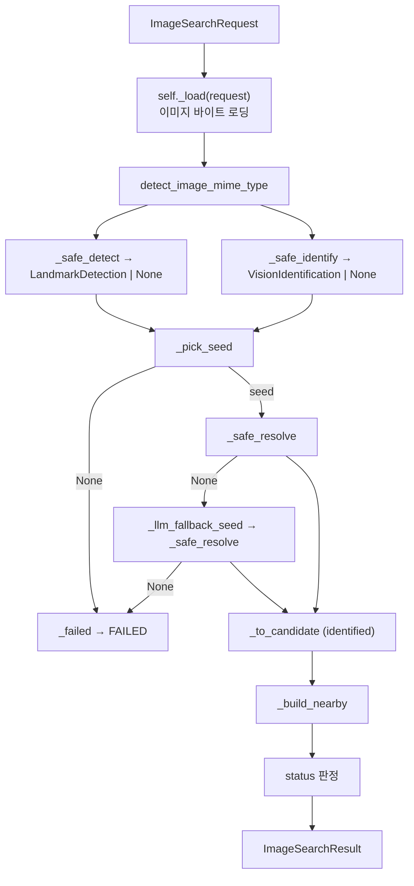

# 🧭 Image Search Services

세 provider(랜드마크·Gemini·Places)를 캐스케이드로 엮어 사진 한 장을 장소 후보로 조립하는 **Application 계층(services)**입니다.

이 폴더는 Cloud Vision·Gemini·Places 같은 외부 API를 직접 호출하지 않습니다. 세 연동은 모두 Protocol 뒤의 provider에 위임하고, 좌표·place_id 같은 사실은 스스로 만들지 않고 항상 Places가 확정한 값만 받아 조립합니다. image_search는 이 실행 계층을 `application/`이 아니라 `services/`로 부르며, 이는 route_planner의 `services/trip_planner_service.py`, free_time_recommender의 `application/` Use Case 계층과 같은 대응 관계입니다.

> 상위 문서: [Image Search](../README.md)

<br>

## 📚 목차

1. [🎯 디렉터리 역할](#-디렉터리-역할)
2. [📁 파일 구성](#-파일-구성)
3. [🔄 전체 실행 흐름](#-전체-실행-흐름)
4. [🔌 Provider 인터페이스 (Protocol)](#-provider-인터페이스-protocol)
5. [⚙️ PlaceRecognizerConfig](#-placerecognizerconfig)
6. [🧠 PlaceRecognizer 캐스케이드](#-placerecognizer-캐스케이드)
7. [📍 좌표는 항상 Places](#-좌표는-항상-places)
8. [🔒 이미지 로딩과 보안 (image_loader)](#-이미지-로딩과-보안-image_loader)
9. [🚨 오류 처리](#-오류-처리)
10. [🧪 테스트 관점](#-테스트-관점)
11. [⚠️ 현재 한계](#-현재-한계)
12. [🔗 관련 문서](#-관련-문서)

<br>


## 🎯 디렉터리 역할

`ai/image_search/services`는 사진 요청을 받아 식별과 근처 추천을 하나의 결과로 조립하는 **오케스트레이션 계층**입니다. 다음 책임을 가집니다.

- 세 provider(랜드마크·Gemini·Places)의 계약을 `Protocol`로 정의하고 DI로 주입받기
- 이미지 소스를 한 곳에서 로딩해 두 식별기에 같은 바이트를 넘기기
- 이미지 바이트로 MIME 타입을 감지해 Gemini에 올바른 타입 전달
- 랜드마크 감지와 비전 LLM을 매 요청마다 모두 실행
- 두 결과 중 시드(seed)로 삼을 장소명 선택(캐스케이드)
- 시드 이름을 Places로 검색해 좌표·place_id 확정(실패 시 LLM 이름으로 재시도)
- 확정 좌표를 중심으로 근처 추천 후보 채우기
- 인식 상태(SUCCESS·PARTIAL·FAILED) 판정 후 `ImageSearchResult` 반환
- 각 외부 호출 실패를 예외 대신 저하(None·빈 리스트)로 흡수(우아한 저하)
- 신뢰할 수 없는 이미지 소스를 SSRF·경로 탈출 관점에서 안전하게 로딩

이 계층은 장소 인식 알고리즘(랜드마크 감지·비전 추론·Places 검색)을 직접 구현하지 않습니다.

```text
services (Application)
→ provider Protocol 호출
→ 시드 선택 · 좌표 확정 · 근처 추천 조립
→ ImageSearchResult 반환
```

각 책임의 위치는 다음과 같이 분리됩니다.

| 계층 | 책임 |
|---|---|
| services | 실행 순서 조합, 캐스케이드 판단, 상태 판정, 이미지 로딩 보안 |
| providers | Cloud Vision·Gemini·Places 실제 호출과 원신호 생성 |
| domain | 요청·응답 계약 DTO와 provider 원신호 모델, 카테고리 어휘 |

> **관련 문서**
>
> - [Image Search](../README.md) — 모듈 전체 구조와 좌표 불변조건
> - [Providers](../providers/README.md) — 각 provider의 실제 구현
> - [Domain](../domain/README.md) — 원신호·계약 DTO 정의

<br>

## 📁 파일 구성

`services/` 아래 구현 파일은 두 개입니다.

```text
ai/image_search/services/
├── README.md              이 문서
├── place_recognizer.py    PlaceRecognizer Application Service (캐스케이드 조합)
└── image_loader.py        이미지 로딩 + SSRF · 경로 · 크기 보안
```

| 파일 | 책임 |
|---|---|
| `place_recognizer.py` | 세 provider Protocol 정의, `PlaceRecognizerConfig`, `PlaceRecognizer.search()` 전체 흐름 조합 |
| `image_loader.py` | `load_image_bytes` · `validate_image_url`(SSRF) · `validate_image_path`(경로 탈출) · `detect_image_mime_type`(매직 넘버) |

두 파일 모두 provider 구체 구현이나 네트워크·파일에 직접 결합하지 않도록 설계됩니다. `place_recognizer.py`는 provider를 `Protocol`로만 알고, `image_loader.py`는 검증 로직을 순수 함수(`validate_*` · `detect_image_mime_type`)로 분리해 네트워크·파일 없이 테스트합니다.

<br>

## 🔄 전체 실행 흐름

`PlaceRecognizer.search(request)`가 전체 처리 순서를 조정합니다. 진입점은 단일 메서드이며, 내부 단계는 모두 `_` 접두 헬퍼로 나뉩니다.



`search()`의 실제 단계 순서는 다음과 같습니다.

```text
1. image_bytes = self._load(request)           이미지 로딩(실패 시 예외 전파)
2. mime_type = detect_image_mime_type(...)     MIME 감지
3. landmark = self._safe_detect(...)           랜드마크 감지(매 요청)
4. llm = self._safe_identify(...)              비전 LLM(매 요청)
5. signals = RecognitionSignals(landmark, llm) 원신호 보존
6. seed = self._pick_seed(landmark, llm)       시드 선택 → None 이면 _failed
7. category = llm.category if llm else None     카테고리(근처 필터)
8. resolved = self._safe_resolve(seed_name)    좌표·place_id 확정
     └ None 이면 _llm_fallback_seed 로 재시도, 또 None 이면 _failed
9. identified = self._to_candidate(...)         식별 후보
10. nearby = self._build_nearby(...)            근처 추천(wanted 개)
11. status 판정 → ImageSearchResult 반환
```

세 단계가 이 계층의 정체성입니다. (3)(4)는 두 식별기를 **모두** 돌리는 병행 실행, (6)은 어느 결과를 채택할지 고르는 캐스케이드, (8)은 식별기 좌표를 버리고 Places로 재확정하는 불변조건입니다.

> **관련 문서**
>
> - [Image Search](../README.md) — 전체 처리 흐름 개요와 mermaid
> - [Providers](../providers/README.md) — 각 단계가 호출하는 provider

<br>

## 🔌 Provider 인터페이스 (Protocol)

`PlaceRecognizer`는 구체 provider 클래스에 직접 의존하지 않고, 같은 파일에 정의한 세 `Protocol`에만 의존합니다. 세 Protocol 모두 `@runtime_checkable`이라 실제·가짜 provider가 인터페이스를 만족하는지 테스트에서 `isinstance`로 검증할 수 있습니다.

### LandmarkDetector

Cloud Vision 랜드마크 감지를 추상화합니다.

```text
LandmarkDetector (@runtime_checkable Protocol)
└── detect(image_bytes: bytes | None = None,
           image_url: str | None = None) -> LandmarkDetection | None
```

두 인자 모두 선택이지만, `PlaceRecognizer._safe_detect`는 항상 `detect(image_bytes=image_bytes)` 형태로 로딩한 바이트만 넘깁니다(`image_url` 미사용). 결과가 없으면 `None`을 돌려주는 것도 정상 계약입니다.

### VisionIdentifier

Gemini 비전 추론을 추상화합니다.

```text
VisionIdentifier (@runtime_checkable Protocol)
└── identify(image_bytes: bytes,
             mime_type: str = "image/jpeg",
             note: str | None = None) -> VisionIdentification
```

`mime_type`에는 `detect_image_mime_type`가 감지한 값이, `note`에는 `request.note`(예: "야경")가 전달됩니다. 반환은 `Optional`이 아니라 `VisionIdentification`이며, 실패는 예외로 던지고 그 예외는 `_safe_identify`가 흡수합니다.

### PlacesResolver

Google Places의 두 동작을 하나의 Protocol로 묶습니다.

```text
PlacesResolver (@runtime_checkable Protocol)
├── resolve_place(place_name: str,
│                 language_code: str = "ko",
│                 region_code: str = "JP") -> ResolvedPlace
└── search_nearby(latitude: float,
                  longitude: float,
                  *, category: PlaceCategory | None = None,
                  radius_m: float,
                  max_result_count: int,
                  language_code: str = "ko",
                  region_code: str = "JP") -> list[ResolvedPlace]
```

- `resolve_place`는 장소 "이름"을 받아 실제 `ResolvedPlace`(좌표·place_id·주소)를 확정합니다.
- `search_nearby`는 좌표를 중심으로 관련 장소 목록을 돌려줍니다. `radius_m`·`max_result_count`는 키워드 전용 인자이며, `PlaceRecognizer._safe_nearby`는 `language_code`·`region_code`를 넘기지 않고 기본값(`ko`·`JP`)에 맡깁니다.

### 의존 방향

```text
provider 구현(Cloud Vision · Gemini · Places)
→ services 의 Protocol 계약 충족
→ PlaceRecognizer 는 구체 구현을 알지 못함
```

Protocol이 provider 패키지가 아니라 `place_recognizer.py` 안에 정의되어 있어, 계약과 조합 로직이 같은 파일에 있습니다. 테스트에서는 이 Protocol을 만족하는 가짜 provider를 주입해 네트워크 없이 전 흐름을 검증합니다.

> **관련 문서**
>
> - [Providers](../providers/README.md) — 각 Protocol을 구현하는 실제 provider
> - [Domain](../domain/README.md) — `LandmarkDetection` · `VisionIdentification` · `ResolvedPlace`

<br>

## ⚙️ PlaceRecognizerConfig

캐스케이드 동작을 조절하는 `frozen` 데이터클래스입니다. 세 값은 실 API 검증(Modal 배포, 실제 사진)에서 캐스케이드 동작을 확인했으며, 이후 추가 튜닝 여지만 남아 있습니다.

```text
PlaceRecognizerConfig (frozen dataclass)
├── landmark_score_threshold  = 0.6    이 값 이상이면 랜드마크 채택, 미만이면 LLM 폴백
├── nearby_radius_m           = 1500   근처 검색 반경(미터)
└── nearby_confidence_decay   = 0.15   근처 후보 confidence 순차 감소폭
```

`PlaceRecognizer(...)` 생성 시 `config`를 넘기지 않으면 위 기본값의 `PlaceRecognizerConfig()`가 쓰입니다.

### 생성자 의존성

```text
PlaceRecognizer(
    landmark: LandmarkDetector,
    vision_llm: VisionIdentifier,
    places: PlacesResolver,
    config: PlaceRecognizerConfig | None = None,      → 없으면 기본 Config
    image_loader: Callable[[ImageSearchRequest], bytes] | None = None,
)                                                     → 없으면 load_image_bytes
```

`image_loader`는 `self._load`에 저장되며, 테스트에서는 가짜 로더를, 실제 사용에서는 `image_loader.load_image_bytes`를 주입합니다.

### 클래스 상수

```text
PlaceRecognizer._NEARBY_API_MAX = 20   Places searchNearby 결과 개수 상한
```

`_build_nearby`가 `wanted + 1`을 요청할 때 이 값으로 상한을 걸어 `min(wanted + 1, 20)`만 조회합니다.

> **관련 문서**
>
> - [Image Search](../README.md) — 카테고리와 근처 추천 정책
> - [Providers](../providers/README.md) — `searchNearby`의 API 한도

<br>

## 🧠 PlaceRecognizer 캐스케이드

두 식별기를 병행한 뒤 무엇을 시드로 삼을지 고르는 것이 캐스케이드의 핵심입니다. "폴백"이라는 이름과 달리 **두 식별기는 매 요청마다 모두 호출**되고(`_safe_detect` · `_safe_identify`), 캐스케이드는 그 결과 중 채택 대상을 결정하는 내부 판단입니다.

### _pick_seed — 시드 선택

`_pick_seed(landmark, llm)`은 `(seed_name, confidence, source, reason)` 튜플 또는 `None`을 돌려줍니다.

```text
landmark 존재 && landmark.score >= landmark_score_threshold(0.6)
  → (landmark.name, landmark.score, CandidateSource.LANDMARK,
     "랜드마크 감지 결과와 일치 (신뢰도 {score:.2f})")

그 외 && llm 존재 && llm.place_name_guess 있음
  → (llm.place_name_guess, llm.confidence, CandidateSource.LLM, llm.reason)

둘 다 없음
  → None  → search() 는 _failed(signals) 반환 (FAILED)
```

임계값 0.6은 랜드마크 감지를 신뢰할 최소 기준이고, 그보다 낮으면 오탐 가능성이 높다고 보아 LLM 추정으로 넘어갑니다.

### _llm_fallback_seed — 랜드마크 확정 실패 시 LLM 대체

랜드마크를 시드로 골랐지만 그 이름이 Places에서 검색되지 않으면(`_safe_resolve`가 `None`), LLM 추정 이름으로 한 번 더 시도합니다.

```text
source is not CandidateSource.LANDMARK   → None (LLM 시드였으면 재시도 안 함)
llm is None 또는 place_name_guess 없음    → None
llm.place_name_guess == 방금 실패한 이름   → None (같은 이름 재검색 회피)
그 외
  → (llm.place_name_guess, llm.confidence, CandidateSource.LLM, llm.reason)
```

대체 시드를 얻으면 그 이름으로 `_safe_resolve`를 한 번 더 호출하고, 그래도 `None`이면 `_failed`로 종료합니다. 랜드마크 감지의 오탐을 LLM이 보정하는 안전장치입니다.

### 카테고리 결정

```text
category = llm.category if llm is not None else None
```

카테고리는 오직 LLM(`VisionIdentification.category`)에서 나오며, 근처 추천의 검색 필터와 각 후보의 `category` 필드에 쓰입니다. LLM이 없으면 `None`으로 두고, 후보 매핑 단계에서 `PlaceCategory.ETC`로 대체됩니다.

### _build_nearby — 근처 후보 조립

식별 장소의 좌표를 중심으로 같은 성격의 장소를 추천 후보로 덧붙입니다. 검색 중심이 식별 장소 좌표라 자기 자신이 결과에 섞일 수 있어, 1개 더 요청한 뒤 `place_id`로 제외합니다.

```text
wanted <= 0                        → [] (근처 요청 없음)
fetch_count = min(wanted + 1, 20)  → _NEARBY_API_MAX 상한
nearby = _safe_nearby(resolved, category, fetch_count)
deduped = [p for p in nearby if p.place_id != resolved.place_id][:wanted]
각 deduped[index] → _to_candidate(
    place, _decay(base_conf, index), "근처의 비슷한 장소",
    CandidateSource.NEARBY, category, request)
```

`nearby_wanted`는 `search()`에서 `max(0, request.max_candidates - 1)`로 계산됩니다. 후보 최대 개수 중 1개는 식별 장소이므로 나머지를 근처에서 채웁니다.

### _decay — confidence 순차 감소

근처 후보는 식별 장소만큼 확실하지 않으므로 순위 기반으로 감소시킵니다.

```text
value = base_conf - nearby_confidence_decay(0.15) * (index + 1)
반환   = round(min(base_conf, max(0.1, value)), 2)
```

- 하한 `0.1`: 아무리 감소해도 0.1 밑으로는 내려가지 않습니다.
- 상한 `base_conf`: 식별 confidence가 하한보다 낮은 경우에도 근처 후보가 식별 위로 올라가지 않게 클램프합니다.
- 소수점 2자리로 반올림합니다.

```text
식별 장소    base_conf
근처 후보 1  base_conf − 0.15
근처 후보 2  base_conf − 0.30
...          (0.1 하한, base_conf 상한 클램프)
```

### _to_candidate — ResolvedPlace → PlaceCandidate

식별 후보와 근처 후보 모두 이 정적 헬퍼로 매핑합니다.

```text
PlaceCandidate(
  name       = place.name,
  city       = place.city or request.city or "",       Places → 요청 힌트 → ""
  country    = place.country or request.country or "",
  latitude   = place.latitude,      longitude = place.longitude,
  confidence = confidence,          reason    = reason,
  category   = category or PlaceCategory.ETC,           LLM 없으면 ETC
  source     = source,              place_id  = place.place_id,
  rating     = place.rating)
```

도시·국가는 Places가 파싱한 값을 우선하고, 없으면 요청 힌트로 채우며, 그것도 없으면 빈 문자열입니다.

### 상태 판정

```text
SUCCESS  근처 후보를 얻음, 또는 애초에 근처를 요청하지 않음(nearby_wanted == 0)
PARTIAL  식별은 됐으나 요청한 근처 후보를 하나도 얻지 못함
FAILED   시드 없음 또는 Places 확정 실패 (_failed 경로)
```

코드상 판정은 `RecognitionStatus.SUCCESS if nearby_candidates or nearby_wanted == 0 else RecognitionStatus.PARTIAL`이며, `FAILED`는 `search()` 앞부분의 두 `_failed(signals)` 조기 반환에서만 나옵니다. `_failed`는 `identified=None`, `candidates=[]`로 두되 `signals`(원신호)는 보존합니다.

> **관련 문서**
>
> - [Image Search](../README.md) — 캐스케이드 식별과 근처 추천 정책
> - [Providers](../providers/README.md) — 각 식별기의 입력·출력 원신호

<br>

## 📍 좌표는 항상 Places

이 계층이 지키는 1급 불변조건입니다. **어떤 식별기가 준 좌표도 그대로 쓰지 않습니다.**

```text
식별기 출력(장소 "이름")
→ _safe_resolve → PlacesResolver.resolve_place
→ Places 가 준 좌표 · place_id · 주소로 확정
   └ 식별기가 준 좌표는 폐기
```

`LandmarkDetection`은 `latitude`·`longitude`·`score`를 함께 반환하지만, `PlaceRecognizer`는 그 좌표를 후보에 넣지 않고 오직 `name`만 시드 검색어로 씁니다. `VisionIdentification`에는 애초에 좌표 필드가 없습니다. 최종 후보의 좌표는 항상 `ResolvedPlace.latitude`·`ResolvedPlace.longitude`에서만 옵니다(`_to_candidate` 참조).

### 폐기하는 이유

- 랜드마크 감지도 오탐이 있고, 그 좌표조차 신뢰 대상이 아닙니다.
- LLM은 그럴듯한 좌표를 지어낼 수 있어(환각) 사실 확정에 쓸 수 없습니다.
- 이름을 검색어로만 쓰면 잘못된 이름은 "검색 실패"로 걸러지고, 실제 존재하는 장소만 좌표를 얻습니다.

### Places가 확정하는 값(ResolvedPlace)

```text
place_id
latitude · longitude
formatted_address
city · country          (addressComponents 파싱)
rating
review_count · primary_type   (파싱해 보관만, 현재 내부 로직 미사용)
```

`review_count`·`primary_type`은 `ResolvedPlace`에 보관되지만 `PlaceCandidate` 조립에는 쓰이지 않습니다(백엔드 매핑·향후 활용 대비).

> **관련 문서**
>
> - [Image Search](../README.md) — 좌표 불변조건의 배경
> - [Providers](../providers/README.md) — `PlacesResolver.resolve_place`의 실제 확정 로직

<br>

## 🔒 이미지 로딩과 보안 (image_loader)

`image_loader.py`는 신뢰할 수 없는 이미지 소스(URL·로컬 경로)를 안전하게 바이트로 로딩합니다. 검증 로직은 순수 함수로 분리해 네트워크·파일 없이 테스트합니다. 모든 검증 실패는 `ImageLoadError`로 통일되며, 이는 `ValueError`의 하위 클래스입니다.

### load_image_bytes — 진입점

`recognizer`가 한 곳에서 로딩해 두 식별기에 같은 이미지를 넘기기 위한 함수입니다.

```text
load_image_bytes(
  request: ImageSearchRequest,
  allowed_base_dir: Path | None = None,
  timeout_seconds: float = 10.0,
  transport: httpx.BaseTransport | None = None,   테스트 주입(MockTransport)
  max_bytes: int = 20MB,
  deadline_seconds: float = 30.0) -> bytes
```

분기:

```text
request.image_path 있음
  → allowed_base_dir 없으면 ImageLoadError (임의 파일 읽기 방지)
  → validate_image_path 후 resolved.read_bytes()

그 외 (image_url)
  → validate_image_url 로 공인 IP 확보(pinned_ip)
  → transport 미주입이면 _build_pinned_transport(pinned_ip) 사용
  → httpx.Client(follow_redirects=False).stream("GET", url)
  → raise_for_status → _reject_if_declared_too_large → _read_capped
  → httpx.HTTPError 는 ImageLoadError 로 감쌈
```

### validate_image_url — SSRF 방지

URL을 SSRF 관점에서 검증하고, 접속을 고정할 공인 IP를 돌려줍니다.

```text
스킴          _ALLOWED_SCHEMES = {"http", "https"} 만 허용
호스트        parsed.hostname 없으면 차단
주소 해석      _resolve_addresses(host)
공인성 검사    해석된 모든 주소가 address.is_global 이어야 함
              (루프백 · 사설 · 링크로컬 · 메타데이터 · unspecified 는 차단)
반환          검증한 첫 주소 str(addresses[0])  → 접속 고정용
```

`_resolve_addresses`는 호스트가 이미 IP 리터럴이면 그대로 쓰고, 아니면 `socket.getaddrinfo(host, None)`로 모든 주소를 해석합니다. 해석 실패(`socket.gaierror`)나 빈 결과도 `ImageLoadError`로 차단합니다.

### _PinnedIpBackend — DNS 리바인딩 차단

검사와 접속 사이에 DNS가 다시 해석되면(rebinding) 공인 IP로 검증한 뒤 사설 IP로 접속하는 우회가 가능합니다. 이를 막기 위해 검증한 IP로만 TCP 접속을 고정합니다.

```text
_PinnedIpBackend(httpcore.NetworkBackend)
├── connect_tcp(host, port, ...)
│     → host(원 호스트명)를 무시하고 self._pinned_ip 로 접속
└── connect_unix_socket(...)  → 내부 backend 로 위임

_build_pinned_transport(pinned_ip):
  transport = httpx.HTTPTransport(retries=0)
  transport._pool._network_backend = _PinnedIpBackend(pinned_ip, 기존 backend)
```

`httpcore`는 접속 후 TLS(SNI·인증서 검증)를 **원 호스트명**으로 수행하므로 https는 그대로 동작하고, 접속 시 DNS를 다시 해석하지 않아 검사↔접속 사이 재해석 틈이 사라집니다. `transport`를 주입한 테스트 경로에서는 pinned transport를 만들지 않습니다.

### 크기와 시간 제한

```text
follow_redirects = False    리다이렉트를 통한 SSRF 우회 차단
_reject_if_declared_too_large  Content-Length 가 숫자이고 max_bytes 초과면
                            본문을 받기 전에 거부
_read_capped 스트리밍 상한   청크 누적이 max_bytes(20MB) 초과면 중단
_read_capped 데드라인        time.monotonic 기준 deadline_seconds(30s) 초과면 중단
```

`_read_capped`는 `response.iter_bytes()`로 청크를 받으며 매 청크마다 누적 크기와 wall-clock 데드라인을 함께 검사합니다.

### validate_image_path — 경로 탈출 방지

```text
base      = base_dir.resolve()
candidate = (base / path).resolve()
검사       base != candidate 이고 base 가 candidate.parents 에 없으면
          ImageLoadError (허용된 디렉토리 밖의 경로)
반환       정규화된 절대경로 candidate
```

`../`나 절대경로로 허용 base 디렉터리 밖을 가리키면 차단합니다. `image_path` 로딩에 `allowed_base_dir`를 필수로 요구하는 것과 함께, 신뢰 디렉터리 한정을 이중으로 강제합니다.

### detect_image_mime_type — 매직 넘버 감지

이미지 바이트의 매직 넘버로 MIME 타입을 추정해 Gemini에 올바른 타입을 넘깁니다.

```text
\xff\xd8\xff                         → image/jpeg
\x89PNG\r\n\x1a\n                     → image/png
GIF87a / GIF89a                      → image/gif
[:4]=="RIFF" && [8:12]=="WEBP"       → image/webp
[4:8]=="ftyp" && [8:12] ∈ _HEIC_BRANDS → image/heic
그 외                                 → image/jpeg (기본값)
```

HEIC(아이폰 기본 포맷)는 `ftyp` 컨테이너 브랜드로 판별합니다.

```text
_HEIC_BRANDS = {heic, heix, hevc, heim, heis, mif1, msf1}
```

> **관련 문서**
>
> - [Image Search](../README.md) — 이미지 로딩 보안 개요
> - [Domain](../domain/README.md) — `ImageSearchRequest`(image_url · image_path)

<br>

## 🚨 오류 처리

이 계층은 두 층위의 오류를 서로 다르게 다룹니다. **로딩 실패는 전파**하고, **provider 실패는 저하**합니다.

### 이미지 로딩 실패는 전파

`search()`는 가장 먼저 `image_bytes = self._load(request)`를 `try` 밖에서 호출합니다. 따라서 `ImageLoadError`(SSRF 차단·경로 탈출·크기 초과·데드라인·다운로드 실패)는 흡수하지 않고 그대로 호출자에게 올라갑니다.

```text
_load 실패 → ImageLoadError(ValueError 계열) → search() 밖으로 전파
           (Modal 엔트리포인트에서 422 로 매핑)
```

### provider 실패는 우아하게 저하

각 외부 호출은 `_safe_` 래퍼로 감싸 예외를 `None` 또는 빈 리스트로 흡수합니다. 한 호출이 실패해도 전체 요청은 중단하지 않습니다.

```text
_safe_detect     except Exception → None      랜드마크 없이 진행
_safe_identify   except Exception → None      LLM 없이 진행
_safe_resolve    except Exception → None      좌표 확정 실패 → 폴백/실패
_safe_nearby     except Exception → []         근처 없이 진행(PARTIAL 가능)
```

이 저하가 상태 판정과 맞물립니다.

```text
랜드마크 감지 실패    → LLM 으로 시드 선택 시도
비전 LLM 실패        → 랜드마크로 시드 선택 시도
두 식별기 다 실패     → _pick_seed None → FAILED
Places 확정 실패      → LLM 폴백 시드로 재시도, 그래도 실패면 FAILED
근처 추천 실패/없음   → 식별만 반환(PARTIAL)
```

### 원신호는 항상 보존

`FAILED` 경로(`_failed`)에서도 `signals=RecognitionSignals(landmark, llm)`를 그대로 담아 반환합니다. 식별에 실패해도 어떤 원신호가 있었는지는 로깅·디버깅을 위해 남깁니다.

> **관련 문서**
>
> - [Image Search](../README.md) — Modal 엔트리포인트의 에러 매핑(ImageLoadError → 422)
> - [Providers](../providers/README.md) — provider가 던지는 예외의 종류

<br>

## 🧪 테스트 관점

이 계층은 결정론적 단위 테스트로 로직·경계·보안을 검증합니다. 세 provider와 이미지 로더를 Protocol·Callable로 주입할 수 있어 실제 네트워크·API 없이 전 흐름을 돌립니다. 실 Google·Gemini 응답을 쓰는 end-to-end 확인은 `scripts/run_image_search.py`로 수행하며, Modal 배포 환경에서 실제 사진으로 end-to-end 검증(SUCCESS)을 완료했습니다.

### PlaceRecognizer 캐스케이드

- 랜드마크 `score >= 0.6` → 랜드마크 시드 채택
- 랜드마크 `score < 0.6` 또는 부재 → LLM 추정 시드 채택
- 두 식별기 모두 없음 → `FAILED`
- 랜드마크 시드가 Places 실패 → LLM 폴백으로 재시도
- 폴백 조건(LANDMARK 소스, LLM 추정 존재, 이름 상이) 경계
- 폴백 이름이 방금 실패한 이름과 같을 때 재시도 안 함
- 두 식별기 병행 호출 여부(`_safe_detect`·`_safe_identify` 모두 실행)

### 좌표 불변조건

- 최종 후보 좌표가 항상 `ResolvedPlace`에서 오는지
- 랜드마크가 준 좌표가 후보에 새지 않는지

### 근처 추천

- `nearby_wanted = max(0, max_candidates - 1)` 계산
- `wanted + 1` 조회 후 `place_id`로 식별 장소 자기 자신 제외
- `_NEARBY_API_MAX(20)` 상한
- `wanted` 개수로 절단
- `_decay` 순차 감소, 하한 0.1, 상한 base_conf 클램프, 2자리 반올림

### 상태 판정

- 근처를 얻음 → `SUCCESS`
- `max_candidates == 1`(근처 미요청) → `SUCCESS`
- 근처를 원했으나 하나도 못 얻음 → `PARTIAL`
- 식별 실패 → `FAILED`, 단 `signals` 보존

### 우아한 저하

- 한 식별기 예외 시 다른 하나로 진행
- 근처 검색 예외 시 빈 리스트로 저하
- `ImageLoadError`는 저하하지 않고 전파

### 후보 매핑

- `city`·`country`가 Places → 요청 힌트 → 빈 문자열 순으로 채워지는지
- LLM 없을 때 `category`가 `PlaceCategory.ETC`가 되는지

### image_loader 보안

- SSRF 차단: 사설·루프백·링크로컬·메타데이터·unspecified IP, 허용 외 스킴
- 리다이렉트 차단(`follow_redirects=False`)
- Content-Length 사전 거부, 20MB 스트리밍 상한, 30s 데드라인
- pinned IP 접속 고정(DNS 리바인딩)
- 경로 탈출(`../`·절대경로) 차단, `allowed_base_dir` 필수
- MIME 감지(JPEG·PNG·GIF·WEBP·HEIC, 미상 → image/jpeg)

> **관련 문서**
>
> - [Providers](../providers/README.md) — provider 계약 준수 테스트
> - [Domain](../domain/README.md) — 계약 DTO 검증 규칙

<br>

## ⚠️ 현재 한계

- 위치 힌트(`latitude`·`longitude`·`city`·`country`)를 요청으로 받지만, `resolve_place`/`search_nearby`의 locationBias로는 아직 활용하지 않습니다. 힌트는 후보의 `city`·`country` 채움에만 쓰입니다.
- 두 식별기를 병행으로 부른다고 하지만 실제 호출은 순차입니다(`_safe_detect` 다음 `_safe_identify`). 병렬 앙상블은 미적용이며, `RecognitionSignals`가 확장 대비로 원신호만 보존합니다.
- `_safe_` 래퍼가 모든 `Exception`을 일괄 흡수하므로, provider의 세부 실패 원인은 결과에 구분되어 남지 않습니다(원신호 유무로만 추론).
- 근처 검색은 단일 `category` 필터 기준이며, 다중 카테고리 혼합은 하지 않습니다. LLM이 없으면 카테고리 없이 검색합니다.
- `PlacesResolver`의 `language_code`·`region_code`가 `_safe_resolve`·`_safe_nearby`에서 기본값(`ko`·`JP`)으로 고정되어 있어, 일본 외 지역에는 재조정이 필요합니다.
- `_decay`의 감소폭·하한·임계값(0.6)은 실 API 검증(Modal 배포)에서 동작을 확인했으며, 값 자체는 이후 추가 튜닝 여지가 있습니다.
- Provider Protocol이 별도 Port 파일이 아니라 `place_recognizer.py` 안에 정의되어 있어 계약과 조합 로직이 한 파일에 결합되어 있습니다.

<br>

## 🔗 관련 문서

| 문서 | 설명 |
|---|---|
| [Image Search](../README.md) | 모듈 전체 구조와 좌표 불변조건, Modal 엔트리포인트 |
| [Domain](../domain/README.md) | 원신호 모델·계약 DTO·`PlaceCategory` 어휘 |
| [Providers](../providers/README.md) | Cloud Vision·Gemini·Places 실제 구현과 API 키 정책 |
| [`place_recognizer.py`](./place_recognizer.py) | `PlaceRecognizer` Application Service 구현 |
| [`image_loader.py`](./image_loader.py) | 이미지 로딩과 SSRF·경로 보안 구현 |
| [Route Planner Application](../../route_planner/application/README.md) | 형제 모듈의 Application 계층(services 대응) |
| [Free Time Recommender Application](../../free_time_recommender/application/README.md) | 형제 모듈의 Application Use Case 계층 |
