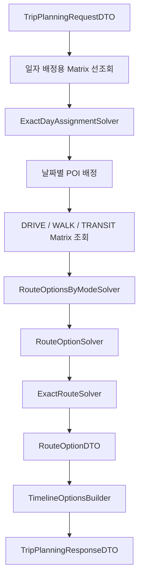

# 🗺️ Route Planner

여행 장소를 **일자별로 정확하게 배정**하고, 이동수단별 **최소 이동시간 경로와 Timeline**을 생성하는 일정 최적화 모듈입니다.

현재 구현은 Cheapest Insertion, Relocate, 2-opt 같은 휴리스틱을 사용하지 않습니다.
입력 제한 범위 안에서 **부분집합 동적 계획법 기반의 정확 최적화**를 수행하며, 제한을 초과하면 휴리스틱으로 전환하지 않고 명시적인 예외를 반환합니다.

> Route Planner의 결과는 [Free Time Recommender](../free_time_recommender/README.md)의 입력으로 사용됩니다.

<br>

## 📚 목차

1. [🎯 모듈 역할](#-모듈-역할)
2. [🔄 전체 처리 흐름](#-전체-처리-흐름)
3. [🧠 정확 경로 최적화](#-정확-경로-최적화)
4. [📅 정확 일자 배정](#-정확-일자-배정)
5. [🚘 이동수단별 Route Option](#-이동수단별-route-option)
6. [🧩 Matrix와 식별자 정책](#-matrix와-식별자-정책)
7. [🚨 누락 구간 처리](#-누락-구간-처리)
8. [⏱️ Timeline 생성](#-timeline-생성)
9. [📥 입력과 출력](#-입력과-출력)
10. [🧪 테스트와 평가](#-테스트와-평가)
11. [📁 디렉터리 구조](#-디렉터리-구조)
12. [⚠️ 현재 한계](#-현재-한계)
13. [🔗 세부 문서](#-세부-문서)

<br>


## 🎯 모듈 역할

`ai/route_planner`는 다음 문제를 처리합니다.

- 전체 후보 POI의 여행 일자별 배정
- 날짜별 이동시간 Matrix 조회
- DRIVE, WALK, TRANSIT별 정확 경로 계산
- Route Option과 Route Leg 생성
- 이동시간과 체류시간 기반 Timeline 생성
- Provider 누락 구간과 일정 초과 상태의 명시적 처리

이 모듈은 LLM이나 학습 모델로 경로를 생성하지 않습니다.
Google Routes Provider의 이동시간 데이터와 도메인 제약을 기반으로 결정론적 최적화를 수행합니다.

> **관련 문서**
>
> - [Application Service와 전체 실행 흐름](./application/README.md)
> - [요청·응답 DTO와 도메인 모델](./domain/README.md)

<br>

## 🔄 전체 처리 흐름



```text
요청 검증
→ 날짜별 일자 배정용 Matrix 조회
→ 정확 일자 배정
→ 날짜별 이동수단 Matrix 조회
→ 이동수단별 정확 경로 계산
→ Route Option 생성
→ Timeline 생성
→ 최종 응답 반환
```

`TripPlannerService`가 전체 처리 순서를 조정합니다.

1. 날짜별 일자 배정용 Matrix를 먼저 조회합니다.
2. 전체 후보 POI를 각 여행 날짜에 정확하게 배정합니다.
3. 각 날짜의 배정 결과로 이동수단별 Matrix를 다시 조회합니다.
4. DRIVE, WALK, TRANSIT별 정확 경로를 계산합니다.
5. 경로 결과를 Route Option으로 변환합니다.
6. 각 Route Option에 Timeline을 생성합니다.
7. 최종 `TripPlanningResponseDTO`를 반환합니다.

> **관련 문서**
>
> - [Application Service와 전체 실행 흐름](./application/README.md)
> - [정확 최적화 Solver 구조](./solvers/README.md)

<br>


## 🧠 정확 경로 최적화

각 날짜와 이동수단에서 다음 형태의 경로를 계산합니다.

```text
START
→ 배정된 모든 POI를 정확히 한 번씩 방문
→ END
```

`ExactRouteSolver`는 **Held-Karp 부분집합 동적 계획법**을 사용합니다.

### 상태 구조

```text
(방문한 POI 집합 비트마스크, 마지막 방문 POI)
→ 해당 상태까지의 최소 누적 이동시간
→ 이전 방문 POI
```

### 계산 순서

1. START에서 각 POI로 이동하는 초기 상태를 생성합니다.
2. 방문한 POI 부분집합을 확장합니다.
3. 동일 상태에서는 이동시간이 가장 작은 경로만 유지합니다.
4. 모든 POI를 방문한 뒤 END까지 연결되는 후보를 비교합니다.
5. 최소 이동시간 후보를 선택합니다.
6. 이전 상태를 역추적해 최종 방문 순서를 복원합니다.

입력 제한 범위 안에서는 근사 경로가 아니라 **전역 최소 이동시간 경로**를 계산합니다.

### POI가 없는 경우

배정된 POI가 없다면 다음 경로만 계산합니다.

```text
START → END
```

### 입력 제한

기본 제한은 다음과 같습니다.

```text
max_poi_count = 12
```

제한을 초과하면 `ExactRouteLimitExceededError`가 발생합니다.

```text
POI 제한 초과
→ 휴리스틱 fallback 없음
→ 명시적인 오류 반환
```

> **관련 문서**
>
> - [Held-Karp 정확 경로 Solver](./solvers/README.md)
> - [경로 및 Route Option 도메인 모델](./domain/README.md)

<br>

## 📅 정확 일자 배정

일자 배정도 Greedy, 공간 군집화 또는 휴리스틱 방식이 아닙니다.

`ExactDayAssignmentSolver`는 다음 순서로 동작합니다.

1. 날짜별 가능한 POI 부분집합을 생성합니다.
2. 각 부분집합의 정확 경로비용을 계산합니다.
3. 날짜별 후보 부분집합을 겹치지 않게 결합합니다.
4. Partition Dynamic Programming으로 최종 배정을 선택합니다.

### 날짜별 부분집합

각 날짜에 대해 비어 있는 집합을 포함한 POI 부분집합을 검토합니다.

```text
Day 1
├── {}
├── {POI-A}
├── {POI-B}
├── {POI-A, POI-B}
└── ...
```

부분집합은 다음 조건을 만족해야 합니다.

- `max_place_count`를 초과하지 않아야 합니다.
- `preferred_day_index`가 지정된 POI는 해당 날짜에만 포함됩니다.
- START, 모든 POI, END를 연결하는 완전 경로가 존재해야 합니다.

### 날짜 간 배정

동일한 POI가 여러 날짜에 배정되지 않도록 비트마스크 상태를 사용합니다.

```text
현재까지 배정한 POI 집합
→ 다음 날짜 후보 결합
→ 중복 POI가 있으면 제외
→ 같은 배정 집합에서는 더 작은 총 이동시간 유지
```

### 배정 결과 상태

- 모든 POI 배정 완료: `SUCCESS`
- 하나 이상의 POI 미배정: `PARTIAL_SUCCESS`

일자 배정도 기본 설정에서 전체 POI가 12개를 초과하면 휴리스틱으로 전환하지 않습니다.

> **관련 문서**
>
> - [정확 일자 배정과 Partition DP](./solvers/README.md)
> - [일자 제약과 Day Plan 도메인 모델](./domain/README.md)

<br>

## 🚘 이동수단별 Route Option

일자 배정이 완료되면 각 날짜에서 다음 이동수단을 독립적으로 계산합니다.

- `DRIVE`
- `WALK`
- `TRANSIT`

```text
같은 날짜의 같은 POI 집합
├── DRIVE Matrix   → DRIVE 최소 경로
├── WALK Matrix    → WALK 최소 경로
└── TRANSIT Matrix → TRANSIT 최소 경로
```

이동수단마다 이동시간 Matrix가 다르므로 하나의 방문 순서를 모든 이동수단에 재사용하지 않습니다.

서버는 특정 이동수단 하나를 임의로 선택하지 않고 복수의 Route Option을 반환합니다.

### Route Option 생성 흐름

```text
DayPlanDTO
+ TravelTimeMatrixResult
→ ExactRouteSolver
→ ExactRouteResult
→ ordered_stops
→ route_legs
→ RouteOptionDTO
```

### 주요 결과

- 이동수단
- 정렬된 방문 장소
- 장소 간 Route Leg
- 총 이동시간
- 누락 구간
- 경고
- Timeline

> **관련 문서**
>
> - [이동수단별 Route Option 생성](./solvers/README.md)
> - [Route Option과 Route Leg 모델](./domain/README.md)

<br>

## 🧩 Matrix와 식별자 정책

이동시간 Matrix의 Key는 `place_id` 쌍입니다.

```text
(origin_place_id, destination_place_id)
→ travel_minutes
```

이동시간은 방향에 따라 달라질 수 있으므로 비대칭 Matrix를 지원합니다.

```text
A → B 이동시간 ≠ B → A 이동시간
```

START, END, POI의 `place_id`는 동일 Matrix 안에서 모두 고유해야 합니다.

### 일자 배정 Matrix

각 날짜에서 다음 Location을 사용합니다.

```text
해당 날짜 START
+ 전체 후보 POI
+ 해당 날짜 END
```

일자 배정용 이동수단은 `TripPlannerServiceConfig.day_assignment_travel_mode`로 주입됩니다.

### Route Option Matrix

일자 배정 후에는 다음 Location만 사용합니다.

```text
해당 날짜 START
+ 해당 날짜에 배정된 POI
+ 해당 날짜 END
```

위 Location 집합으로 DRIVE, WALK, TRANSIT Matrix를 각각 조회합니다.

### 출발시각과 timezone

```text
여행 날짜
+ 시작 시각
+ IANA timezone
→ timezone-aware departure_time
```

지원하지 않는 timezone과 잘못된 날짜 또는 시각 형식은 오류로 처리합니다.

> **관련 문서**
>
> - [Travel Time Matrix Provider](./providers/README.md)
> - [Matrix 및 경로 도메인 모델](./domain/README.md)

<br>

## 🚨 누락 구간 처리

Provider가 일부 이동 구간을 계산하지 못해도 임의의 비용을 보충하지 않습니다.

```text
누락 구간
→ Matrix에 없는 상태로 유지
→ 정확 Solver는 실제 연결 가능한 경로만 탐색
```

### 우회 가능한 경우

일부 구간이 누락되어도 다른 연결을 통해 모든 장소를 방문할 수 있다면 정확 경로를 생성합니다.

Provider가 계산하지 못한 구간은 다음 항목에 기록합니다.

- `missing_segments`
- `warnings`

### 완전 경로를 만들 수 없는 경우

```text
total_travel_minutes = 0
ordered_stops = []
route_legs = []
missing_segments = 누락 구간 목록
warnings = 경로 생성 불가 사유
timeline = None
```

Provider 누락이 없는 완전한 Matrix에서 도메인 경로 오류가 발생하면 오류를 숨기지 않고 그대로 전파합니다.

> **관련 문서**
>
> - [Provider 누락 구간 정책](./providers/README.md)
> - [정확 Solver의 경로 부재 처리](./solvers/README.md)

<br>

## ⏱️ Timeline 생성

`TimelineOptionsBuilder`는 날짜의 모든 Route Option에 Timeline을 적용합니다.

```text
START 출발
→ 첫 번째 POI까지 이동
→ 첫 번째 POI 체류
→ 다음 POI까지 이동
→ 다음 POI 체류
→ ...
→ END 도착
```

Timeline에는 다음 정보가 포함됩니다.

- 날짜 시작 시각
- 구간별 이동시간
- 장소별 체류시간
- 장소별 도착시각
- 장소별 출발시각
- 실제 일정 종료시각
- 계획 종료시각 초과 여부

`missing_segments`가 있는 Route Option에는 Timeline을 생성하지 않습니다.

```text
missing_segments 존재
→ timeline = None
→ warning 추가
```

가짜 이동시간으로 불완전한 Timeline을 만들지 않기 위한 정책입니다.

> **관련 문서**
>
> - [Timeline Builder와 Route Option 처리](./solvers/README.md)
> - [Timeline 도메인 모델](./domain/README.md)

<br>

## 📥 입력과 출력

### 입력

주요 입력 모델은 `TripPlanningRequestDTO`입니다.

```text
TripPlanningRequestDTO
├── trip_id
├── timezone
├── days
│   ├── day_index
│   ├── date
│   ├── start_time
│   ├── end_time
│   ├── start_place
│   ├── end_place
│   └── max_place_count
└── pois
    ├── poi_id
    ├── place_id
    ├── name
    ├── lat
    ├── lng
    ├── estimated_stay_minutes
    └── preferred_day_index
```

### 출력

```text
TripPlanningResponseDTO
├── trip_id
├── status
├── day_plans
│   ├── assigned_pois
│   ├── estimated_total_stay_minutes
│   └── route_options
│       ├── DRIVE
│       ├── WALK
│       └── TRANSIT
├── unassigned_pois
└── warnings
```

> **관련 문서**
>
> - [요청·응답 DTO와 상태 모델](./domain/README.md)

<br>

## 🧪 테스트와 평가

주요 테스트 대상은 다음과 같습니다.

- Held-Karp 정확 경로 결과
- 비대칭 Matrix
- POI가 없는 경로
- 누락된 Matrix 구간
- POI 제한 초과
- 날짜별 POI 부분집합 생성
- 날짜 간 POI 중복 배정 방지
- 선호 날짜와 날짜별 최대 장소 수
- 이동수단별 Route Option 생성 순서
- Route Leg 합계와 총 이동시간 정합성
- Timeline 생성과 누락 옵션 처리
- DTO 불변성과 `model_copy` 기반 갱신

평가에서는 다음 항목을 확인합니다.

- 총 이동시간
- 실행시간
- 평가한 DP 상태 수
- 날짜별 배정 결과
- 미배정 POI
- 이동수단별 결과
- 누락 구간

> **관련 문서**
>
> - [정확 최적화 평가와 Benchmark](./evaluation/README.md)
> - [Solver 내부 검증 기준](./solvers/README.md)

<br>

## 📁 디렉터리 구조

```text
ai/route_planner/
├── README.md
├── application/
│   ├── README.md
│   └── trip_planner_service.py
├── domain/
│   ├── README.md
│   ├── schemas.py
│   └── trip_schemas.py
├── providers/
│   └── README.md
├── solvers/
│   ├── README.md
│   ├── exact_route_solver.py
│   ├── exact_day_assignment_solver.py
│   ├── day_assignment_solver.py
│   ├── route_option_solver.py
│   ├── route_options_by_mode_solver.py
│   ├── timeline_builder.py
│   └── timeline_options_builder.py
├── evaluation/
│   └── README.md
├── tests/
└── modal_app.py
```

> **세부 문서**
>
> - [Application](./application/README.md)
> - [Domain](./domain/README.md)
> - [Providers](./providers/README.md)
> - [Solvers](./solvers/README.md)
> - [Evaluation](./evaluation/README.md)

<br>

## ⚠️ 현재 한계

- 정확 계산을 위해 POI 수가 기본 12개로 제한됩니다.
- 제한 초과 시 휴리스틱 fallback을 제공하지 않습니다.
- 영업시간, 휴무일과 예약 가능 여부는 강제 제약으로 사용되지 않습니다.
- 일정 초과 시 POI를 자동 제거하거나 다른 날짜로 다시 배정하지 않습니다.
- 실시간 위치와 교통 변화에 따른 자동 재계획을 수행하지 않습니다.
- 서버가 복수 Route Option 중 하나를 최종 선택하지 않습니다.
- 최종 이동수단 선택은 호출 측의 책임입니다.

<br>

## 🔗 세부 문서

| 문서 | 설명 |
|---|---|
| [Application](./application/README.md) | 일정 최적화의 전체 실행 순서와 Application Service |
| [Domain](./domain/README.md) | 요청·응답 DTO, Route Option과 Timeline 모델 |
| [Providers](./providers/README.md) | Google Routes Matrix 조회와 누락 구간 정책 |
| [Solvers](./solvers/README.md) | 정확 일자 배정, Held-Karp 경로와 Timeline 생성 |
| [Evaluation](./evaluation/README.md) | 정확 최적화 결과 검증, 평가와 Benchmark |
| [Free Time Recommender](../free_time_recommender/README.md) | 최적화 경로 기반 빈 시간대 장소 추천 |
