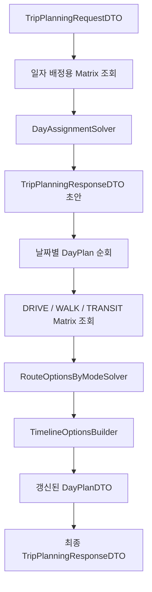

# 🧭 Route Planner Application

Route Planner의 전체 실행 순서를 조합하는 Application Service를 설명합니다.

현재 실제 구현 파일은 `ai/route_planner/application/`이 아니라 다음 경로에 있습니다.

```text
ai/route_planner/services/trip_planner_service.py
```

이 README는 Route Planner의 Application 계층 문서 진입점으로 사용합니다.

> 상위 문서: [Route Planner](../README.md)

<br>

## 📚 목차

1. [🎯 Application 계층 역할](#-application-계층-역할)
2. [📁 현재 코드 위치](#-현재-코드-위치)
3. [🔄 전체 실행 흐름](#-전체-실행-흐름)
4. [🔌 Provider 인터페이스](#-provider-인터페이스)
5. [⚙️ TripPlannerServiceConfig](#-tripplannerserviceconfig)
6. [🧠 TripPlannerService](#-tripplannerservice)
7. [📅 일자 배정 Matrix 선조회](#-일자-배정-matrix-선조회)
8. [🚘 이동수단별 Matrix 조회](#-이동수단별-matrix-조회)
9. [🕒 출발시각과 timezone](#-출발시각과-timezone)
10. [🪪 Location 식별자 정책](#-location-식별자-정책)
11. [✅ 결과 조립과 불변성](#-결과-조립과-불변성)
12. [🚨 오류 처리](#-오류-처리)
13. [🧪 테스트 관점](#-테스트-관점)
14. [⚠️ 현재 구조의 주의사항](#-현재-구조의-주의사항)
15. [🔗 관련 문서](#-관련-문서)

<br>


## 🎯 Application 계층 역할

Route Planner Application 계층은 다음 책임을 가집니다.

- 이동시간 Matrix Provider 계약 정의
- 일자 배정용 Matrix 선조회
- 정확 일자 배정 Solver 호출
- 날짜별 배정 결과와 날짜 제약 연결
- 이동수단별 Matrix 조회
- 이동수단별 Route Option 생성
- Route Option별 Timeline 생성
- 최종 `TripPlanningResponseDTO` 조립
- Provider 요청에 사용할 timezone-aware 출발시각 생성
- Matrix Key 충돌을 방지하기 위한 장소 식별자 검증

Application 계층은 경로 최적화 알고리즘을 직접 구현하지 않습니다.

```text
Application
→ Provider 호출
→ Solver 호출
→ DTO 조립
```

각 계층의 책임은 다음과 같이 분리됩니다.

| 계층 | 책임 |
|---|---|
| Application | 실행 순서와 의존성 조합 |
| Provider | 이동시간 Matrix 생성 |
| Solver | 정확 일자 배정과 경로 최적화 |
| Domain | 요청·응답 DTO와 공통 모델 |

<br>

## 📁 현재 코드 위치

현재 구조:

```text
ai/route_planner/
├── application/
│   └── README.md
├── services/
│   └── trip_planner_service.py
├── domain/
├── solvers/
└── providers/
```

Application Service 구현은 다음 파일에 있습니다.

```text
../services/trip_planner_service.py
```

따라서 대표 README나 다른 세부 문서에서 구현 파일을 연결할 때는 다음 경로를 사용해야 합니다.

```markdown
[`services/trip_planner_service.py`](../services/trip_planner_service.py)
```

`application/`으로 실제 코드를 이동하기 전까지는 문서 경로와 구현 경로가 다르다는 점을 명시적으로 유지합니다.

<br>

## 🔄 전체 실행 흐름

`TripPlannerService.plan_trip()`이 전체 일정 최적화 흐름을 조정합니다.



처리 순서:

```text
1. 날짜별 일자 배정 Matrix 조회
2. 전체 POI의 정확 일자 배정
3. day_index 기반 날짜 제약 Map 생성
4. 날짜별 DayPlan 순회
5. 이동수단별 Matrix 조회
6. Route Option 생성
7. Timeline 생성
8. 최종 응답의 day_plans 교체
```

### 1. 일자 배정 Matrix 생성

```text
TripPlanningRequestDTO
→ 날짜별 START + 전체 POI + END
→ 일자 배정용 Matrix
```

### 2. 정확 일자 배정

```text
request
+ 날짜별 Matrix
→ DayAssignmentSolver
→ TripPlanningResponseDTO
```

이 시점의 `DayPlanDTO.route_options`는 아직 비어 있습니다.

### 3. 날짜 제약 조회 Map

```text
day_index
→ DayConstraintDTO
```

일자 배정 결과의 `DayPlanDTO`와 원본 날짜 제약을 연결할 때 사용합니다.

### 4. 이동수단별 Route Option 생성

날짜별로 다음 Matrix를 조회합니다.

```text
DRIVE
WALK
TRANSIT
```

조회 결과를 `RouteOptionsByModeSolver`에 전달합니다.

### 5. Timeline 생성

이동수단별 Route Option이 포함된 DayPlan을 `TimelineOptionsBuilder`에 전달합니다.

### 6. 최종 응답 조립

원본 `trip_response`를 직접 변경하지 않고 다음 방식으로 새로운 응답을 만듭니다.

```text
trip_response.model_copy(
    update={
        "day_plans": updated_day_plans
    }
)
```

<br>

## 🔌 Provider 인터페이스

Application Service 내부에는 이동시간 Matrix Provider Protocol이 정의되어 있습니다.

```python
class TravelTimeMatrixProvider(Protocol):
    def build_travel_time_matrix_result(
        self,
        locations: List[Location],
        travel_mode: TravelMode,
        departure_time: datetime | None = None,
    ) -> TravelTimeMatrixResult:
        ...
```

### 입력

| 필드 | 의미 |
|---|---|
| `locations` | Matrix에 포함할 장소 목록 |
| `travel_mode` | DRIVE, WALK 또는 TRANSIT |
| `departure_time` | timezone-aware 출발시각 |

### 출력

```text
TravelTimeMatrixResult
├── matrix
└── missing_elements
```

Application Service는 Provider의 구체적인 구현을 알지 않습니다.

```text
TripPlannerService
→ TravelTimeMatrixProvider Protocol
→ 실제 Google Routes Provider
```

이를 통해 테스트에서는 Fake Provider 또는 Stub Provider를 주입할 수 있습니다.

### Protocol 위치

현재 Provider Protocol은 `providers/`가 아니라 `trip_planner_service.py` 안에 정의되어 있습니다.

따라서 실제 구현 의존 방향은 다음과 같습니다.

```text
Provider 구현
→ Application Service의 Protocol 계약 충족
```

장기적으로 Protocol을 별도 Port 모듈로 분리할 수 있지만, 현재 문서는 실제 코드 구조를 기준으로 설명합니다.

<br>

## ⚙️ TripPlannerServiceConfig

`TripPlannerServiceConfig`는 일자 배정에 사용할 이동수단을 명시합니다.

```text
TripPlannerServiceConfig
└── day_assignment_travel_mode
```

예:

```text
day_assignment_travel_mode = DRIVE
```

이 설정은 **POI를 날짜별로 배정할 때 사용할 Matrix**를 결정합니다.

최종 Route Option은 이 설정과 관계없이 다음 세 이동수단을 모두 조회합니다.

```text
DRIVE
WALK
TRANSIT
```

즉, 다음 두 개념은 분리되어 있습니다.

```text
일자 배정 기준 이동수단
≠
최종 반환 Route Option 이동수단 목록
```

예를 들어 일자 배정은 DRIVE 이동시간을 기준으로 수행하면서도 최종 응답에는 WALK와 TRANSIT Route Option도 함께 포함할 수 있습니다.

<br>

## 🧠 TripPlannerService

생성자 의존성:

```text
TripPlannerService
├── routes_provider
├── config
├── day_assignment_solver
├── route_options_solver
└── timeline_options_builder
```

필수 의존성:

- `routes_provider`
- `config`

선택적 의존성:

- `DayAssignmentSolver`
- `RouteOptionsByModeSolver`
- `TimelineOptionsBuilder`

선택적 의존성을 전달하지 않으면 기본 구현을 생성합니다.

```text
day_assignment_solver
→ DayAssignmentSolver()

route_options_solver
→ RouteOptionsByModeSolver()

timeline_options_builder
→ TimelineOptionsBuilder()
```

이 구조를 통해 단위 테스트에서 각 단계를 독립적인 Fake 또는 Spy 객체로 교체할 수 있습니다.

### plan_trip 입력

```text
TripPlanningRequestDTO
```

### plan_trip 출력

```text
TripPlanningResponseDTO
```

### 처리 중 상태 변경

Application Service는 전달받은 Pydantic DTO를 직접 수정하지 않습니다.

각 단계에서 `model_copy()`를 통해 새 DTO를 생성합니다.

```text
원본 DayPlanDTO
→ Route Option이 포함된 새 DayPlanDTO
→ Timeline이 포함된 새 DayPlanDTO
```

<br>

## 📅 일자 배정 Matrix 선조회

`_build_assignment_matrices_by_day()`는 각 날짜의 일자 배정용 Matrix를 조회합니다.

### 날짜 처리 순서

날짜는 `day_index` 기준으로 정렬합니다.

```text
request.days
→ day_index 오름차순
```

### Location 구성

한 날짜의 일자 배정 Matrix에는 다음 장소가 포함됩니다.

```text
해당 날짜 START
+ 요청의 전체 후보 POI
+ 해당 날짜 END
```

예:

```text
Day 1 START
POI-A
POI-B
POI-C
Day 1 END
```

각 DTO는 Provider용 `Location`으로 변환됩니다.

```text
Location.name = place_id
Location.lat = 장소 위도
Location.lng = 장소 경도
```

`Location` 모델 자체에는 `place_id`가 없으므로 Application에서 `name` 필드에 `place_id`를 넣습니다.

따라서 Route Planner에서 Provider Matrix의 실질적인 식별자는 다음과 같습니다.

```text
Location.name
= place_id
```

### Provider 요청

```text
locations
+ config.day_assignment_travel_mode
+ 날짜별 departure_time
→ TravelTimeMatrixResult
```

### Solver 전달 데이터

일자 배정에는 `TravelTimeMatrixResult.matrix`만 전달합니다.

```text
matrix_result.matrix
→ ExactDayAssignmentSolver
```

`missing_elements`는 이 단계에서 별도 경고 DTO로 전달하지 않습니다.

누락 구간에는 가짜 비용을 채우지 않고 Matrix에서 빠진 상태로 유지합니다.

```text
Provider 누락 구간
→ Matrix Key 없음
→ 정확 Solver에서 해당 이동 불가
```

<br>

## 🚘 이동수단별 Matrix 조회

일자 배정이 끝난 뒤 `_build_route_matrix_results_by_mode()`가 날짜별 Route Option Matrix를 조회합니다.

### Location 구성

이번에는 전체 후보 POI가 아니라 해당 날짜에 실제 배정된 POI만 사용합니다.

```text
해당 날짜 START
+ 해당 날짜 assigned_pois
+ 해당 날짜 END
```

### 출발시각

세 이동수단은 동일 날짜의 동일 출발시각을 사용합니다.

```text
day.date
+ day.start_time
+ request.timezone
→ departure_time
```

### 조회 이동수단

현재 코드에 고정된 순서는 다음과 같습니다.

```text
DRIVE
WALK
TRANSIT
```

각 이동수단에 대해 동일 Provider 메서드를 호출합니다.

```text
build_travel_time_matrix_result(
    locations=locations,
    travel_mode=travel_mode,
    departure_time=departure_time,
)
```

### 결과 구조

```text
Mapping[
    TravelMode,
    TravelTimeMatrixResult,
]
```

이 결과는 `RouteOptionsByModeSolver`에 전달됩니다.

<br>

## 🕒 출발시각과 timezone

`_build_departure_time()`은 Provider 요청에 사용할 timezone-aware `datetime`을 생성합니다.

### 입력

```text
DayConstraintDTO.date
DayConstraintDTO.start_time
TripPlanningRequestDTO.timezone
```

### timezone 검증

`ZoneInfo`를 이용합니다.

```text
ZoneInfo(timezone_name)
```

지원하지 않는 timezone이면 ValueError가 발생합니다.

```text
지원하지 않는 timezone입니다: {timezone_name}
```

### 날짜와 시작시각 파싱

다음 문자열을 생성해 `datetime.fromisoformat()`으로 파싱합니다.

```text
{date}T{start_time}
```

예:

```text
2026-07-23T09:30
```

잘못된 날짜 또는 시작시각이면 ValueError로 변환합니다.

### offset 포함 금지

`start_time` 문자열에 timezone offset이 들어 있으면 거부합니다.

거부 예:

```text
09:30+09:00
```

여행 timezone은 요청의 `timezone` 필드 하나로 관리합니다.

### timezone 적용

파싱된 local datetime에 ZoneInfo를 적용합니다.

```text
local_departure_time.replace(
    tzinfo=timezone
)
```

최종 Provider 출발시각 예:

```text
2026-07-23 09:30:00+09:00
```

### Timeline과의 차이

Provider 요청 출발시각은 timezone-aware입니다.

반면 현재 `TimelineBuilder`가 생성하는 Timeline 문자열은 timezone offset을 포함하지 않습니다.

```text
Provider departure_time
→ timezone-aware datetime

Route Planner Timeline
→ timezone-naive ISO 문자열
```

두 시각 모델은 동일하지 않으므로 문서와 Adapter 구현에서 구분해야 합니다.

<br>

## 🪪 Location 식별자 정책

Matrix Key 충돌을 방지하기 위해 Application Service는 `Location.name` 중복을 검사합니다.

### 검사 대상

#### 일자 배정 Matrix

```text
해당 날짜 START
+ 전체 요청 POI
+ 해당 날짜 END
```

#### Route Option Matrix

```text
해당 날짜 START
+ 해당 날짜 배정 POI
+ 해당 날짜 END
```

### 검증 규칙

```text
Location.name 중복
→ ValueError
```

현재 `Location.name`에는 `place_id`가 들어가므로 실질적인 검증은 다음과 같습니다.

```text
START, POI, END의 place_id는 모두 고유해야 함
```

오류 메시지에는 Matrix 문맥과 `day_index`가 포함됩니다.

```text
정확 일자 배정 Matrix day_index=N
경로 옵션 Matrix day_index=N
```

### 검증 이유

Travel Time Matrix는 다음 Key를 사용합니다.

```text
(origin_place_id, destination_place_id)
```

중복 식별자가 있으면 서로 다른 장소가 같은 Matrix Key를 공유할 수 있으므로 요청을 거부합니다.

<br>

## ✅ 결과 조립과 불변성

### 날짜 제약 Map

`_build_day_constraints_by_index()`는 다음 Map을 만듭니다.

```text
day_index
→ DayConstraintDTO
```

중복 `day_index`가 있으면 ValueError가 발생합니다.

요청 DTO에서도 중복 검증을 수행하지만, Application Service에서도 다시 검증합니다.

### DayPlan과 DayConstraint 연결

일자 배정 응답의 각 `DayPlanDTO.day_index`에 해당하는 원본 날짜 제약을 조회합니다.

찾을 수 없으면 ValueError가 발생합니다.

```text
DayConstraintDTO not found for day_index
```

이는 Solver 결과와 요청 간 무결성을 다시 확인하기 위한 방어적 검증입니다.

### 원본 DTO 보존

다음 객체들을 직접 수정하지 않습니다.

- 원본 요청
- 초기 일자 배정 응답
- 초기 DayPlan
- Route Option 생성 전 DayPlan

각 단계는 새 DTO를 반환합니다.

```text
DayPlanDTO
→ model_copy(route_options)
→ model_copy(timelines)
```

최종 응답도 `trip_response.model_copy()`로 생성합니다.

<br>

## 🚨 오류 처리

Application Service는 하위 계층 오류를 일반적으로 숨기지 않습니다.

### timezone 오류

```text
유효하지 않은 IANA timezone
→ ValueError
```

### 날짜 또는 시각 형식 오류

```text
datetime.fromisoformat() 실패
→ ValueError
```

### start_time offset 포함

```text
start_time에 timezone offset 존재
→ ValueError
```

### 장소 식별자 중복

```text
Location.name 중복
→ ValueError
```

### 날짜 제약 불일치

```text
DayPlan의 day_index에 해당하는 DayConstraint 없음
→ ValueError
```

### Provider 오류

Provider가 예외를 발생시키면 Application Service에서 빈 Matrix 또는 기본값으로 바꾸지 않습니다.

```text
Provider 예외
→ 호출자에게 전파
```

### Solver 오류

다음 오류도 Application에서 별도로 숨기지 않습니다.

- 정확 일자 배정 제한 초과
- 정확 경로 제한 초과
- 완전 경로 부재
- DTO 불변조건 위반
- Timeline 생성 오류

단, Provider 누락에 따른 Route Option 상태 변환은 `RouteOptionsByModeSolver`의 책임입니다.

<br>

## 🧪 테스트 관점

### 의존성 조합

- 기본 Solver 생성
- 주입된 Fake Solver 사용
- 주입된 Fake Timeline Builder 사용
- 주입된 Fake Provider 사용

### 전체 호출 순서

```text
일자 배정 Matrix
→ DayAssignmentSolver
→ Route Option Matrix
→ RouteOptionsByModeSolver
→ TimelineOptionsBuilder
```

### 일자 배정 Matrix

- 날짜 `day_index` 정렬
- START + 전체 POI + END 구성
- `day_assignment_travel_mode` 사용
- 날짜별 timezone-aware departure time
- Provider `missing_elements`에 가짜 비용을 채우지 않는지 검증

### Route Option Matrix

- START + assigned_pois + END 구성
- 미배정 POI가 포함되지 않는지 검증
- DRIVE, WALK, TRANSIT 각각 한 번 호출
- 세 이동수단이 동일 departure time을 사용하는지 검증

### timezone

- 정상 IANA timezone
- 존재하지 않는 timezone
- 잘못된 날짜
- 잘못된 시작시각
- timezone offset이 포함된 시작시각
- 반환 datetime의 `tzinfo`

### 식별자

- 일자 배정 Location 중복
- Route Option Location 중복
- START와 END 동일 `place_id`
- POI와 START 동일 `place_id`

### 결과 조립

- DayPlan과 DayConstraint 연결
- 알 수 없는 `day_index`
- 응답 DayPlan 순서
- 원본 응답 불변성
- 최종 Timeline 포함 여부

<br>

## ⚠️ 현재 구조의 주의사항

### Application 문서와 구현 폴더가 다름

문서는 다음 위치에 있습니다.

```text
ai/route_planner/application/README.md
```

실제 구현은 다음 위치에 있습니다.

```text
ai/route_planner/services/trip_planner_service.py
```

대표 README의 디렉터리 구조와 링크도 현재 실제 경로에 맞게 수정해야 합니다.

### Provider Protocol이 Service 파일 내부에 있음

`TravelTimeMatrixProvider`가 별도 Port 파일이나 Provider 패키지에 있지 않습니다.

이로 인해 Application 계약과 구현 Service가 같은 파일에 결합되어 있습니다.

### Location.name을 식별자로 사용

`Location`에 `place_id` 필드가 없으므로 `name`에 `place_id`를 저장합니다.

사람이 읽는 장소 이름이 필요한 Provider에서는 혼동할 수 있으므로 이 정책을 명시적으로 유지해야 합니다.

### 일자 배정 누락 정보

일자 배정 Matrix의 `missing_elements`는 응답 경고로 직접 보존되지 않습니다.

Matrix에서 구간이 빠진 결과만 정확 Solver에 반영됩니다.

### 이동수단 목록이 Application과 Solver에 중복됨

Application Service는 DRIVE, WALK, TRANSIT을 직접 순회합니다.

`RouteOptionsByModeSolverConfig`에도 별도의 이동수단 목록이 있습니다.

두 목록이 달라지면 다음 문제가 발생할 수 있습니다.

```text
Application이 조회한 Matrix 이동수단
≠
Solver가 요구하는 Route Option 이동수단
```

현재 기본값은 일치하지만 구성의 단일 출처는 아닙니다.

### Provider 출발시각과 Timeline 시각 차이

Provider 호출은 timezone-aware datetime을 사용하지만 Timeline 결과는 timezone-naive 문자열입니다.

동일한 시간 정책으로 오해하면 안 됩니다.

<br>

## 🔗 관련 문서

| 문서 | 설명 |
|---|---|
| [Route Planner](../README.md) | 전체 일정 최적화 구조 |
| [Domain](../domain/README.md) | 요청·응답 DTO와 Matrix 모델 |
| [Solvers](../solvers/README.md) | 정확 일자 배정, 경로 및 Timeline 생성 |
| [Providers](../providers/README.md) | `TravelTimeMatrixProvider` 실제 구현 |
| [Evaluation](../evaluation/README.md) | Application 결과 검증과 평가 |
| [`TripPlannerService`](../services/trip_planner_service.py) | 실제 Application Service 구현 |
| [Free Time Recommender Application](../../free_time_recommender/application/README.md) | Route Planner 실행 결과와 추천 기능 통합 |
