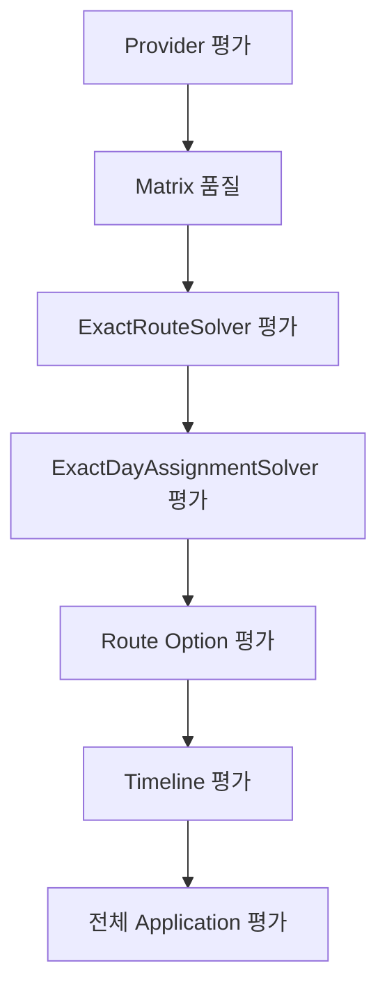

# 📊 Route Planner Evaluation

Route Planner의 정확 일자 배정, 정확 경로 최적화, Route Option과 Timeline 결과를 검증하기 위한 평가 기준을 정의합니다.

현재 `ai/route_planner/evaluation/`에는 별도의 평가 실행기나 Benchmark 코드가 구현되어 있지 않습니다.

따라서 이 문서는 다음 두 역할을 가집니다.

1. 현재 테스트와 코드 리뷰에서 사용할 평가 기준 정의
2. 향후 평가 스크립트와 CI Benchmark 구현을 위한 명세 제공

> 상위 문서: [Route Planner](../README.md)

<br>

## 📚 목차

1. [🎯 평가 목적](#-평가-목적)
2. [📁 현재 구현 상태](#-현재-구현-상태)
3. [🧭 평가 범위](#-평가-범위)
4. [🛣️ 정확 경로 평가](#-정확-경로-평가)
5. [📅 정확 일자 배정 평가](#-정확-일자-배정-평가)
6. [🚘 Route Option 평가](#-route-option-평가)
7. [⏱️ Timeline 평가](#-timeline-평가)
8. [🌐 Provider 데이터 평가](#-provider-데이터-평가)
9. [⚡ 성능 평가](#-성능-평가)
10. [🧪 평가 시나리오](#-평가-시나리오)
11. [📄 권장 결과 형식](#-권장-결과-형식)
12. [🔁 회귀 평가](#-회귀-평가)
13. [🚨 실패 판정 기준](#-실패-판정-기준)
14. [🛠️ 향후 구현 계획](#-향후-구현-계획)
15. [⚠️ 평가 해석 시 주의사항](#-평가-해석-시-주의사항)
16. [🔗 관련 문서](#-관련-문서)

<br>


## 🎯 평가 목적

Route Planner 평가는 단순히 응답이 반환되는지만 확인하지 않습니다.

다음 네 가지를 함께 검증해야 합니다.

```text
정확성
+ 도메인 무결성
+ 외부 데이터 처리
+ 계산 성능
```

### 정확성

- 모든 필수 POI가 가능한 범위에서 우선 배정되었는가
- 정확 경로가 실제 전역 최소 이동시간인가
- 날짜별 배정이 정의된 사전식 목적함수를 따르는가
- Route Leg 합계가 총 이동시간과 일치하는가

### 도메인 무결성

- POI가 여러 날짜에 중복 배정되지 않았는가
- START와 END가 올바른 위치에 있는가
- 모든 배정 POI를 정확히 한 번 방문하는가
- Timeline 순서가 Route Option과 일치하는가

### 외부 데이터 처리

- Provider 누락 구간에 임의 비용을 넣지 않는가
- 완전 경로가 없는 이동수단을 정상 경로처럼 반환하지 않는가
- Provider 오류가 빈 결과로 숨겨지지 않는가

### 계산 성능

- POI 수 증가에 따라 실행시간이 어떻게 증가하는가
- 평가한 DP 상태 수가 얼마나 증가하는가
- 설정된 POI 제한이 정상적으로 적용되는가

<br>

## 📁 현재 구현 상태

현재 디렉터리 구조:

```text
ai/route_planner/evaluation/
└── README.md
```

현재 확인되지 않은 항목:

- 전용 Benchmark 실행 스크립트
- JSON 또는 CSV 평가 결과 생성기
- 기준 데이터셋
- 성능 회귀 임계값
- CI 평가 Workflow
- 결과 시각화 도구
- 휴리스틱 비교 실행기

따라서 이 문서에 포함된 명령, 결과 모델과 지표는 **향후 구현 권장안**이며 현재 실행 가능한 API로 간주하면 안 됩니다.

현재 평가 가능한 근거는 다음에 있습니다.

```text
Solver 반환 결과
도메인 DTO
단위 테스트
Provider Fake 또는 Stub
```

<br>

## 🧭 평가 범위

평가는 다음 계층으로 나누어 수행합니다.



### 계층별 평가 대상

| 계층 | 평가 대상 |
|---|---|
| Provider | Matrix, 누락 구간, duration 변환 |
| Exact Route | 전역 최소 경로와 상태 수 |
| Day Assignment | 사전식 목적함수와 날짜별 배정 |
| Route Option | 정류장, 구간과 총비용 |
| Timeline | 도착·출발 시각과 일정 초과 |
| Application | 전체 호출 순서와 최종 응답 |

각 계층을 독립적으로 평가해야 오류 원인을 명확하게 구분할 수 있습니다.

<br>

## 🛣️ 정확 경로 평가

대상:

```text
ExactRouteSolver
```

입력:

```text
START
POI 목록
END
TravelTimeMatrix
```

출력:

```text
ExactRouteResult
├── ordered_place_ids
├── total_travel_minutes
└── evaluated_state_count
```

### 필수 정확성 검증

#### START와 END

```text
ordered_place_ids[0] = START
ordered_place_ids[-1] = END
```

#### POI 방문 집합

```text
ordered_place_ids[1:-1]
```

위 집합은 입력 POI 집합과 정확히 같아야 합니다.

검증:

```text
누락 POI 없음
알 수 없는 POI 없음
중복 POI 없음
```

#### Route Cost

경로에 포함된 모든 인접 구간 비용을 더합니다.

```text
sum(
    matrix[
        ordered_place_ids[i],
        ordered_place_ids[i + 1]
    ]
)
```

계산 결과는 반드시 다음과 같아야 합니다.

```text
계산한 구간 합계
= ExactRouteResult.total_travel_minutes
```

### 전역 최적성 검증

작은 입력에서는 모든 POI 순열을 생성해 결과를 비교할 수 있습니다.

```text
모든 POI 순열
→ START와 END 연결
→ 존재하는 완전 경로 비용 계산
→ 최소 비용 선택
```

검증 조건:

```text
ExactRouteSolver 비용
= 완전 탐색 최소 비용
```

이 검증은 POI 수가 작은 Fixture에서만 사용합니다.

권장 범위:

```text
POI 0~8개
```

### 비대칭 Matrix

다음과 같은 Matrix를 반드시 포함합니다.

```text
A → B ≠ B → A
```

대칭 Matrix만 사용하면 방향별 Key 처리 오류를 발견하기 어렵습니다.

### 누락 구간

세 경우를 분리합니다.

#### 직접 구간 일부 누락

```text
일부 Edge 없음
+ 다른 순서로 완전 경로 존재
→ 정확 우회 경로 반환
```

#### 완전 경로 부재

```text
모든 POI를 방문하는 연결 없음
→ ExactRouteNotFoundError
```

#### POI 없음

```text
START → END 존재
→ 직접 경로 반환

START → END 없음
→ ExactRouteNotFoundError
```

### 결정성

동일 입력을 여러 번 실행했을 때 다음 값이 같아야 합니다.

```text
ordered_place_ids
total_travel_minutes
evaluated_state_count
```

동일 비용 경로가 여러 개 존재할 때 선택되는 경로도 현재 구현 순서 안에서 반복 가능해야 합니다.

<br>

## 📅 정확 일자 배정 평가

대상:

```text
ExactDayAssignmentSolver
```

출력:

```text
ExactDayAssignmentResult
├── assigned_poi_ids_by_day
├── unassigned_poi_ids
├── total_travel_minutes
└── evaluated_state_count
```

### 날짜별 제약

각 날짜의 배정 결과가 다음 제약을 만족해야 합니다.

```text
배정 POI 수 ≤ max_place_count
```

`max_place_count`가 `None`이면 장소 수 제한을 적용하지 않습니다.

### preferred_day_index

```text
preferred_day_index = N
→ 해당 POI는 Day N 외 날짜에 배정되면 안 됨
```

선호 날짜에 완전 경로가 없거나 수용량이 없으면 미배정될 수 있습니다.

다른 날짜로 자동 이동시키면 안 됩니다.

### 날짜 간 중복

```text
Day 1 POI 집합
∩ Day 2 POI 집합
= 공집합
```

모든 날짜 조합에서 동일해야 합니다.

### 배정과 미배정

```text
전체 배정 POI 집합
∩ 미배정 POI 집합
= 공집합
```

입력의 모든 POI는 배정 또는 미배정 중 하나에 속해야 합니다.

```text
배정 POI 집합
∪ 미배정 POI 집합
= 입력 POI 집합
```

### 사전식 목적함수

현재 최종 결과는 다음 순서로 비교됩니다.

```text
1. 미배정 must_visit POI 수
2. 전체 미배정 POI 수
3. priority별 미배정 POI 수
4. 총 이동시간
5. 결정론적 배정 순서
```

평가 Fixture는 각 기준이 실제로 앞선 기준보다 우선하는지 검증해야 합니다.

#### must_visit 우선

```text
상태 A:
must_visit 미배정 0
총 이동시간 100분

상태 B:
must_visit 미배정 1
총 이동시간 20분

기대 결과:
상태 A
```

#### 전체 미배정 수

must_visit 미배정 수가 같다면 더 많은 POI를 배정한 상태를 선택해야 합니다.

#### priority

숫자가 작을수록 높은 우선순위입니다.

```text
priority 1
→ priority 2
→ priority 3
→ priority 4
→ priority 5
```

높은 우선순위 POI의 미배정을 먼저 줄여야 합니다.

#### 총 이동시간

앞선 목적함수 값이 모두 같을 때만 총 이동시간이 작은 상태를 선택해야 합니다.

### 날짜별 완전 경로

날짜에 배정된 POI 부분집합은 해당 날짜의 Matrix에서 완전 경로가 존재해야 합니다.

```text
START
→ 배정된 모든 POI
→ END
```

경로가 없는 부분집합이 최종 결과에 포함되면 평가 실패입니다.

<br>

## 🚘 Route Option 평가

대상:

```text
RouteOptionSolver
RouteOptionsByModeSolver
```

### 이동수단 순서

기본 설정에서는 다음 순서를 기대합니다.

```text
DRIVE
WALK
TRANSIT
```

응답 순서는 호출 측 계약의 일부로 취급합니다.

### ordered_stops

정상 Route Option:

```text
START
→ POI
→ ...
→ END
```

검증:

- 첫 정류장 타입은 START
- 마지막 정류장 타입은 END
- 중간 정류장 타입은 POI
- 배정된 모든 POI 포함
- 중복 장소 없음

### route_legs

```text
len(route_legs)
= len(ordered_stops) - 1
```

각 구간은 정류장 순서와 일치해야 합니다.

```text
route_legs[i].origin_place_id
= ordered_stops[i].place_id
```

```text
route_legs[i].destination_place_id
= ordered_stops[i + 1].place_id
```

### 총 이동시간

```text
sum(route_leg.travel_minutes)
= total_travel_minutes
```

### 누락 구간이 없는 정상 옵션

```text
missing_segments = []
warnings = []
```

Timeline 생성 전에는 다음 상태가 정상입니다.

```text
timeline = None
```

### Provider 누락으로 완전 경로가 없는 옵션

기대 결과:

```text
total_travel_minutes = 0
ordered_stops = []
route_legs = []
missing_segments는 비어 있지 않음
warnings는 비어 있지 않음
timeline = None
```

### 누락 구간은 있지만 우회 경로가 있는 옵션

현재 구현에서는 정상 경로를 만들더라도 Provider 누락 구간을 `missing_segments`에 기록합니다.

이 상태는 Timeline 생성 정책에 영향을 주므로 별도 평가해야 합니다.

```text
ordered_stops 존재
route_legs 존재
missing_segments 존재
```

현재 `TimelineOptionsBuilder`는 이 경우에도 Timeline을 생성하지 않습니다.

<br>

## ⏱️ Timeline 평가

대상:

```text
TimelineBuilder
TimelineOptionsBuilder
```

### 기본 시간 누적

각 Route Leg 이동시간과 POI 체류시간을 순서대로 누적합니다.

```text
현재 출발시각
+ 이동시간
→ 다음 장소 도착시각

다음 장소 도착시각
+ 체류시간
→ 다음 장소 출발시각
```

### START와 END

```text
START stay_minutes = 0
END stay_minutes = 0
```

### POI 체류시간

```text
TimelineStopDTO.stay_minutes
= PoiDTO.estimated_stay_minutes
```

### 총 체류시간

```text
total_stay_minutes
= 모든 Timeline Stop stay_minutes 합계
```

### 총 이동시간

```text
TimelineDTO.total_travel_minutes
= RouteOptionDTO.total_travel_minutes
```

### actual_end_at

```text
actual_end_at
= 마지막 Timeline Stop의 departure_at
```

### 계획 종료 초과

```text
actual_end_at > planned_end_at
→ exceeds_planned_end = True
→ warnings에 초과 분 포함
```

초과가 없다면:

```text
exceeds_planned_end = False
```

### 누락 구간 옵션

```text
missing_segments 존재
→ Timeline 생성 안 함
→ timeline = None
→ 경고 추가
```

### 시각 형식

현재 Timeline 시각은 분 단위 ISO 문자열입니다.

```text
YYYY-MM-DDTHH:MM
```

timezone offset은 포함되지 않습니다.

평가에서는 timezone-aware 문자열을 기대하면 안 됩니다.

<br>

## 🌐 Provider 데이터 평가

대상:

```text
GoogleRoutesProvider
```

### Matrix Key

Application에서 `Location.name`에 `place_id`를 넣으므로 다음 형태를 기대합니다.

```text
(origin_place_id, destination_place_id)
→ travel_minutes
```

### 대각 원소

```text
origin_index == destination_index
→ Matrix에서 제외
→ missing_elements에서도 제외
```

### duration 누락

```text
duration 없음
→ Matrix에 저장하지 않음
→ missing_elements에 저장
```

### duration 변환

```text
duration_seconds
→ round(duration_seconds / 60)
```

평가 Fixture도 동일한 반올림 규칙을 사용해야 합니다.

### 비대칭 보존

```text
A → B
B → A
```

두 방향은 독립적인 Matrix Key로 유지되어야 합니다.

### HTTP 실패

Google API 오류를 정상적인 빈 Matrix로 평가하면 안 됩니다.

```text
HTTP 400 이상
→ RuntimeError
```

### TRANSIT 출발시각

timezone-aware datetime은 UTC 문자열로 변환되어야 합니다.

```text
현지 시각
→ UTC
→ Z suffix
```

<br>

## ⚡ 성능 평가

### 핵심 지표

현재 Solver 결과에서 직접 얻을 수 있는 지표:

```text
total_travel_minutes
evaluated_state_count
```

추가로 평가 실행기에서 측정할 지표:

```text
elapsed_time_ms
peak_memory_mb
poi_count
day_count
candidate_subset_count
```

### ExactRouteSolver 상태 수

대표적인 이론적 상태 상한:

```text
n × 2ⁿ
```

다만 Matrix 누락으로 도달할 수 없는 상태는 저장되지 않으므로 실제 상태 수는 더 작을 수 있습니다.

### ExactDayAssignmentSolver 상태 수

`evaluated_state_count`는 Partition DP에서 실제 평가한 상태와 날짜 후보 조합 수를 나타냅니다.

다음 값과 같지 않을 수 있습니다.

- 최종 상태 수
- 날짜별 후보 수
- ExactRouteSolver의 상태 수
- 전체 부분집합 수

따라서 지표 이름과 의미를 혼동하면 안 됩니다.

### 권장 성능 입력

```text
POI 0개
POI 1개
POI 4개
POI 8개
POI 10개
POI 12개
```

일자 배정 요청 DTO는 현재 빈 POI 목록을 허용하지 않으므로, POI 0개 평가는 `ExactRouteSolver` 단위에서만 수행합니다.

### 반복 측정

성능 결과는 한 번만 측정하지 않습니다.

권장:

```text
Warm-up 3회
측정 10회 이상
중앙값 기록
최솟값과 최댓값 함께 기록
```

외부 Google API 호출시간과 Solver 계산시간은 분리해야 합니다.

```text
Provider latency
≠
Solver execution time
```

<br>

## 🧪 평가 시나리오

### Scenario 1: POI 없는 정확 경로

```text
START → END = 15
```

기대:

```text
ordered_place_ids = (START, END)
total_travel_minutes = 15
evaluated_state_count = 1
```

### Scenario 2: Greedy와 정확해가 다른 경로

가까운 장소부터 방문하면 최적이 아닌 비대칭 Matrix를 구성합니다.

기대:

```text
ExactRouteSolver
= 모든 순열 최소비용
```

### Scenario 3: 일부 구간 누락과 우회

```text
START → A 없음
START → B 존재
B → A 존재
A → END 존재
```

기대:

```text
START → B → A → END
```

### Scenario 4: 완전 경로 부재

어떤 순서로도 모든 POI를 방문하고 END에 도착할 수 없는 Matrix를 구성합니다.

기대:

```text
ExactRouteNotFoundError
```

### Scenario 5: must_visit 우선 배정

이동시간은 더 크지만 must_visit POI를 배정할 수 있는 상태를 구성합니다.

기대:

```text
must_visit 미배정 수가 작은 상태 선택
```

### Scenario 6: priority 우선 배정

배정 POI 수와 must_visit 조건은 같지만 서로 다른 priority가 미배정되는 상태를 구성합니다.

기대:

```text
더 높은 우선순위 POI를 배정한 상태 선택
```

### Scenario 7: 날짜 수용량

```text
Day 1 max_place_count = 1
Day 2 max_place_count = 2
```

기대:

```text
각 날짜 배정 수가 제약을 넘지 않음
```

### Scenario 8: 선호 날짜

```text
POI-A preferred_day_index = 2
```

기대:

```text
Day 1에 POI-A 배정 금지
```

### Scenario 9: 이동수단별 다른 경로

DRIVE, WALK, TRANSIT Matrix가 서로 다른 최적 순서를 갖도록 구성합니다.

기대:

```text
각 Route Option의 ordered_stops가 독립적으로 계산됨
```

### Scenario 10: Timeline 종료 초과

```text
계획 종료: 18:00
실제 종료: 18:45
```

기대:

```text
exceeds_planned_end = True
45분 초과 경고
```

<br>

## 📄 권장 결과 형식

향후 평가 실행기는 다음과 같은 JSON 결과를 권장합니다.

```json
{
  "scenario_id": "exact-route-8-pois",
  "solver": "ExactRouteSolver",
  "input": {
    "poi_count": 8,
    "day_count": 1
  },
  "result": {
    "is_valid": true,
    "total_travel_minutes": 214,
    "evaluated_state_count": 1024
  },
  "performance": {
    "elapsed_time_ms": 18.4,
    "peak_memory_mb": 12.7
  },
  "verification": {
    "matches_bruteforce": true,
    "all_pois_visited_once": true,
    "route_leg_total_matches": true
  }
}
```

일자 배정 결과 예:

```json
{
  "scenario_id": "day-assignment-priority",
  "solver": "ExactDayAssignmentSolver",
  "input": {
    "poi_count": 6,
    "day_count": 2
  },
  "result": {
    "assigned_poi_ids_by_day": {
      "1": ["poi-1", "poi-3"],
      "2": ["poi-2", "poi-4"]
    },
    "unassigned_poi_ids": ["poi-5", "poi-6"],
    "total_travel_minutes": 180,
    "evaluated_state_count": 245
  },
  "verification": {
    "must_visit_objective_satisfied": true,
    "priority_objective_satisfied": true,
    "no_duplicate_assignment": true,
    "day_capacity_satisfied": true
  }
}
```

### CSV 권장 필드

성능 추세 비교에는 다음 필드를 권장합니다.

```text
scenario_id
solver
poi_count
day_count
total_travel_minutes
evaluated_state_count
elapsed_time_ms
peak_memory_mb
is_valid
```

<br>

## 🔁 회귀 평가

코드 변경 전후에 다음 항목을 비교합니다.

### 정확성 회귀

- 최적 비용이 달라졌는가
- 방문 장소 집합이 달라졌는가
- must_visit 목적함수가 깨졌는가
- priority 목적함수가 깨졌는가
- 누락 구간 처리 방식이 달라졌는가

### 결정성 회귀

동일 Fixture에서 다음 값이 불필요하게 변경되지 않아야 합니다.

```text
ordered_place_ids
assigned_poi_ids_by_day
warnings 순서
Route Option 순서
```

동일 비용 해가 여러 개라면 코드 순회 순서 변경으로 결과가 달라질 수 있으므로, 변경이 의도적인지 검토해야 합니다.

### 성능 회귀

권장 비교 항목:

```text
elapsed_time_ms 증가율
evaluated_state_count 증가율
peak_memory_mb 증가율
```

성능 임계값은 실행 환경에 따라 달라지므로 고정 수치를 문서에서 임의로 정하지 않습니다.

CI 환경의 기준 실행 결과를 누적한 뒤 임계값을 정의해야 합니다.

<br>

## 🚨 실패 판정 기준

다음 중 하나라도 발생하면 평가 실패로 판단합니다.

### 경로 정확성 실패

- START 또는 END 위치가 잘못됨
- 입력 POI 누락
- 알 수 없는 POI 포함
- POI 중복 방문
- 완전 탐색 최소비용과 불일치
- Matrix에 없는 구간 선택

### 일자 배정 실패

- POI 날짜 중복
- 배정과 미배정 동시 포함
- `max_place_count` 초과
- `preferred_day_index` 위반
- 사전식 목적함수 위반
- 완전 경로가 없는 부분집합 배정

### Route Option 실패

- Route Leg 순서 불일치
- Route Leg 개수 불일치
- Route Leg 합계와 총 이동시간 불일치
- 이동수단 순서 변경
- 완전 경로가 없는데 정상 옵션처럼 반환

### Timeline 실패

- 도착·출발 시각 누적 오류
- POI 체류시간 누락
- 실제 종료시각 계산 오류
- 일정 초과 상태 오류
- 누락 구간이 있는데 Timeline 생성

### Provider 실패

- duration 없는 element를 정상 Matrix에 저장
- 대각 원소를 누락 구간으로 기록
- 방향별 Matrix Key 덮어쓰기
- HTTP 실패를 빈 Matrix로 변환
- TRANSIT timezone-naive 출발시각 허용

<br>

## 🛠️ 향후 구현 계획

현재는 평가 문서만 존재하므로, 다음 구조로 구현하는 것을 권장합니다.

```text
ai/route_planner/evaluation/
├── README.md
├── fixtures/
│   ├── exact_route_cases.py
│   ├── day_assignment_cases.py
│   └── provider_cases.py
├── evaluators/
│   ├── exact_route_evaluator.py
│   ├── day_assignment_evaluator.py
│   └── trip_plan_evaluator.py
├── benchmarks/
│   ├── benchmark_exact_route.py
│   └── benchmark_day_assignment.py
├── reports/
└── run_evaluation.py
```

### 1단계: 정확성 평가기

먼저 작은 입력의 Brute Force 비교기를 구현합니다.

```text
ExactRouteSolver
vs
모든 POI 순열
```

### 2단계: 일자 배정 목적함수 검증

Solver와 독립적으로 사전식 점수를 계산하는 검증기를 구현합니다.

### 3단계: 성능 Benchmark

다음 값을 측정합니다.

```text
elapsed_time_ms
evaluated_state_count
peak_memory_mb
```

### 4단계: 결과 저장

JSON과 CSV를 모두 지원합니다.

### 5단계: CI 연동

Pull Request마다 작은 정확성 Fixture를 실행하고, 정기 Workflow에서 10~12 POI 성능 Benchmark를 실행하는 구성이 적절합니다.

외부 Google API를 사용하는 Provider 평가는 일반 단위 테스트와 분리해야 합니다.

```text
일반 CI
→ Fake Provider

선택적 통합 테스트
→ 실제 Google Routes API
```

<br>

## ⚠️ 평가 해석 시 주의사항

### 이동시간 최소화만 평가하면 안 됨

일자 배정의 최종 목적함수는 단순 이동시간 최소화가 아닙니다.

```text
must_visit
→ 전체 배정 수
→ priority
→ 이동시간
```

이 순서를 무시하면 정상 결과를 잘못 실패로 판정할 수 있습니다.

### evaluated_state_count 의미가 다름

`ExactRouteSolver`와 `ExactDayAssignmentSolver`의 `evaluated_state_count`는 같은 단위를 의미하지 않습니다.

```text
ExactRouteSolver
→ 저장된 경로 DP 상태 수

ExactDayAssignmentSolver
→ Partition DP에서 평가한 조합 수
```

직접적인 절대값 비교는 의미가 없습니다.

### Provider 시간과 Solver 시간을 분리해야 함

실제 전체 요청시간에는 네트워크 지연이 포함됩니다.

```text
전체 응답시간
= Provider 호출시간
+ Solver 계산시간
+ DTO 변환시간
```

Solver 성능을 평가할 때 실제 Google API를 함께 호출하면 결과가 불안정해집니다.

### Timeline은 timezone-naive임

현재 Timeline 문자열에는 timezone offset이 없습니다.

따라서 Timeline 평가에서 offset 포함 여부를 성공 조건으로 두면 안 됩니다.

### 누락 구간 정책

현재 구현은 실제 선택 경로에 포함되지 않은 Provider 누락 구간도 `missing_segments`에 기록할 수 있습니다.

그 결과 완전 경로가 존재해도 Timeline이 생략될 수 있습니다.

평가에서는 현재 구현을 검증하는 테스트와 향후 원하는 정책을 검증하는 테스트를 구분해야 합니다.

### 평가 구현은 아직 없음

이 문서의 권장 디렉터리와 결과 형식은 현재 존재하는 실행 인터페이스가 아닙니다.

실제 평가 코드를 구현할 때 문서와 구현을 함께 갱신해야 합니다.

<br>

## 🔗 관련 문서

| 문서 | 설명 |
|---|---|
| [Route Planner](../README.md) | 전체 일정 최적화 구조 |
| [Domain](../domain/README.md) | 평가 대상 DTO와 불변조건 |
| [Solvers](../solvers/README.md) | 정확 경로와 일자 배정 알고리즘 |
| [Application](../application/README.md) | 전체 실행 순서와 결과 조립 |
| [Providers](../providers/README.md) | Matrix와 누락 구간 생성 |
| [Free Time Recommender](../../free_time_recommender/README.md) | Route Planner 결과를 사용하는 추천 모듈 |
