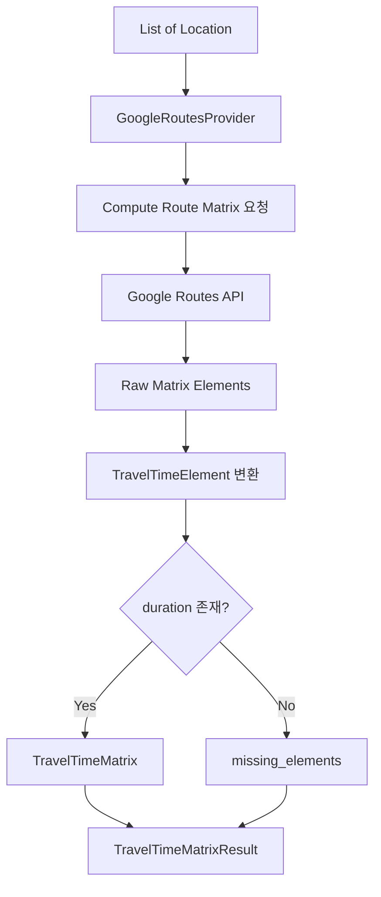

# 🌐 Route Planner Providers

Google Routes API를 호출해 장소 목록을 **이동시간 Matrix**로 변환하는 외부 연동 계층입니다.

Provider는 정확 경로를 직접 계산하지 않습니다.
외부 API 응답을 Route Planner의 도메인 모델인 `TravelTimeMatrixResult`로 변환하고, 정상 구간과 누락 구간을 구분해 반환합니다.

> 상위 문서: [Route Planner](../README.md)

<br>

## 📚 목차

1. [🎯 디렉터리 역할](#-디렉터리-역할)
2. [📁 파일 구성](#-파일-구성)
3. [🔄 전체 처리 흐름](#-전체-처리-흐름)
4. [🔌 Provider 계약](#-provider-계약)
5. [🗺️ GoogleRoutesProvider](#-googleroutesprovider)
6. [📊 Route Matrix 요청](#-route-matrix-요청)
7. [⏱️ 이동시간 변환](#-이동시간-변환)
8. [🚨 누락 구간 처리](#-누락-구간-처리)
9. [🕒 TRANSIT 출발시각](#-transit-출발시각)
10. [🔐 API Key와 환경변수](#-api-key와-환경변수)
11. [✅ 입력과 응답 검증](#-입력과-응답-검증)
12. [🚨 오류 처리](#-오류-처리)
13. [🧪 테스트 관점](#-테스트-관점)
14. [⚠️ 현재 한계](#-현재-한계)
15. [🔗 관련 문서](#-관련-문서)

<br>


## 🎯 디렉터리 역할

`ai/route_planner/providers`는 다음 책임을 가집니다.

- Google Routes Compute Route Matrix API 호출
- Route Planner `Location`을 Google 요청 형식으로 변환
- Google 응답 index를 내부 장소 식별자로 복원
- 이동시간 duration 문자열 파싱
- 초 단위 이동시간을 분 단위로 변환
- 정상 이동 구간 Matrix 생성
- 계산되지 않은 이동 구간 분리
- TRANSIT 출발시각 UTC 변환
- Google Maps API Key 로딩
- HTTP 상태 오류와 응답 형식 오류 전파

Provider 계층의 출력은 Solver가 바로 사용할 수 있는 형태입니다.

```text
장소 좌표 목록
→ Google Routes API
→ TravelTimeElement 목록
→ TravelTimeMatrixResult
→ Exact Solver
```

<br>

## 📁 파일 구성

```text
ai/route_planner/providers/
├── README.md
├── google_routes_provider.py
└── env.py
```

| 파일 | 책임 |
|---|---|
| `google_routes_provider.py` | Google Routes API 호출과 Matrix 변환 |
| `env.py` | `.env` 로딩과 API Key 조회 |

<br>

---

## 🔄 전체 처리 흐름



실제 처리 순서:

```text
Location 목록 검증
→ 요청 Header 생성
→ 요청 Payload 생성
→ Google Routes API POST
→ HTTP 응답 상태 검증
→ 응답 element 파싱
→ 대각 원소 제외
→ 정상 duration은 Matrix에 저장
→ duration 누락은 missing_elements에 저장
```

<br>

## 🔌 Provider 계약

Application 계층에서 기대하는 Provider 계약은 다음 형태입니다.

```python
build_travel_time_matrix_result(
    locations: List[Location],
    travel_mode: TravelMode,
    departure_time: datetime | None = None,
) -> TravelTimeMatrixResult
```

### 입력

```text
locations
travel_mode
departure_time
```

| 입력 | 의미 |
|---|---|
| `locations` | 출발지와 목적지로 모두 사용할 장소 목록 |
| `travel_mode` | WALK, DRIVE 또는 TRANSIT |
| `departure_time` | 선택적 출발시각 |

### 출력

```text
TravelTimeMatrixResult
├── matrix
└── missing_elements
```

### Application과의 연결

`TripPlannerService`는 동일 Provider를 두 단계에서 사용합니다.

```text
1. 일자 배정용 Matrix 조회
2. 최종 Route Option용 Matrix 조회
```

일자 배정 단계:

```text
START + 전체 후보 POI + END
```

Route Option 단계:

```text
START + 날짜에 배정된 POI + END
```

<br>

## 🗺️ GoogleRoutesProvider

`GoogleRoutesProvider`는 Google Routes API의 Compute Route Matrix endpoint를 사용합니다.

```text
https://routes.googleapis.com/distanceMatrix/v2:computeRouteMatrix
```

### 생성자

```python
GoogleRoutesProvider(
    api_key: Optional[str] = None,
    timeout_seconds: float = 20.0,
)
```

기본 timeout:

```text
20초
```

### API Key 결정

```text
생성자 api_key 전달
→ 해당 값 사용

api_key 미전달
→ 환경변수 GOOGLE_MAPS_API_KEY 조회
```

### 주요 메서드

| 메서드 | 책임 |
|---|---|
| `build_travel_time_matrix_result()` | Matrix와 누락 구간을 함께 반환 |
| `build_travel_time_matrix()` | 정상 Matrix만 반환하는 호환 메서드 |
| `compute_route_matrix()` | 실제 Google Routes API 호출 |
| `_to_route_matrix_location()` | 내부 Location을 Google 요청 형식으로 변환 |
| `_parse_element()` | Google 응답 element를 도메인 모델로 변환 |
| `_parse_duration_seconds()` | `"420s"` 형식 duration 파싱 |

<br>

## 📊 Route Matrix 요청

### 최소 장소 수

Compute Route Matrix는 최소 두 장소가 필요합니다.

```text
locations 수 < 2
→ ValueError
```

정상적인 Route Planner 요청은 최소 START와 END를 포함합니다.

### Matrix element 수

요청 element 수는 다음과 같이 계산합니다.

```text
origin 수 × destination 수
```

현재 Provider는 동일 Location 목록을 origins와 destinations 양쪽에 사용합니다.

```text
element_count
= len(locations) × len(locations)
```

최대 허용값:

```text
625
```

초과 시 API를 호출하지 않고 ValueError를 발생시킵니다.

```text
Too many matrix elements
→ 장소 수를 줄이거나 요청 분할 필요
```

625는 정사각 Matrix 기준 최대 25개 Location에 해당합니다.

```text
25 × 25 = 625
```

### 요청 Header

```text
Content-Type: application/json
X-Goog-Api-Key: API Key
X-Goog-FieldMask: 필요한 응답 필드
```

Field Mask:

```text
originIndex
destinationIndex
duration
distanceMeters
status
condition
```

불필요한 응답 필드는 요청하지 않습니다.

### 요청 Payload

```text
origins
destinations
travelMode
departureTime
```

기본 구조:

```json
{
  "origins": [],
  "destinations": [],
  "travelMode": "DRIVE"
}
```

`departureTime`은 TRANSIT 조건에서만 선택적으로 추가됩니다.

<br>

## 📍 Location 변환

내부 `Location` 모델은 다음 구조입니다.

```text
Location
├── name
├── lat
└── lng
```

Google 요청에서는 좌표만 사용합니다.

```text
waypoint
└── location
    └── latLng
        ├── latitude
        └── longitude
```

변환 결과 예:

```json
{
  "waypoint": {
    "location": {
      "latLng": {
        "latitude": 37.5665,
        "longitude": 126.9780
      }
    }
  }
}
```

`Location.name`은 Google API에 전송되지 않습니다.

대신 응답의 `originIndex`, `destinationIndex`를 다시 내부 식별자로 변환할 때 사용합니다.

```text
originIndex
→ locations[originIndex].name

destinationIndex
→ locations[destinationIndex].name
```

Route Planner Application은 `Location.name`에 `place_id`를 넣으므로 최종 Matrix Key는 사실상 `place_id` 쌍입니다.

```text
(origin_place_id, destination_place_id)
→ travel_minutes
```

<br>

## ⏱️ 이동시간 변환

Google Routes API는 duration을 문자열로 반환합니다.

예:

```text
"420s"
```

Provider는 정규표현식으로 초 단위 값을 파싱합니다.

```text
(\d+)s
```

변환:

```text
"420s"
→ 420 seconds
```

예상하지 못한 형식이면 ValueError가 발생합니다.

```text
"7m"
"420.5s"
"PT7M"
→ Invalid duration format
```

### 분 단위 변환

`TravelTimeElement.duration_minutes`는 다음 방식으로 계산됩니다.

```text
round(duration_seconds / 60)
```

예:

```text
420초 → 7분
90초  → round(1.5)
```

Python `round()` 규칙을 사용하므로 일반적인 항상 올림 방식과 다릅니다.

따라서 매우 짧은 이동시간이나 `.5` 경계에서 기대하는 값과 다를 수 있습니다.

<br>

## 🚨 누락 구간 처리

`build_travel_time_matrix_result()`는 정상 구간과 누락 구간을 분리합니다.

### 대각 원소

출발지와 도착지가 같은 구간은 제외합니다.

```text
origin_index == destination_index
→ Matrix에 저장하지 않음
→ missing_elements에도 저장하지 않음
```

자기 자신으로 이동하는 비용은 경로 최적화에 필요하지 않기 때문입니다.

### 정상 duration

```text
duration_minutes 존재
→ matrix에 저장
```

Matrix Key:

```text
(
    element.origin_name,
    element.destination_name,
)
```

Matrix Value:

```text
duration_minutes
```

### duration 누락

```text
duration_minutes is None
→ missing_elements에 저장
```

누락 element는 조용히 삭제하지 않습니다.

다음 정보가 보존됩니다.

```text
TravelTimeElement
├── origin_name
├── destination_name
├── origin_index
├── destination_index
├── duration_seconds
├── distance_meters
├── status
└── condition
```

### Solver 영향

누락 구간에는 임의 비용을 넣지 않습니다.

```text
누락 구간
→ Matrix Key 없음
→ Exact Solver에서 해당 방향 이동 불가
```

다른 연결로 완전 경로가 존재하면 Solver는 우회 경로를 계산할 수 있습니다.

완전 경로가 없으면 `RouteOptionsByModeSolver`가 Provider 누락 여부에 따라 불완전 Route Option으로 변환할 수 있습니다.

<br>

## 🕒 TRANSIT 출발시각

현재 `departure_time`은 TRANSIT 요청에서만 Payload에 포함됩니다.

```text
travel_mode == TRANSIT
AND
departure_time is not None
→ departureTime 전송
```

DRIVE와 WALK에서는 전달된 `departure_time`을 Payload에 포함하지 않습니다.

### timezone-aware 검증

TRANSIT 출발시각은 timezone-aware datetime이어야 합니다.

다음은 거부됩니다.

```python
datetime(2026, 7, 23, 9, 30)
```

다음은 허용됩니다.

```python
datetime(
    2026,
    7,
    23,
    9,
    30,
    tzinfo=ZoneInfo("Asia/Seoul"),
)
```

timezone 정보가 없으면 ValueError가 발생합니다.

### UTC 변환

출발시각은 UTC로 변환한 뒤 RFC 3339 형태로 전송합니다.

```text
현지 timezone-aware datetime
→ UTC 변환
→ ISO 문자열
→ +00:00을 Z로 교체
```

예:

```text
2026-07-23T09:30:00+09:00
→ 2026-07-23T00:30:00Z
```

### departure_time이 없는 TRANSIT

`departure_time`이 `None`이면 Payload에 `departureTime`을 넣지 않습니다.

이 경우 Google Routes API가 어떤 시간 기준을 사용하는지는 API 동작에 의존합니다.

<br>

## 🔐 API Key와 환경변수

`env.py`는 Route Planner 전용 `.env` 파일을 로드합니다.

경로:

```text
ai/route_planner/.env
```

필수 환경변수:

```text
GOOGLE_MAPS_API_KEY
```

### 로딩 순서

```text
get_google_maps_api_key()
→ load_route_planner_env()
→ load_dotenv(ai/route_planner/.env)
→ os.getenv("GOOGLE_MAPS_API_KEY")
```

### 누락 시 오류

API Key가 없으면 ValueError가 발생합니다.

```text
GOOGLE_MAPS_API_KEY is required.
Check ai/route_planner/.env
```

### 생성자 주입

테스트나 별도 실행 환경에서는 `.env` 없이 API Key를 생성자에 직접 주입할 수 있습니다.

```python
GoogleRoutesProvider(
    api_key="test-api-key"
)
```

### 보안 주의사항

다음 값은 문서, 로그, 테스트 fixture와 Git 저장소에 포함하면 안 됩니다.

```text
실제 GOOGLE_MAPS_API_KEY
전체 인증 Header
민감한 Google API 오류 응답
```

현재 Provider는 HTTP 오류 응답 본문 전체를 예외 메시지에 포함하므로, 운영 로그에 민감한 정보가 포함되지 않는지 확인해야 합니다.

<br>

## ✅ 입력과 응답 검증

### 입력 검증

Provider는 다음을 직접 검증합니다.

- Location이 최소 2개 이상
- Matrix element 수가 625 이하
- TRANSIT 출발시각이 timezone-aware
- duration 문자열이 예상 형식인지

### Domain 모델 검증

`Location`은 좌표 범위를 검증합니다.

```text
-90 ≤ lat ≤ 90
-180 ≤ lng ≤ 180
```

### 응답 index

Google 응답의 다음 필드는 필수처럼 직접 접근합니다.

```text
originIndex
destinationIndex
```

필드가 없으면 KeyError가 발생합니다.

또한 index가 `locations` 범위를 벗어나면 IndexError가 발생합니다.

현재 Provider는 이 오류들을 별도 도메인 예외로 변환하지 않습니다.

### status 파싱

`status`가 dict인 경우에만 내부 `code`를 저장합니다.

```text
status = {"code": ...}
→ code 저장

status가 dict 아님
→ None
```

### condition 파싱

`condition`은 응답 값을 그대로 보존합니다.

예:

```text
ROUTE_EXISTS
ROUTE_NOT_FOUND
```

다만 Provider는 condition 문자열 자체로 누락 여부를 판정하지 않습니다.

현재 누락 여부의 기준은 다음입니다.

```text
duration이 존재하는가
```

<br>

## 🚨 오류 처리

### ValueError

다음 사례에서 발생할 수 있습니다.

- Location이 2개 미만
- Matrix element 수가 625 초과
- TRANSIT 출발시각이 timezone-naive
- 잘못된 duration 형식
- API Key 누락

### RuntimeError

Google Routes API가 400 이상의 HTTP 상태를 반환하면 RuntimeError가 발생합니다.

예외 메시지에는 다음이 포함됩니다.

```text
HTTP status
응답 body
```

Provider는 HTTP 오류를 빈 Matrix로 바꾸지 않습니다.

```text
Google API 오류
→ RuntimeError
→ Application으로 전파
```

### httpx 예외

다음 네트워크 오류는 별도 변환 없이 전파될 수 있습니다.

- Timeout
- 연결 실패
- DNS 오류
- TLS 오류

### JSON 파싱 오류

응답 본문이 JSON이 아니면 `response.json()` 단계의 예외가 전파됩니다.

### 응답 구조 오류

필수 index 필드 누락이나 잘못된 index는 KeyError 또는 IndexError로 전파될 수 있습니다.

### 누락 구간은 예외가 아님

개별 element에 duration이 없는 것은 전체 Provider 호출 실패로 처리하지 않습니다.

```text
일부 element duration 없음
→ missing_elements에 저장
→ 나머지 정상 Matrix 반환
```

<br>

## 🧪 테스트 관점

### 생성자와 환경변수

- 생성자 API Key 우선 사용
- `.env` API Key 로딩
- API Key 누락
- timeout 기본값
- timeout 사용자 지정

### 입력 검증

- Location 0개
- Location 1개
- Location 2개
- 정확히 625 element
- 625 초과
- 좌표 범위 오류

### 요청 Header

- API Key Header
- Content-Type
- Field Mask
- API Key가 Payload에 포함되지 않는지 검증

### 요청 Payload

- origins 변환
- destinations 변환
- travelMode
- DRIVE에서 departureTime 미포함
- WALK에서 departureTime 미포함
- TRANSIT에서 departureTime 포함
- TRANSIT departure_time이 None인 경우

### timezone

- Asia/Seoul 출발시각의 UTC 변환
- UTC 출발시각
- DST 적용 timezone
- timezone-naive TRANSIT 출발시각

### 응답 파싱

- 정상 duration
- duration 없음
- 잘못된 duration 형식
- distanceMeters
- status dict
- status 비정상 타입
- condition
- originIndex 누락
- destinationIndex 누락
- 범위를 벗어난 index

### Matrix 생성

- 대각 원소 제외
- 방향별 비대칭 구간 보존
- duration 없는 구간의 `missing_elements`
- 정상 Matrix와 누락 목록 동시 반환
- `build_travel_time_matrix()` 호환 메서드

### HTTP 오류

- 400 응답
- 401 또는 403 인증 오류
- 429 Rate Limit
- 500 계열 응답
- timeout
- JSON이 아닌 응답

<br>

## ⚠️ 현재 한계

- Google Routes API 한 Provider 구현에 직접 의존합니다.
- Matrix 요청은 자동 분할하지 않고 625 element 초과 시 실패합니다.
- 자동 retry, backoff와 circuit breaker가 없습니다.
- 응답 cache가 없습니다.
- Rate Limit 대응 정책이 없습니다.
- DRIVE와 WALK 요청에는 출발시각을 포함하지 않습니다.
- 누락 여부는 `condition`이나 `status`가 아니라 duration 존재 여부로 판정합니다.
- duration을 분으로 변환할 때 Python `round()`를 사용합니다.
- HTTP 오류 응답 본문 전체를 RuntimeError 메시지에 포함합니다.
- Google 응답 index 범위와 필수 필드에 대한 명시적 방어 검증이 없습니다.
- 네트워크와 JSON 오류를 Provider 전용 예외로 통일하지 않습니다.
- `Location.name`이 실제 장소 이름이 아니라 `place_id`로 사용됩니다.
- 일자 배정 단계의 `missing_elements`는 최종 응답 경고로 직접 보존되지 않습니다.
- 테스트용 Fake Provider는 현재 이 디렉터리에 별도 구현되어 있지 않습니다.

<br>

## 🔗 관련 문서

| 문서 | 설명 |
|---|---|
| [Route Planner](../README.md) | 전체 일정 최적화 구조 |
| [Application](../application/README.md) | Provider 호출 순서와 출발시각 생성 |
| [Domain](../domain/README.md) | `Location`, `TravelTimeElement`, Matrix 모델 |
| [Solvers](../solvers/README.md) | 누락 구간이 정확 경로에 미치는 영향 |
| [Evaluation](../evaluation/README.md) | Provider 응답과 경로 결과 평가 |
| [`GoogleRoutesProvider`](./google_routes_provider.py) | 실제 Google Routes API 연동 구현 |
| [`env.py`](./env.py) | Route Planner 환경변수 로딩 |
| [Free Time Recommender Providers](../../free_time_recommender/providers/README.md) | 추천 기능의 Google Places 및 Routes 연동 |
