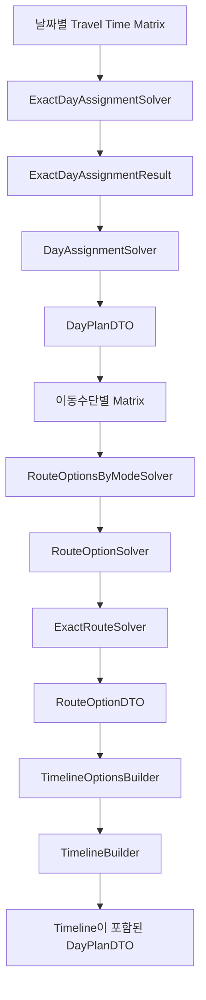

# 🧠 Route Planner Solvers

Route Planner의 **정확 일자 배정**, **이동수단별 정확 경로 계산**, **Route Option 변환**, **Timeline 생성**을 담당합니다.

현재 Solver는 Cheapest Insertion, Relocate, 2-opt 또는 Local Search 같은 휴리스틱을 사용하지 않습니다.

입력 제한 범위 안에서 부분집합 Dynamic Programming을 이용해 정확해를 계산하며, 제한을 초과하면 근사 알고리즘으로 전환하지 않고 명시적인 예외를 반환합니다.

> 상위 문서: [Route Planner](../README.md)

<br>

## 📚 목차

1. [🎯 디렉터리 역할](#-디렉터리-역할)
2. [📁 파일 구성](#-파일-구성)
3. [🔄 전체 Solver 흐름](#-전체-solver-흐름)
4. [🛣️ ExactRouteSolver](#-exactroutesolver)
5. [📅 ExactDayAssignmentSolver](#-exactdayassignmentsolver)
6. [🧩 DayAssignmentSolver](#-dayassignmentsolver)
7. [🚘 RouteOptionSolver](#-routeoptionsolver)
8. [🚦 RouteOptionsByModeSolver](#-routeoptionsbymodesolver)
9. [⏱️ TimelineBuilder](#-timelinebuilder)
10. [🕒 TimelineOptionsBuilder](#-timelineoptionsbuilder)
11. [✅ 불변조건과 교차 검증](#-불변조건과-교차-검증)
12. [🚨 예외와 실패 정책](#-예외와-실패-정책)
13. [📊 계산 복잡도와 제한](#-계산-복잡도와-제한)
14. [🧪 테스트 관점](#-테스트-관점)
15. [⚠️ 현재 한계](#-현재-한계)
16. [🔗 관련 문서](#-관련-문서)

<br>


## 🎯 디렉터리 역할

`ai/route_planner/solvers`는 다음 책임을 가집니다.

- 고정 START와 END 사이의 정확 최소 이동 경로 계산
- 날짜별 가능한 POI 부분집합 생성
- 전체 날짜에 대한 정확 POI 배정
- 정확 Solver 결과를 일정 도메인 DTO로 변환
- DRIVE, WALK, TRANSIT별 Route Option 생성
- Provider 누락 구간과 완전 경로 부재 구분
- Route Option의 방문 순서와 이동시간을 Timeline으로 변환
- Solver 결과와 DTO 사이의 무결성 재검증
- 입력 규모 제한과 명시적 오류 처리

Solver 계층은 Provider에서 전달된 이동시간 Matrix를 신뢰 가능한 입력 형식으로 받아 계산합니다.

```text
Travel Time Matrix
→ Exact Solver
→ Exact Result
→ Domain DTO Adapter
→ Route Option
→ Timeline
```

<br>

## 📁 파일 구성

```text
ai/route_planner/solvers/
├── README.md
├── exact_route_solver.py
├── exact_day_assignment_solver.py
├── day_assignment_solver.py
├── route_option_solver.py
├── route_options_by_mode_solver.py
├── timeline_builder.py
└── timeline_options_builder.py
```

| 파일 | 책임 |
|---|---|
| `exact_route_solver.py` | 고정 START와 END 사이의 정확 최소 이동 경로 계산 |
| `exact_day_assignment_solver.py` | 날짜별 POI 부분집합과 전체 일자 배정 정확 최적화 |
| `day_assignment_solver.py` | 정확 배정 결과를 `TripPlanningResponseDTO`로 변환 |
| `route_option_solver.py` | 정확 경로 결과를 `RouteOptionDTO`로 변환 |
| `route_options_by_mode_solver.py` | 이동수단별 Route Option 일괄 생성 |
| `timeline_builder.py` | 하나의 Route Option에 Timeline 생성 |
| `timeline_options_builder.py` | 날짜의 모든 Route Option에 Timeline 일괄 적용 |

<br>

---

## 🔄 전체 Solver 흐름



실행 순서는 다음과 같습니다.

```text
전체 POI
→ 날짜별 가능한 POI 부분집합 생성
→ 각 부분집합의 정확 경로비용 계산
→ 날짜 간 부분집합 Partition DP
→ DayPlanDTO 생성
→ 이동수단별 정확 경로 계산
→ RouteOptionDTO 생성
→ Timeline 생성
```

`ExactRouteSolver`는 두 단계에서 재사용됩니다.

```text
1. 일자 배정 후보의 경로비용 계산
2. 최종 날짜별 이동수단 Route Option 계산
```

<br>

## 🛣️ ExactRouteSolver

`ExactRouteSolver`는 고정된 START와 END 사이에서 모든 POI를 정확히 한 번 방문하는 최소 이동시간 경로를 계산합니다.

```text
START
→ 모든 POI를 정확히 한 번 방문
→ END
```

### 입력

```text
start_place_id
poi_place_ids
end_place_id
travel_time_matrix
```

### 출력

```text
ExactRouteResult
├── ordered_place_ids
├── total_travel_minutes
└── evaluated_state_count
```

### Held-Karp 상태

DP 상태는 다음과 같습니다.

```text
(방문한 POI 비트마스크, 마지막 POI 인덱스)
→ 누적 이동시간
→ 직전 POI 인덱스
```

예:

```text
POI = [A, B, C]

mask = 101
last = C

의미:
A와 C를 방문했고 현재 C에 위치
```

### 초기 상태

START에서 직접 이동 가능한 각 POI에 대해 상태를 생성합니다.

```text
START → POI-A
START → POI-B
START → POI-C
```

Matrix에 해당 구간이 없으면 그 초기 상태는 생성하지 않습니다.

### 상태 확장

현재 방문 집합에 포함되지 않은 POI로 이동할 수 있는 구간을 탐색합니다.

```text
현재 상태
(mask, last)

→ 미방문 next
→ next_mask = mask | next_bit
→ candidate_minutes = current_minutes + travel_minutes
```

같은 `(next_mask, next_index)` 상태에 여러 경로가 도달하면 더 작은 이동시간만 유지합니다.

```text
새 비용 < 기존 비용
→ 상태 교체

새 비용 ≥ 기존 비용
→ 기존 상태 유지
```

비용이 같은 경우 별도의 교체를 하지 않으므로, 최초로 저장된 상태가 유지됩니다.

### END 연결

모든 POI를 방문한 상태 중 END까지 이동 가능한 후보를 비교합니다.

```text
전체 POI 방문 비용
+ 마지막 POI → END 비용
→ 총 이동시간
```

최소 총 이동시간 후보의 마지막 POI를 선택합니다.

### 경로 복원

저장된 이전 POI 인덱스를 역추적합니다.

```text
마지막 POI
→ 이전 POI
→ 이전 POI
→ ...
→ 역순 뒤집기
```

최종 결과:

```text
START
→ 복원된 POI 순서
→ END
```

### POI가 없는 경우

POI 목록이 비어 있으면 DP를 수행하지 않습니다.

```text
START → END
```

Matrix에 START→END가 있으면 다음 결과를 반환합니다.

```text
ordered_place_ids = (START, END)
evaluated_state_count = 1
```

해당 구간이 없으면 `ExactRouteNotFoundError`가 발생합니다.

### 입력 검증

다음 조건을 검증합니다.

- POI 수가 설정 제한을 초과하지 않아야 함
- START, POI, END의 모든 `place_id`가 고유해야 함

기본 제한:

```text
max_poi_count = 12
```

제한 초과 시 휴리스틱 fallback은 사용하지 않습니다.

<br>

## 📅 ExactDayAssignmentSolver

`ExactDayAssignmentSolver`는 전체 POI를 날짜별로 배정하는 전역 최적해를 계산합니다.

단순히 가까운 장소부터 날짜에 넣는 방식이 아닙니다.

```text
날짜별 가능한 POI 부분집합 전체 생성
→ 부분집합별 정확 경로비용 계산
→ 날짜 간 중복 없는 부분집합 결합
→ 사전식 목적함수 최적화
```

### 입력

```text
days
pois
travel_time_matrices_by_day
```

### 출력

```text
ExactDayAssignmentResult
├── assigned_poi_ids_by_day
├── unassigned_poi_ids
├── total_travel_minutes
└── evaluated_state_count
```

### 입력 정규화

계산의 결정성을 위해 입력을 정렬합니다.

```text
days
→ day_index 기준 정렬

pois
→ poi_id 기준 정렬
```

POI 비트마스크 인덱스는 정렬된 `poi_id` 순서를 기준으로 생성됩니다.

### 날짜별 후보 모델

```text
DaySubsetCandidate
├── day_index
├── poi_mask
├── poi_ids
└── travel_minutes
```

각 후보는 다음 의미를 가집니다.

```text
특정 날짜에 특정 POI 부분집합을 배정했을 때
START → 모든 부분집합 POI → END
정확 경로가 존재하며 그 최소 이동시간이 얼마인지
```

### 빈 부분집합

각 날짜에서 먼저 빈 POI 집합을 검사합니다.

```text
START → END
```

해당 직접 경로가 존재할 때만 빈 후보가 생성됩니다.

따라서 POI를 하나도 배정하지 않는 날짜도 START와 END 사이의 유효한 경로가 필요합니다.

### 모든 POI 부분집합 생성

POI가 `n`개라면 다음 범위의 마스크를 검사합니다.

```text
1 ... 2^n - 1
```

각 부분집합은 다음 제약을 확인합니다.

#### 날짜 최대 장소 수

```text
max_place_count가 존재
AND
부분집합 POI 수 > max_place_count
→ 후보 제외
```

#### 선호 날짜

```text
preferred_day_index가 None
→ 모든 날짜 후보 가능

preferred_day_index가 지정됨
→ 해당 day_index의 후보에만 포함 가능
```

#### 완전 경로 존재

부분집합에 대해 `ExactRouteSolver`를 실행합니다.

```text
완전 경로 존재
→ 후보 생성

ExactRouteNotFoundError
→ 후보 제외
```

즉, 날짜별 부분집합 후보의 `travel_minutes`는 추정 비용이 아니라 정확 경로 최소비용입니다.

### Partition Dynamic Programming

날짜별 후보를 하나씩 결합합니다.

DP Key:

```text
assigned_mask
```

DP Value:

```text
DayAssignmentState
├── assigned_mask
├── total_travel_minutes
└── assigned_poi_ids_by_day
```

초기 상태:

```text
assigned_mask = 0
total_travel_minutes = 0
assigned_poi_ids_by_day = ()
```

날짜 후보를 결합할 때 이미 배정된 POI와 겹치는 후보는 제외합니다.

```text
state.assigned_mask & candidate.poi_mask != 0
→ 중복 POI 존재
→ 후보 제외
```

같은 `assigned_mask`에 도달한 상태끼리는 다음 순서로 비교합니다.

```text
1. total_travel_minutes
2. assigned_poi_ids_by_day
```

즉, 같은 POI 집합을 배정했다면 더 작은 이동시간을 우선하고, 이동시간도 같으면 결정론적인 날짜별 POI 순서를 사용합니다.

### 최종 목적함수

모든 날짜를 처리한 최종 상태는 다음 사전식 점수로 비교합니다.

```text
1. 미배정 must_visit POI 수
2. 전체 미배정 POI 수
3. priority별 미배정 POI 수
4. 총 이동시간
5. 날짜별 배정 결과
```

실제 점수 구조:

```text
(
    unassigned_must_visit_count,
    len(unassigned_pois),
    unassigned_priority_counts,
    total_travel_minutes,
    assigned_poi_ids_by_day,
)
```

`priority`는 숫자가 작을수록 높은 우선순위입니다.

```text
priority 1 미배정 수
→ priority 2 미배정 수
→ priority 3 미배정 수
→ priority 4 미배정 수
→ priority 5 미배정 수
```

따라서 정확 일자 배정은 단순 최소 이동시간 문제가 아닙니다.

예를 들어 더 많은 이동시간이 필요하더라도 `must_visit` POI를 더 많이 배정할 수 있다면 그 상태가 우선될 수 있습니다.

### 입력 검증

다음 조건을 검증합니다.

- 날짜가 최소 한 개 이상 존재
- `day_index` 중복 금지
- `poi_id` 중복 금지
- POI `place_id` 중복 금지
- `preferred_day_index`가 실제 날짜를 참조
- 모든 날짜의 이동시간 Matrix 존재
- 각 날짜에서 START, 전체 POI, END의 `place_id`가 모두 고유

기본 POI 제한:

```text
max_poi_count = 12
```

제한 초과 시 `ExactDayAssignmentLimitExceededError`가 발생하며 휴리스틱 fallback은 사용하지 않습니다.

<br>

## 🧩 DayAssignmentSolver

`DayAssignmentSolver`는 `ExactDayAssignmentSolver`의 결과를 여행 일정 응답 DTO로 변환하는 Adapter 역할을 합니다.

```text
ExactDayAssignmentResult
→ DayPlanDTO 목록
→ UnassignedPoiDTO 목록
→ TripPlanningResponseDTO
```

### 처리 순서

1. 정확 일자 배정 Solver 실행
2. `poi_id → PoiDTO` Map 생성
3. 날짜별 `DayPlanDTO` 생성
4. 미배정 POI DTO 생성
5. 배정 결과 무결성 검증
6. 최종 상태 결정
7. `TripPlanningResponseDTO` 반환

### POI Map

```text
poi_id → PoiDTO
```

중복 `poi_id`가 있으면 ValueError가 발생합니다.

### DayPlan 생성

날짜는 `day_index` 기준으로 정렬됩니다.

각 날짜의 배정 POI를 조회하고 다음 값을 계산합니다.

```text
estimated_total_stay_minutes
= 배정 POI estimated_stay_minutes 합계
```

생성되는 `assignment_reason`은 현재 고정 문자열입니다.

```text
정확 일자 배정 최적화 결과
```

### 체류시간 경고

설정:

```text
warn_when_stay_time_exceeds_available_time = True
```

날짜의 사용 가능 시간은 다음과 같이 계산합니다.

```text
end_time - start_time
```

배정된 POI의 총 체류시간이 사용 가능 시간을 초과하면 경고를 추가합니다.

```text
estimated_total_stay_minutes > available_minutes
→ warning
```

이 검사는 이동시간을 포함하지 않습니다.

즉, 이 단계의 경고는 다음 비교만 수행합니다.

```text
POI 체류시간 합계
vs
날짜 시작·종료 시간 범위
```

실제 이동시간까지 포함한 종료 초과 여부는 Timeline 단계에서 다시 계산합니다.

### 미배정 POI

미배정 사유는 현재 다음 고정 메시지를 사용합니다.

```text
날짜별 수용량 또는 완전 경로 제약으로 정확 배정되지 못함
```

### 응답 상태

```text
미배정 POI 없음
→ SUCCESS

미배정 POI 존재
→ PARTIAL_SUCCESS
```

`FAILED` 상태는 이 Adapter의 정상 반환 흐름에서 사용하지 않습니다.

### 결과 무결성 검증

다음 조건을 검증합니다.

- 동일 POI가 여러 날짜에 중복 배정되지 않음
- Exact 결과의 배정 POI 집합과 DayPlan의 POI 집합 일치
- 동일 POI가 배정과 미배정 결과에 동시에 포함되지 않음

<br>

## 🚘 RouteOptionSolver

`RouteOptionSolver`는 하나의 날짜와 이동수단에 대해 정확 경로를 계산하고 `RouteOptionDTO`로 변환합니다.

```text
DayPlanDTO
+ TravelMode
+ TravelTimeMatrix
→ ExactRouteSolver
→ RouteOptionDTO
```

### RouteOptionContext

경로 계산 전 다음 불변 컨텍스트를 생성합니다.

```text
RouteOptionContext
├── start_place_id
├── end_place_id
├── poi_place_ids
└── stops_by_place_id
```

START, POI, END는 각각 `RouteStopDTO`로 변환됩니다.

### place_id 중복 검증

다음 전체 장소의 `place_id`가 고유해야 합니다.

```text
START
+ 모든 배정 POI
+ END
```

중복이 있으면 Route Option 생성을 거부합니다.

### 정확 경로 실행

```text
ExactRouteSolver.solve(
    start_place_id,
    poi_place_ids,
    end_place_id,
    travel_time_matrix,
)
```

### 정확 결과 검증

정확 Solver가 반환한 결과도 그대로 신뢰하지 않고 다시 검증합니다.

- 장소 수가 최소 2개 이상
- 첫 장소가 START
- 마지막 장소가 END
- 중간 POI 중복 없음
- 입력 POI 누락 없음
- 알 수 없는 POI 없음
- 전체 장소 집합이 입력과 동일

### ordered_stops 생성

정확 경로의 `ordered_place_ids`를 `RouteStopDTO` 목록으로 변환합니다.

알 수 없는 `place_id`가 결과에 포함되면 ValueError가 발생합니다.

### route_legs 생성

인접한 장소 쌍을 Matrix에서 조회합니다.

```text
ordered_place_ids[i]
→ ordered_place_ids[i + 1]
```

Matrix에 구간이 없으면 ValueError가 발생합니다.

정상적인 `ExactRouteSolver` 결과라면 선택된 경로의 모든 구간은 Matrix에 존재해야 하므로, 이 검사는 Solver 결과와 입력 Matrix 사이의 교차 검증입니다.

### Route Leg 검증

다음 조건을 확인합니다.

```text
route_legs 개수
= ordered_place_ids 개수 - 1
```

```text
Route Leg travel_minutes 합계
= ExactRouteResult.total_travel_minutes
```

### 정상 Route Option

정상 결과는 다음 기본 상태로 생성됩니다.

```text
missing_segments = []
warnings = []
timeline = None
```

Timeline은 이후 `TimelineOptionsBuilder`에서 생성됩니다.

<br>

## 🚦 RouteOptionsByModeSolver

`RouteOptionsByModeSolver`는 한 날짜의 `DayPlanDTO`에 이동수단별 Route Option을 생성합니다.

기본 이동수단과 출력 순서:

```text
1. DRIVE
2. WALK
3. TRANSIT
```

설정:

```text
RouteOptionsByModeSolverConfig.travel_modes
```

### 입력

```text
DayPlanDTO
+ Mapping[TravelMode, TravelTimeMatrixResult]
```

설정된 모든 이동수단의 Matrix 결과가 필요합니다.

```text
DRIVE 누락
WALK 누락
TRANSIT 누락
→ ValueError
```

### Provider 누락 구간 추출

`TravelTimeMatrixResult.missing_elements`에서 자기 자신으로 이동하는 대각 원소를 제외하고 누락 구간 설명을 생성합니다.

```text
origin_name -> destination_name
```

### 정상 경로 생성

각 이동수단에 대해 `RouteOptionSolver`를 실행합니다.

```text
DRIVE Matrix
→ DRIVE Route Option

WALK Matrix
→ WALK Route Option

TRANSIT Matrix
→ TRANSIT Route Option
```

### Provider 누락은 있지만 완전 경로가 존재하는 경우

일부 구간이 누락되어도 Solver가 다른 구간을 통해 전체 방문 경로를 만들 수 있다면 정상 Route Option을 반환합니다.

다만 Provider가 계산하지 못한 구간 정보는 다음 필드에 추가됩니다.

```text
missing_segments
warnings
```

주의할 점은 현재 `TimelineOptionsBuilder`가 `missing_segments` 존재 여부만 보고 Timeline 생성을 건너뛴다는 점입니다.

따라서 Solver가 실제 완전 경로를 생성했더라도 Provider 누락 구간이 하나라도 기록되면 Timeline이 생성되지 않습니다.

### Provider 누락으로 완전 경로가 없는 경우

`RouteOptionSolver`가 `ExactRouteNotFoundError`를 발생시키고 Provider 누락 구간이 존재하면 빈 Route Option으로 변환합니다.

```text
total_travel_minutes = 0
ordered_stops = []
route_legs = []
missing_segments = Provider 누락 구간
warnings = 경로 생성 불가 설명
timeline = None
```

### Provider 누락이 없는 경우

Provider 누락 구간이 없는데 `ExactRouteNotFoundError`가 발생하면 예외를 숨기지 않습니다.

```text
완전한 Matrix
+ 완전 경로 부재
→ ExactRouteNotFoundError 재전파
```

### DTO 갱신

원본 `DayPlanDTO`를 직접 수정하지 않습니다.

```text
day_plan.model_copy(
    update={"route_options": route_options}
)
```

<br>

## ⏱️ TimelineBuilder

`TimelineBuilder`는 하나의 완전한 Route Option을 실제 방문 시간표로 변환합니다.

```text
DayConstraintDTO
+ DayPlanDTO
+ RouteOptionDTO
→ Timeline이 포함된 새 RouteOptionDTO
```

### 시작과 종료 시각

날짜와 시각 문자열을 결합합니다.

```text
date: YYYY-MM-DD
time: HH:MM
```

파싱 형식:

```text
%Y-%m-%d %H:%M
```

현재 생성되는 `datetime`은 timezone 정보가 없습니다.

### 기본 흐름

첫 정류장은 계획 시작 시각에 도착하고 즉시 출발합니다.

```text
START
arrival_at = planned_start_at
departure_at = planned_start_at
stay_minutes = 0
```

그다음 각 Route Leg를 순회합니다.

```text
현재 시각
+ Route Leg 이동시간
→ 목적지 도착시각

도착시각
+ 목적지 체류시간
→ 목적지 출발시각
```

### 체류시간

```text
START → 0분
END   → 0분
POI   → DayPlanDTO.assigned_pois의 estimated_stay_minutes
```

Route Option에 POI 정류장이 있지만 DayPlan에서 체류시간을 찾을 수 없으면 ValueError가 발생합니다.

### 종료 초과

Timeline 마지막 정류장의 `departure_at`을 `actual_end_at`으로 사용합니다.

```text
actual_end_at > planned_end_at
→ exceeds_planned_end = True
→ 초과 분 경고 추가
```

Timeline의 `warnings`에는 Route Option의 기존 경고도 포함됩니다.

### Timeline 시각 문자열

분 단위 ISO 형식으로 저장합니다.

```text
YYYY-MM-DDTHH:MM
```

timezone offset은 포함하지 않습니다.

### 입력 검증

다음 조건을 검증합니다.

- DayConstraint, DayPlan, Route Option의 `day_index` 일치
- DayConstraint와 DayPlan의 날짜 일치
- `missing_segments`가 없어야 함
- 정류장이 최소 START와 END를 포함
- 첫 정류장은 START
- 마지막 정류장은 END
- START `place_id`가 날짜 제약과 일치
- END `place_id`가 날짜 제약과 일치
- Route Leg 개수가 정류장 개수보다 하나 적음
- Route Leg 순서와 ordered stops 순서 일치
- Route Leg 이동시간 합계와 총 이동시간 일치
- `end_time`이 `start_time`보다 늦어야 함

<br>

## 🕒 TimelineOptionsBuilder

`TimelineOptionsBuilder`는 날짜에 포함된 모든 Route Option을 순서대로 처리합니다.

```text
DayPlanDTO.route_options
→ 옵션별 Timeline 생성 또는 생략
→ 새로운 DayPlanDTO 반환
```

### 입력 검증

다음 조건을 검증합니다.

- DayConstraint와 DayPlan의 `day_index` 일치
- DayConstraint와 DayPlan의 날짜 일치
- `route_options`가 비어 있지 않음

### 완전한 Route Option

`missing_segments`가 비어 있으면 `TimelineBuilder`에 전달합니다.

```text
missing_segments = []
→ TimelineBuilder.assign_timeline()
```

### 누락 구간이 있는 Route Option

Timeline을 생성하지 않습니다.

```text
missing_segments 존재
→ timeline = None
→ 이동수단별 경고 추가
```

추가 경고 예:

```text
DRIVE 경로에 누락 구간이 있어 시간표를 생성하지 않았습니다.
```

기존 경고와 새 경고는 입력 순서를 유지하면서 중복 없이 병합합니다.

### DTO 갱신

원본 Route Option과 DayPlan을 직접 변경하지 않고 `model_copy()`로 새 모델을 반환합니다.

<br>

## ✅ 불변조건과 교차 검증

Solver 계층은 계산 결과를 여러 단계에서 반복 검증합니다.

### 정확 경로

```text
START와 END 고정
모든 POI를 정확히 한 번 방문
선택한 모든 구간이 Matrix에 존재
총비용은 선택된 구간 합계
```

### 정확 일자 배정

```text
동일 POI가 여러 날짜에 배정되지 않음
preferred_day_index 준수
max_place_count 준수
날짜별 후보는 완전 경로가 있을 때만 허용
```

### DayPlan 변환

```text
정확 Solver의 POI 집합
= 생성된 DayPlan의 POI 집합

배정 POI
∩ 미배정 POI
= 공집합
```

### Route Option

```text
ordered_stops[0] = START
ordered_stops[-1] = END
route_legs 수 = ordered_stops 수 - 1
Route Leg 합계 = total_travel_minutes
```

### Timeline

```text
Route Option 장소 순서와 Route Leg 순서 일치
POI 체류시간은 DayPlan에서 조회
actual_end_at은 마지막 정류장의 departure_at
```

<br>

## 🚨 예외와 실패 정책

### ExactRouteLimitExceededError

```text
요청 POI 수 > max_poi_count
```

휴리스틱 fallback 없이 실패합니다.

### ExactRouteNotFoundError

다음 상황에서 발생합니다.

- POI가 없는데 START→END 구간이 없음
- 모든 POI를 방문하고 END에 도착하는 완전 경로가 없음

### ExactDayAssignmentLimitExceededError

```text
전체 POI 수 > 일자 배정 max_poi_count
```

### ExactDayAssignmentNotFoundError

모든 날짜를 처리한 뒤 유효한 최종 상태가 하나도 없을 때 발생합니다.

빈 부분집합조차 START→END 경로가 없는 날짜는 후보가 없을 수 있으며, 이로 인해 전체 배정 상태가 사라질 수 있습니다.

### ExactDayAssignmentValidationError

다음 입력 무결성 오류를 표현합니다.

- 날짜 없음
- 중복 `day_index`
- 중복 `poi_id`
- 중복 POI `place_id`
- 잘못된 `preferred_day_index`
- 날짜별 Matrix 누락
- 날짜 내 START, POI, END `place_id` 중복

### Provider 누락과 경로 부재

```text
ExactRouteNotFoundError
+ Provider 누락 구간 있음
→ 빈 Route Option으로 변환

ExactRouteNotFoundError
+ Provider 누락 구간 없음
→ 예외 재전파
```

### Timeline 생성 실패

`missing_segments`가 있는 옵션은 예외를 발생시키지 않고 Timeline 없이 유지합니다.

그 외 Route Option 불변조건 위반은 ValueError로 전달합니다.

<br>

## 📊 계산 복잡도와 제한

### 정확 경로

Held-Karp DP의 대표 복잡도는 다음과 같습니다.

```text
시간 복잡도: O(n² × 2ⁿ)
공간 복잡도: O(n × 2ⁿ)
```

여기서 `n`은 한 경로에 포함된 POI 수입니다.

### 날짜별 후보 생성

전체 POI 부분집합을 날짜마다 검사합니다.

```text
날짜 수 × 2ⁿ개의 부분집합 후보 가능
```

각 유효 부분집합에 대해 다시 `ExactRouteSolver`가 실행됩니다.

따라서 실제 계산량은 POI 수에 대해 빠르게 증가합니다.

### Partition DP

날짜별 후보를 기존 배정 상태와 조합합니다.

상태는 `assigned_mask`별로 하나만 유지하지만, 후보 수 자체가 지수적으로 증가할 수 있습니다.

### 기본 제한

두 정확 Solver의 기본 POI 제한은 모두 12개입니다.

```text
ExactRouteSolverConfig.max_poi_count = 12
ExactDayAssignmentSolverConfig.max_poi_count = 12
```

두 설정은 별도 객체입니다.

일자 배정 제한과 최종 경로 제한을 서로 다르게 주입할 수 있으므로, 운영 구성에서는 두 값의 일관성을 확인해야 합니다.

<br>

## 🧪 테스트 관점

### ExactRouteSolver

- POI가 없는 START→END 경로
- POI가 없는 상태에서 직접 구간 누락
- 단일 POI
- 복수 POI의 전역 최소 경로
- Greedy 결과와 정확해가 다른 Matrix
- 비대칭 Matrix
- 일부 구간 누락이 있지만 우회 가능한 경우
- 완전 경로 부재
- 중복 `place_id`
- POI 제한 경계값
- `evaluated_state_count`

### ExactDayAssignmentSolver

- 날짜별 빈 부분집합
- `max_place_count`
- `preferred_day_index`
- 날짜 간 POI 중복 방지
- 완전 경로가 없는 부분집합 제외
- `must_visit` 우선 목적함수
- 전체 미배정 수 목적함수
- priority별 미배정 수 목적함수
- 총 이동시간 tie-break
- 결정론적 배정 tie-break
- Matrix 누락 날짜
- 중복 식별자
- POI 제한 초과
- `evaluated_state_count`

### DayAssignmentSolver

- `poi_id` Map 생성
- 날짜 정렬
- 총 체류시간 합계
- 체류시간 초과 경고
- 미배정 사유
- `SUCCESS`
- `PARTIAL_SUCCESS`
- 배정과 미배정 교집합 검증

### RouteOptionSolver

- START와 END 정류장 생성
- POI 정류장 변환
- 중복 `place_id`
- 정확 결과의 누락 POI
- 정확 결과의 알 수 없는 POI
- Matrix에 없는 선택 구간
- Route Leg 개수
- Route Leg 합계

### RouteOptionsByModeSolver

- DRIVE, WALK, TRANSIT 출력 순서
- 설정된 이동수단 Matrix 누락
- Provider 대각 누락 원소 제외
- 누락 구간 중복 제거
- 누락은 있지만 우회 가능한 경로
- 누락으로 완전 경로가 없는 옵션
- 완전 Matrix의 경로 오류 재전파
- 원본 DTO 불변성

### TimelineBuilder

- START와 END만 있는 Timeline
- POI 이동 및 체류시간 누적
- 계획 종료시간 초과 경고
- 잘못된 날짜와 시각 형식
- 동일하거나 역전된 시작·종료 시각
- Route Leg 순서 불일치
- Route Leg 합계 불일치
- POI 체류시간 누락
- timezone-naive ISO 문자열

### TimelineOptionsBuilder

- 복수 이동수단 Timeline 생성
- 누락 구간 옵션의 Timeline 생략
- 경고 중복 제거
- Route Option 입력 순서 유지
- 빈 Route Option 목록 거부
- `model_copy()` 기반 갱신

<br>

## ⚠️ 현재 한계

- 정확 계산의 지수 복잡도로 POI 수가 기본 12개로 제한됩니다.
- 제한 초과 시 근사 경로나 휴리스틱 fallback이 없습니다.
- 정확 일자 배정은 날짜별 가능한 모든 POI 부분집합의 경로를 반복 계산합니다.
- 동일 부분집합 경로비용에 대한 명시적 캐시는 없습니다.
- 영업시간, 휴무일과 예약 가능 여부는 Solver 제약에 포함되지 않습니다.
- 체류시간은 날짜별 부분집합 후보 가능 여부를 결정하는 강제 제약이 아닙니다.
- `DayAssignmentSolver`의 체류시간 경고는 이동시간을 포함하지 않습니다.
- 실제 일정 종료 초과가 발생해도 POI를 자동 제거하거나 재배정하지 않습니다.
- Timeline은 timezone offset이 없는 문자열로 생성됩니다.
- Provider 누락 구간이 실제 선택 경로에 포함되지 않았더라도 `missing_segments`가 존재하면 Timeline 생성이 생략됩니다.
- 동일 비용의 정확 경로에 대해 별도의 명시적 사전식 경로 tie-break는 없습니다.
- 이동수단별 Route Option 중 최종 선택은 호출 측의 책임입니다.

<br>

## 🔗 관련 문서

| 문서 | 설명 |
|---|---|
| [Route Planner](../README.md) | 전체 일정 최적화 구조 |
| [Domain](../domain/README.md) | Solver 입출력 DTO와 불변조건 |
| [Application](../application/README.md) | Solver 호출과 전체 실행 순서 |
| [Providers](../providers/README.md) | 이동시간 Matrix와 누락 구간 생성 |
| [Evaluation](../evaluation/README.md) | 정확 경로와 일자 배정 결과 평가 |
| [Free Time Recommender](../../free_time_recommender/README.md) | Route Option과 Timeline 기반 장소 추천 |
| [Free Time Recommender Adapters](../../free_time_recommender/adapters/README.md) | Timeline timezone 변환과 정합성 검증 |
